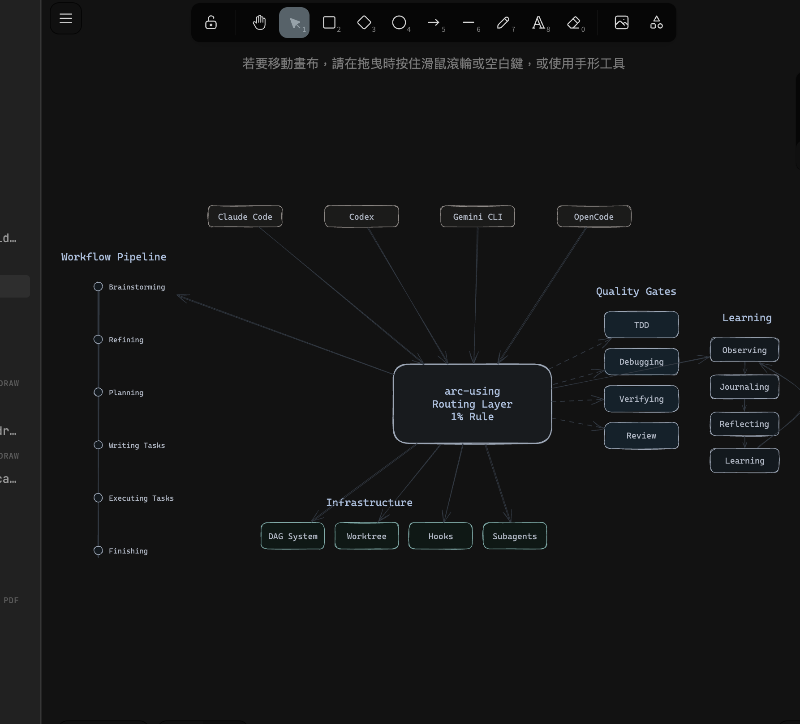

# arcforge

[](CHANGELOG.md)
[](LICENSE)
[](https://github.com/GregoryHo/arcforge/actions/workflows/ci.yml)

arcforge is a minimal, composable skill toolkit for Claude Code, Codex, Gemini CLI, and OpenCode. It gives agents lightweight routing, structured SDD artifacts, and eval-backed quality gates without turning every task into a mandatory workflow.

## Why arcforge

AI coding agents are powerful but uneven. Left to their defaults, they skip design, ignore review, and lose context across sessions. Heavy always-on process creates a different failure mode: the agent follows workflow ceremony when a direct answer or isolated eval would be better.

arcforge solves this with a small composable toolkit. Skills are available in the session, but they are selected when useful: design when intent is unclear, structured specs when artifacts matter, TDD/debugging/review when implementation risk is present, and verification before completion claims.

The outcome: your agent has disciplined workflows when the task justifies them, while preserving direct execution, harness isolation, and small-task speed when a workflow would be overhead.

## How it works

ArcForge is split into three layers:

1. **Core toolkit** — a small promoted surface for routing, design, specs, planning, TDD, debugging, verification, and eval.
2. **Optional workflows** — recipes for SDD, bugfixes, skill authoring, and multi-agent work. These are opt-in by task fit, not global laws.
3. **Harness/eval layer** — tests that verify both activation and non-activation behavior, including instruction-strength regressions.

When your coding agent starts a session, arcforge's hooks inject a minimal bootstrap: ArcForge is available, `ARCFORGE_ROOT` is set, and agents should prefer the smallest useful workflow. Specific skills are read or invoked on demand.

Once a design is approved, ArcForge can build a clear implementation plan and then execute tasks with a two-stage review (spec compliance, then code quality). For larger work, it can create parallel git worktrees so epics can run in isolation.

Skills are tools, not laws. You can enter through `arc-using` for routing help or call any skill directly when you already know the needed workflow.

## Installation

**Note:** Installation differs by platform. Claude Code has a built-in plugin system. Codex and OpenCode require manual setup.

### Claude Code (Plugin Marketplace)

Register the marketplace:

```bash
/plugin marketplace add arcforge
```

Install the plugin:

```bash
/plugin install arcforge@arcforge
```

### Verify Installation

Check that commands appear:

```bash
/help
```

```
# Should see:
# /arcforge:arc-brainstorming - Design exploration
# /arcforge:arc-writing-tasks - Break epics or features into executable tasks
# /arcforge:arc-executing-tasks - Execute tasks with checkpoints
```

### Codex

Tell Codex:

```
Fetch and follow instructions from https://github.com/GregoryHo/arcforge/blob/master/.codex/INSTALL.md
```

**Detailed docs:** `docs/README.codex.md`

### Gemini CLI

Tell Gemini CLI:

```
Fetch and follow instructions from https://github.com/GregoryHo/arcforge/blob/master/.gemini/INSTALL.md
```

**Detailed docs:** `docs/README.gemini.md`

### OpenCode

Tell OpenCode:

```
Clone https://github.com/GregoryHo/arcforge to ~/.config/opencode/arcforge, then create directory ~/.config/opencode/plugin, then symlink ~/.config/opencode/arcforge/.opencode/plugin/arcforge.js to ~/.config/opencode/plugin/arcforge.js, then restart opencode.
```

**Detailed docs:** `docs/README.opencode.md`

## Quick Start: Common Commands

These are the most frequently used commands:

| Command | Purpose | When to Use |
|---------|---------|-------------|
| `/arcforge:arc-brainstorming` | Design exploration | When starting new work or clarifying requirements |
| `/arcforge:arc-writing-tasks` | Break down into tasks | When you have a clear spec and need executable steps |
| `/arcforge:arc-executing-tasks` | Run task list | When tasks are ready and you want to implement |
| `/arcforge:arc-journaling` | Session journaling | At end of session to capture reflections |
| `/arcforge:arc-reflecting` | Analyze patterns | After 5+ journal entries to summarize learnings |

### How Skills Connect



`arc-using` is a bounded router and index, not an always-on policy engine. Skills fan out into workflow, quality, infrastructure, and learning categories; agents should pick the smallest useful path for the task.

## How Skills Compose

`arc-using` helps choose a path when routing is useful. You can also enter at any skill directly.

| Context | Recommended skills | Entry point |
|---------|-------------------|-------------|
| Vague idea, new requirement | brainstorming, refining, planning | `arc-brainstorming` |
| Clear spec, ready to plan | writing-tasks, executing-tasks | `arc-writing-tasks` |
| Large multi-epic initiative | planning, coordinating, implementing | `arc-planning` |
| Tasks already defined | executing-tasks or agent-driven | `arc-executing-tasks` |
| Bug or regression | debugging, tdd, verifying | `arc-debugging` |
| End of session | journaling | `arc-journaling` |

**Within each path:** TDD (RED-GREEN-REFACTOR) with two-stage review (spec compliance, then code quality).

**Finishing:** `arc-finishing-epic` for worktrees, `arc-finishing` for normal branches.

## Terminology

- **epic** - A large initiative that may require parallel worktrees and multiple features.
- **feature** - A scoped deliverable inside an epic.
- **task** - A small, executable step produced by `arc-writing-tasks`.
- **design** - The design document from `arc-brainstorming`.
- **spec** - The structured spec output from `arc-refining`.
- **dag** - The dependency graph produced by `arc-planning`.

## What's Inside

### Core Toolkit Skills

- **arc-using** - Bounded routing help for task scale
- **arc-brainstorming** - Design exploration
- **arc-refining** - Spec generation
- **arc-planning** - DAG breakdown
- **arc-tdd** - Test-driven development
- **arc-debugging** - Systematic debugging with four phases
- **arc-verifying** - Verification evidence before completion claims
- **arc-evaluating** - Measure whether skills and workflows change agent behavior

### Optional Workflow Skills

- **arc-coordinating** - Worktree management
- **arc-implementing** - TDD implementation
- **arc-using-worktrees** - Create isolated workspace for epic development
- **arc-finishing-epic** - Epic completion with merge decision
- **arc-finishing** - Branch completion with merge decision
- **arc-writing-tasks** - Break epics or features into executable tasks
- **arc-dispatching-parallel** - Dispatch multiple agents for independent tasks
- **arc-compacting** - Strategic manual compaction timing at workflow phase boundaries

### Project-Level Meta Skills

- **arc-writing-skills** - ArcForge project-level meta skill for maintaining ArcForge's own skills and skill tests

### Execution Layer

- **arc-tdd** - Test-driven development (RED → GREEN → REFACTOR cycle)
- **arc-agent-driven** - Automated execution with subagent per task and two-stage review
- **arc-executing-tasks** - Human-in-the-loop execution with checkpoints
- **arc-dispatching-teammates** - Lead-present multi-epic parallelism via Claude Code agent teammates
- **arc-looping** - Autonomous cross-session loop execution

### Session & Learning Layer

- **arc-journaling** - Session journaling for capturing reflections before compaction
- **arc-reflecting** - Analyze diary entries for insights and patterns
- **arc-learning** - Extract reusable patterns from sessions
- **arc-observing** - Tool call observation for behavioral pattern detection
- **arc-recalling** - Manual instinct creation from session insights
- **arc-managing-sessions** - Session save/resume with alias support
- **arc-researching** - Autonomous hypothesis-driven experimentation

### Knowledge Base Layer

- **arc-maintaining-obsidian** - Unified Obsidian vault lifecycle: ingest, query, audit (Karpathy LLM Wiki pattern)
- **arc-diagramming-obsidian** - Excalidraw diagram creation inside an Obsidian vault

### Review Layer

- **arc-requesting-review** - When and how to request code review
- **arc-receiving-review** - How to handle review feedback with technical rigor
- **arc-evaluating** - Measure whether skills and workflows change agent behavior

### Review Templates

- `templates/implementer-prompt.md` - TDD implementer subagent prompt
- `templates/spec-reviewer-prompt.md` - Spec compliance reviewer prompt
- `templates/quality-reviewer-prompt.md` - Code quality reviewer prompt

## CLI Usage

The CLI manages the DAG that `arc-planning` produces. You typically do not run these directly — skills invoke them. For manual use or debugging, the commands are:

```bash
# Show workflow status
arcforge status

# Get next available task
arcforge next

# Mark task as completed
arcforge complete <task-id>

# Mark task as blocked with reason
arcforge block <task-id> <reason>

# Show parallelizable epics
arcforge parallel

# Create worktrees for ready epics (--verify runs baseline tests)
arcforge expand [--verify]

# Merge completed epics into base branch
arcforge merge [--base <branch>]

# Remove merged worktree directories
arcforge cleanup

# Sync state between worktree and base DAG
arcforge sync [--direction from-base|to-base|both|scan]

# Show 5-Question Reboot context:
#   Where am I? / Where am I going? / What's the goal?
#   What have I learned? / What have I done?
arcforge reboot
```

## Development

### Setup

```bash
npm install
cd hooks && npm install && cd ..
pip install pytest pyyaml    # Required for test:skills
```

### Plugin Development

To develop arcforge itself with live plugin loading, see the [Plugin Development](CONTRIBUTING.md#plugin-development) section in CONTRIBUTING.md. Quick version: `npm run dev` starts a Claude session that loads the plugin directly from your local checkout.

### Running Tests

```bash
# Run all tests (4 runners — all must pass)
npm test

# Individual runners
npm run test:scripts   # Jest — CLI engine (scripts/lib/)
npm run test:hooks     # Node --test — hook behavior (hooks/__tests__/)
npm run test:node      # Custom — CLI, DAG schema, models, YAML parser (tests/node/)
npm run test:skills    # pytest — skill content validation (tests/skills/)

# Run CLI
node scripts/cli.js --help
```

See [CONTRIBUTING.md](CONTRIBUTING.md) for the full developer guide.

## Philosophy

- **Incremental progress** - Small changes that compile and pass tests
- **Clear intent** - Boring and obvious code
- **Smallest useful workflow** - Use skills when they add leverage; avoid ceremony when a direct answer is enough
- **Evidence over claims** - Verify before declaring success

## Documentation

**[Knowledge Base](https://publish.obsidian.md/greghodev/ArcForge/MOC-ArcForge)** — an interconnected wiki knowledge base covering architecture, skills, agents, eval, and design history. Start with the [Master Map](https://publish.obsidian.md/greghodev/ArcForge/MOC-ArcForge).

| Topic | Link |
|-------|------|
| Skill System | [MOC-ArcForge-Skills](https://publish.obsidian.md/greghodev/ArcForge/MOC-ArcForge-Skills) |
| Agent System | [MOC-ArcForge-Agents](https://publish.obsidian.md/greghodev/ArcForge/MOC-ArcForge-Agents) |
| Rules & Standards | [MOC-ArcForge-Rules](https://publish.obsidian.md/greghodev/ArcForge/MOC-ArcForge-Rules) |
| Eval System | [MOC-ArcForge-Eval](https://publish.obsidian.md/greghodev/ArcForge/MOC-ArcForge-Eval) |
| Changelog | [CHANGELOG.md](CHANGELOG.md) |

## Contributing

See [CONTRIBUTING.md](CONTRIBUTING.md) for the full guide. It covers:

- **Naming conventions** — `arc-<gerund>[-<object>]` pattern for skills
- **The Iron Law** — no skill without a failing test first (TDD for documentation)
- **Test runners** — all 4 runners must pass before submitting a PR
- **PR process** — branch naming, conventional commits, Iron Law compliance

## Updating

Skills update automatically when you update the plugin:

```bash
/plugin update arcforge
```

## Acknowledgements

arcforge draws inspiration from these excellent projects:

- [superpowers](https://github.com/obra/superpowers) — Skill-based workflow system for Claude Code by Jesse Vincent
- [everything-claude-code](https://github.com/affaan-m/everything-claude-code) — Complete Claude Code configuration collection by Affaan
- [claude-diary](https://github.com/rlancemartin/claude-diary) — Session memory and reflection system by Lance Martin

## License

MIT
