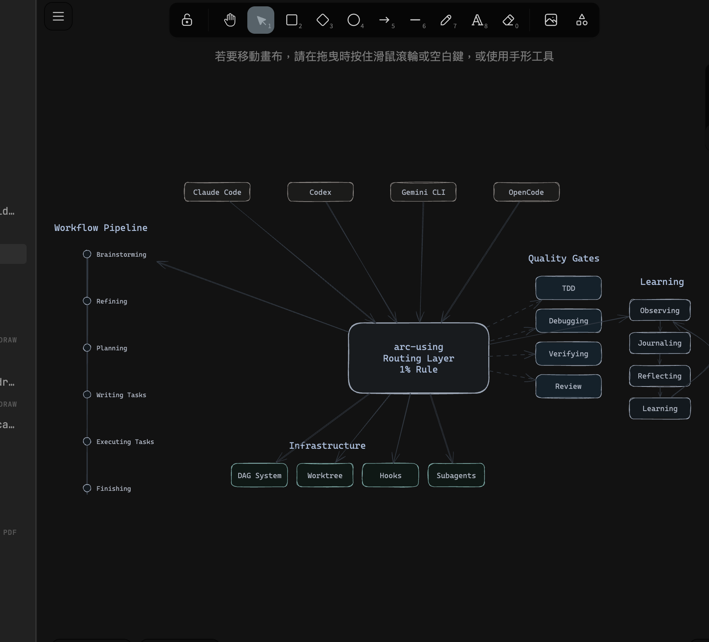

# arcforge

[](CHANGELOG.md)
[](LICENSE)
[](https://github.com/GregoryHo/arcforge/actions/workflows/ci.yml)

arcforge is a minimal, composable skill toolkit for Claude Code. It gives agents lightweight routing, self-contained skills, and eval-backed quality gates without turning every task into a mandatory workflow.

## Why arcforge

AI coding agents are powerful but uneven. Left to their defaults, they skip design, ignore review, and lose context across sessions. Heavy always-on process creates a different failure mode: the agent follows workflow ceremony when a direct answer or isolated eval would be better.

arcforge solves this with a small composable toolkit. Skills are available in the session, but they are selected when useful: design when intent is unclear, structured specs when artifacts matter, TDD/debugging/review when implementation risk is present, and verification before completion claims.

The outcome: your agent has disciplined workflows when the task justifies them, while preserving direct execution, harness isolation, and small-task speed when a workflow would be overhead.

## How it works

ArcForge is split into three layers:

1. **Core toolkit** — a small promoted surface for routing, design, specs, planning, TDD, debugging, verification, and eval.
2. **Optional workflows** — recipes for feature work, bugfixes, skill authoring, and multi-agent work. These are opt-in by task fit, not global laws.
3. **Harness/eval layer** — tests that verify both activation and non-activation behavior, including instruction-strength regressions.

When your coding agent starts a session, arcforge's hooks inject a minimal bootstrap: ArcForge is available, and agents should prefer the smallest useful workflow. Specific skills are read or invoked on demand.

Once a design is approved, ArcForge can build a clear implementation plan and then execute tasks with a single per-task reviewer that returns both verdicts in one pass (spec compliance and task quality). For larger work, it can create parallel git worktrees so epics can run in isolation.

Skills are tools, not laws. You can enter through `arc-using` for routing help or call any skill directly when you already know the needed workflow.

## Installation

### Claude Code (Plugin Marketplace)

Register the marketplace:

```bash
/plugin marketplace add GregoryHo/arcforge
```

Install the plugin:

```bash
/plugin install arcforge@arcforge-dev
```

### Verify Installation

Check that commands appear:

```bash
/help
```

```
# Should see:
# /arcforge:arc-brainstorming - Design exploration
# /arcforge:arc-writing-tasks - Break features into executable tasks
# /arcforge:arc-executing-tasks - Execute tasks with checkpoints
```

Every skill is directly invocable by name — `/arcforge:arc-<name>` (e.g. `/arcforge:tdd`, `/arcforge:debugging`). Unsure where to start? Invoke `/arcforge:arc-using` for routing help.

## Quick Start: Common Commands

These are the most frequently used commands:

| Command | Purpose | When to Use |
|---------|---------|-------------|
| `/arcforge:arc-using` | Routing help + skill index | When unsure which skill or workflow applies |
| `/arcforge:arc-brainstorming` | Design exploration | When starting new work or clarifying requirements |
| `/arcforge:arc-writing-tasks` | Break down into tasks | When you have a clear spec and need executable steps |
| `/arcforge:arc-executing-tasks` | Run task list | When tasks are ready and you want to implement |
| `/arcforge:learning` | Diaries, patterns, instincts | At end of session, or to review what the learning module proposes |

## How Skills Compose



**`arc-using` is the canonical in-session router.** When you're unsure which skill applies, invoke it — it maps concrete conditions to the smallest useful workflow. It is a bounded router and index, not an always-on policy engine: you can also enter at any skill directly. The **[Skills Reference](docs/guide/skills-reference.md)** is the offline companion with full per-skill detail.

| Context | Recommended skills | Entry point |
|---------|-------------------|-------------|
| Vague idea, new requirement | brainstorming | `arc-brainstorming` |
| Clear spec, ready to plan | writing-tasks, executing-tasks | `arc-writing-tasks` |
| Large multi-epic initiative | using-worktrees, dispatching-teammates | `arc-dispatching-teammates` |
| Tasks already defined | executing-tasks or agent-driven | `arc-executing-tasks` |
| Bug or regression | debugging, tdd, verifying | `/debugging` |
| End of session | learning | `/learning` |

**Within each path:** TDD (RED-GREEN-REFACTOR) with a single per-task reviewer returning both verdicts (spec compliance and task quality).

**Finishing:** `/finishing` for both.

## Terminology

- **epic** - A large initiative that may require parallel worktrees and multiple features.
- **feature** - A scoped deliverable inside an epic.
- **task** - A small, executable step produced by `arc-writing-tasks`.
- **design** - The design document from `arc-brainstorming`.

## What's Inside

Skills grouped by category. Within each category, model-invoked skills auto-trigger from their description when their condition is present; user-invoked skills _(marked)_ never auto-trigger and are reached only by `/arcforge:<name>` or a project-level task.

### Task workflow (idea → tasks → integration)

- **arc-brainstorming** - Explore and shape a design before implementation
- **arc-writing-tasks** - Break a feature into small executable tasks with exact code
- **arc-executing-tasks** - Run a prepared task list with human-in-the-loop checkpoints
- **finishing** - Integrate finished work (`/finishing`)

### Orchestration (subagents, worktrees, loops)

- **arc-agent-driven** - Execute a task list with one fresh subagent + task-reviewer per task
- **arc-dispatching-parallel** - Fan out independent features to parallel subagents in one worktree
- **arc-dispatching-teammates** - Lead-present epic-level parallelism via agent teammates
- **looping** _(user-invoked)_ - Hand a task list to an unattended loop that keeps working across fresh sessions (`/looping`)
- **arc-using-worktrees** - Isolated git worktree for any repo (branch, experiment, review checkout)

### Discipline (quality gates)

- **tdd** - Test-first implementation (RED → GREEN → REFACTOR)
- **debugging** - Systematic root-cause investigation before any fix
- **code-review** - Two-axis review of a finished change, then answering the feedback on evidence

### Memory (session continuity + learning; default-off module)

- **learning** _(user-invoked)_ - Session diaries, pattern extraction from them, manual instincts, and review of the opt-in observe → curate → activate lifecycle
- **sessions** - Write a handover when work stops mid-task, and read one when it restarts
- **compacting** - Decide when to compact, and what has to reach disk before it

The **[Learning Dashboard](docs/guide/learning-dashboard.md)** is the review and control surface for learning candidates: run `arcforge learn dashboard` to open a local UI where you approve, promote, or deactivate each candidate before it changes active behavior.

### Knowledge (Obsidian vault)

- **maintaining-obsidian** - Ingest, query, audit, or bootstrap an Obsidian vault
- **diagramming-obsidian** - Excalidraw diagram creation inside an Obsidian vault

### Meta (operates on the catalog itself)

- **arc-using** - Bounded router: maps task conditions to the smallest useful skill or workflow
- **evaluating** - Measure whether an instruction, skill, or workflow changes agent behavior
- **writing-skills** _(user-invoked)_ - Author an arcforge skill: invocation, description, guidance form, evidence

### Hooks

ArcForge registers event hooks (Claude Code only) that work silently in the background: session tracking, observation logging, a secrets guard, compaction handling, and journaling triggers. They inject at most a few hundred tokens per session and never block normal work. See the **[Hooks System guide](docs/guide/hooks-system.md)** for the full list and how each one behaves.

## CLI Usage

You typically do not run the CLI directly — skills invoke it. For manual use or debugging:

The bare `arcforge <cmd>` form works everywhere that matters: Claude Code adds every loaded plugin's `bin/` directory to PATH, and the plugin ships `bin/arcforge`. From a local checkout without the plugin loaded, use `node scripts/cli.js <cmd>` or `./bin/arcforge <cmd>`.

```bash
# Generic (non-epic) worktree management
arcforge worktree add <name> [--from <ref>] [--setup]
arcforge worktree list [--json]
arcforge worktree remove <name> [--force]

# Autonomous cross-session loop over a markdown task list
arcforge loop --tasks tasks.md [--max-runs N] [--verifier]

# Eval harness
arcforge eval list
arcforge eval run <scenario> [--k N]

# Optional learning subsystem
arcforge learn status
arcforge learn dashboard [--port N]

# Obsidian vault registry
arcforge obsidian list-vaults [--json]
```

## Development

### Setup

```bash
npm install
pip install pytest pyyaml    # Required for test:skills
```

### Plugin Development

To develop arcforge itself with live plugin loading, see the [Plugin Development](CONTRIBUTING.md#plugin-development) section in CONTRIBUTING.md. Quick version: `npm run dev` starts a Claude session that loads the plugin directly from your local checkout.

### Running Tests

```bash
# Run all tests (5 runners — all must pass)
npm test

# Individual runners
npm run test:scripts          # Jest — CLI engine (scripts/lib/)
npm run test:hooks            # Node --test — hook behavior (hooks/__tests__/)
npm run test:node             # Custom — CLI manifest contract, YAML parser (tests/node/)
npm run test:skills           # pytest — skill structure validation (tests/skills/)
npm run test:observer-daemon  # Bash — observer daemon behavior (tests/observer-daemon/)

# Run CLI
node scripts/cli.js --help
```

See [CONTRIBUTING.md](CONTRIBUTING.md) for the full developer guide.

## Philosophy

- **Incremental progress** - Small changes that compile and pass tests
- **Clear intent** - Boring and obvious code
- **Smallest useful workflow** - Use skills when they add leverage; avoid ceremony when a direct answer is enough
- **Evidence over claims** - Verify before declaring success

## Documentation

**[Knowledge Base](https://publish.obsidian.md/greghodev/ArcForge/MOC-ArcForge)** — an interconnected wiki knowledge base covering architecture, skills, agents, eval, and design history. Start with the [Master Map](https://publish.obsidian.md/greghodev/ArcForge/MOC-ArcForge).

| Topic | Link |
|-------|------|
| Skill System | [MOC-ArcForge-Skills](https://publish.obsidian.md/greghodev/ArcForge/MOC-ArcForge-Skills) |
| Agent System | [MOC-ArcForge-Agents](https://publish.obsidian.md/greghodev/ArcForge/MOC-ArcForge-Agents) |
| Rules & Standards | [MOC-ArcForge-Rules](https://publish.obsidian.md/greghodev/ArcForge/MOC-ArcForge-Rules) |
| Eval System | [MOC-ArcForge-Eval](https://publish.obsidian.md/greghodev/ArcForge/MOC-ArcForge-Eval) |
| Changelog | [CHANGELOG.md](CHANGELOG.md) |

### In-Repo Guides

These guides live in the repo under `docs/guide/`:

| Guide | Link |
|-------|------|
| CLI Invocation Convention | [docs/guide/cli-invocation.md](docs/guide/cli-invocation.md) |
| Eval System | [docs/guide/eval-system.md](docs/guide/eval-system.md) |
| Composable Skill Eval Coverage | [docs/guide/composable-skill-eval-coverage.md](docs/guide/composable-skill-eval-coverage.md) |
| Hooks System | [docs/guide/hooks-system.md](docs/guide/hooks-system.md) |
| Worktree Workflow | [docs/guide/worktree-workflow.md](docs/guide/worktree-workflow.md) |
| Skills Reference | [docs/guide/skills-reference.md](docs/guide/skills-reference.md) |
| Learning Dashboard | [docs/guide/learning-dashboard.md](docs/guide/learning-dashboard.md) |

## Contributing

See [CONTRIBUTING.md](CONTRIBUTING.md) for the full guide. It covers:

- **Naming conventions** — `arc-<gerund>[-<object>]` pattern for skills
- **The Iron Law** — no skill without a failing test first (TDD for documentation)
- **Test runners** — all 5 runners must pass before submitting a PR
- **PR process** — branch naming, conventional commits, Iron Law compliance

## Updating

Skills update automatically when you update the plugin:

```bash
/plugin update arcforge
```

## Acknowledgements

arcforge draws inspiration from these excellent projects:

- [superpowers](https://github.com/obra/superpowers) — Skill-based workflow system for Claude Code by Jesse Vincent
- [everything-claude-code](https://github.com/affaan-m/everything-claude-code) — Complete Claude Code configuration collection by Affaan
- [claude-diary](https://github.com/rlancemartin/claude-diary) — Session memory and reflection system by Lance Martin

## License

MIT
