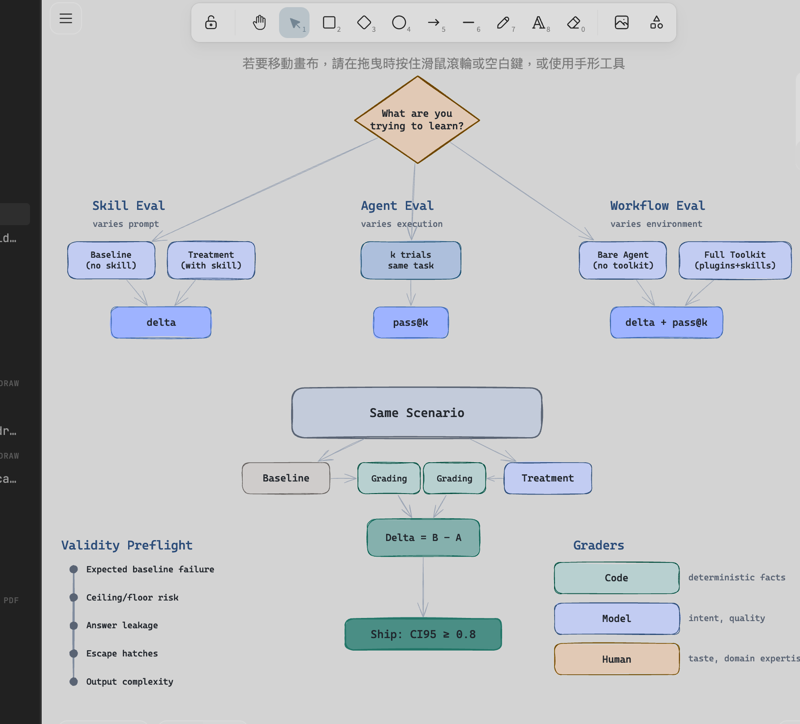
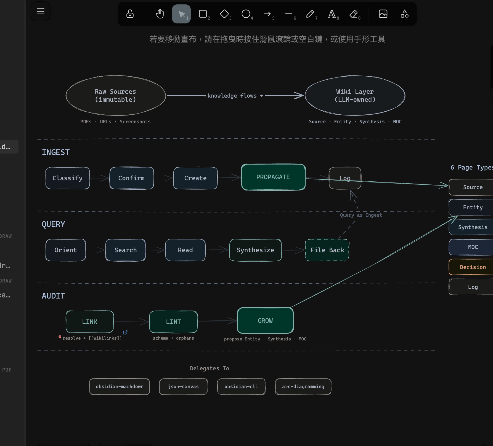

# Documentation

arcforge's primary documentation lives in the [Obsidian Knowledge Base](https://publish.obsidian.md/greghodev/ArcForge/MOC-ArcForge) — 83 interconnected wiki notes covering all skills, rules, agents, templates, and design history.

## Quick Links

| Topic | Wiki Link |
|-------|-----------|
| **Master Map** | [MOC-ArcForge](https://publish.obsidian.md/greghodev/ArcForge/MOC-ArcForge) |
| **Skill System** | [MOC-ArcForge-Skills](https://publish.obsidian.md/greghodev/ArcForge/MOC-ArcForge-Skills) |
| **Agent System** | [MOC-ArcForge-Agents](https://publish.obsidian.md/greghodev/ArcForge/MOC-ArcForge-Agents) |
| **Rules & Standards** | [MOC-ArcForge-Rules](https://publish.obsidian.md/greghodev/ArcForge/MOC-ArcForge-Rules) |
| **Eval System** | [MOC-ArcForge-Eval](https://publish.obsidian.md/greghodev/ArcForge/MOC-ArcForge-Eval) |

## Architecture Diagrams

### Eval System — A/B Testing for AI Agent Behavior

Three eval scopes (Skill, Agent, Workflow) feed into an A/B mechanism with validity preflight and three grader types. [Deep dive →](https://publish.obsidian.md/greghodev/ArcForge/MOC-ArcForge-Eval)

### Obsidian Knowledge Base — Karpathy LLM Wiki Implementation

Three modes (Ingest, Query, Audit) with PROPAGATE as the key differentiator. [Deep dive →](https://publish.obsidian.md/greghodev/ArcForge/ArcForge-Skill-Arc-Maintaining-Obsidian)

## Local Docs

These files are kept in-repo as raw source material for the wiki:

- **Guides**: `guide/eval-system.md`, `guide/hooks-system.md`, `guide/worktree-workflow.md`, `guide/skills-reference.md`
- **Designs**: `plans/` — architecture decision records
- **Research**: `research/` — landscape analysis and experiment baselines
- **Platform Install**: `README.codex.md`, `README.gemini.md`, `README.opencode.md`
