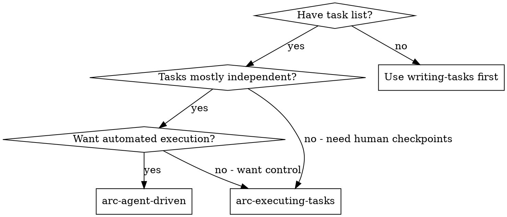
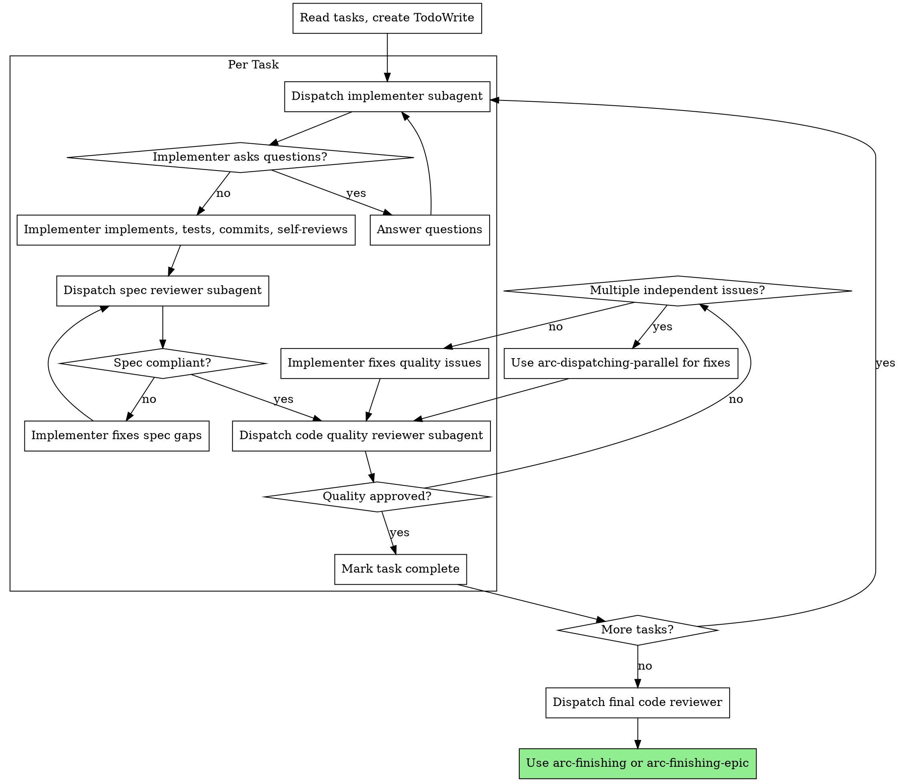

# arc-agent-driven

Execute plan by dispatching fresh subagent per task, with two-stage review after each: spec compliance review first, then code quality review.

**Core principle:** Fresh subagent per task + two-stage review (spec then quality) = high quality, fast iteration

## When to Use



**vs. arc-executing-tasks:**

- Fresh subagent per task (no context pollution)
- Two-stage review after each task
- Faster iteration (no human-in-loop between tasks)

## The Process



## Prompt Templates

- `./implementer-prompt.md` - Dispatch implementer subagent
- `./spec-reviewer-prompt.md` - Dispatch spec compliance reviewer
- `./code-quality-reviewer-prompt.md` - Dispatch code quality reviewer (references arc-requesting-review)

## Example Workflow

```
You: I'm using arc-agent-driven to execute these tasks.

[Read task file: docs/tasks/sync-command-tasks.md]
[Create TodoWrite with all 5 tasks]

Task 1: Add SyncResult dataclass

[Dispatch implementer subagent with full task text + context]

Implementer: "Before I begin - should SyncResult be in models.py or a new file?"

You: "In models.py with other dataclasses"

Implementer:
  - Implemented SyncResult dataclass
  - Added tests, 3/3 passing
  - Self-review: All good
  - Committed: abc1234 "feat(models): add SyncResult dataclass"

[Dispatch spec compliance reviewer]
Spec reviewer: ✅ Spec compliant - all fields present, nothing extra

[Dispatch code quality reviewer]
Code reviewer: Strengths: Clean, typed. Issues: None. Approved.

[Mark Task 1 complete]

Task 2: Add sync CLI command
...

[After all tasks]
[Dispatch final code reviewer for entire implementation]
Final reviewer: All requirements met, architecture solid

Done! Use arc-finishing-epic to decide merge/PR/keep/discard
```

## Subagents Should Use

- **arc-tdd** - Implementer follows TDD for each task

## Advantages

**vs. Manual execution:**

- Subagents follow TDD naturally
- Fresh context per task (no confusion)
- Subagent can ask questions (before AND during work)

**vs. arc-executing-tasks:**

- Same session (no handoff)
- Continuous progress (no waiting)
- Review checkpoints automatic

**Quality gates:**

- Self-review catches issues before handoff
- Two-stage review: spec compliance, then code quality
- Review loops ensure fixes actually work

## Red Flags

**Never:**

- Skip reviews (spec compliance OR code quality)
- Proceed with unfixed issues
- Start implementation on main/master branch without explicit user consent
- Dispatch multiple implementation subagents in parallel (conflicts)
- Make subagent read task file (provide full text instead)
- Skip scene-setting context
- Ignore subagent questions
- Accept "close enough" on spec compliance
- Skip review loops
- Let implementer self-review replace actual review
- **Start code quality review before spec compliance ✅**
- Move to next task while either review has open issues

**If subagent asks questions:**

- Answer clearly and completely
- Provide additional context if needed
- Don't rush them into implementation

**If reviewer finds issues:**

- Implementer fixes them
- Reviewer reviews again
- Repeat until approved

## Integration

**Required workflow skills:**

- **arc-using-worktrees** — REQUIRED: Set up isolated workspace before starting
- **arc-writing-tasks** - Creates the task list this skill executes
- **arc-requesting-review** - Code review template for reviewer subagents
- **arc-finishing** or **arc-finishing-epic** - Complete development after all tasks

**Subagents should use:**

- **arc-tdd** - TDD for each task

**Alternative workflow:**

- **arc-executing-tasks** - Use for human checkpoint mode instead of automated
