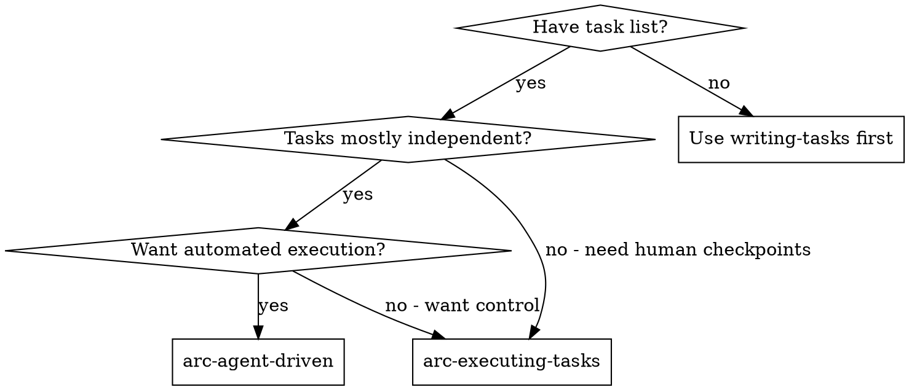
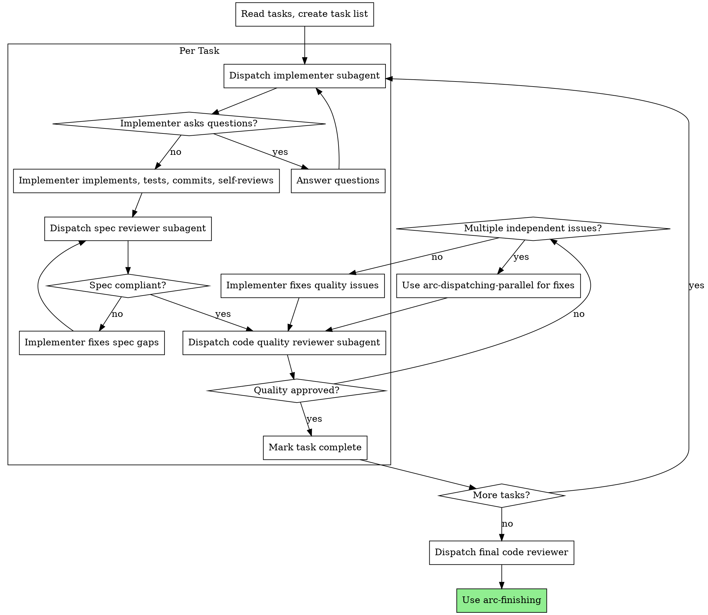

# arc-agent-driven

Execute plan by dispatching fresh subagent per task, with two-stage review after each: spec compliance review first, then code quality review.

**Core principle:** Fresh subagent per task + two-stage review (spec then quality) = high quality, fast iteration

## When to Use


```dot
digraph when_to_use {
    "Have task list?" [shape=diamond];
    "Tasks mostly independent?" [shape=diamond];
    "Want automated execution?" [shape=diamond];
    "arc-agent-driven" [shape=box];
    "arc-executing-tasks" [shape=box];
    "Use writing-tasks first" [shape=box];

    "Have task list?" -> "Tasks mostly independent?" [label="yes"];
    "Have task list?" -> "Use writing-tasks first" [label="no"];
    "Tasks mostly independent?" -> "Want automated execution?" [label="yes"];
    "Tasks mostly independent?" -> "arc-executing-tasks" [label="no - need human checkpoints"];
    "Want automated execution?" -> "arc-agent-driven" [label="yes"];
    "Want automated execution?" -> "arc-executing-tasks" [label="no - want control"];
}
```

**vs. arc-executing-tasks:**

- Fresh subagent per task (no context pollution)
- Two-stage review after each task
- Faster iteration (no human-in-loop between tasks)

## The Process


```dot
digraph process {
    rankdir=TB;

    subgraph cluster_per_task {
        label="Per Task";
        "Dispatch implementer subagent" [shape=box];
        "Implementer asks questions?" [shape=diamond];
        "Answer questions" [shape=box];
        "Implementer implements, tests, commits, self-reviews" [shape=box];
        "Dispatch spec reviewer subagent" [shape=box];
        "Spec compliant?" [shape=diamond];
        "Implementer fixes spec gaps" [shape=box];
        "Dispatch code quality reviewer subagent" [shape=box];
        "Quality approved?" [shape=diamond];
        "Implementer fixes quality issues" [shape=box];
        "Mark task complete" [shape=box];
    }

    "Read tasks, create task list" [shape=box];
    "More tasks?" [shape=diamond];
    "Multiple independent issues?" [shape=diamond];
    "Use arc-dispatching-parallel for fixes" [shape=box];
    "Dispatch final code reviewer" [shape=box];
    "Use arc-finishing" [shape=box style=filled fillcolor=lightgreen];

    "Read tasks, create task list" -> "Dispatch implementer subagent";
    "Dispatch implementer subagent" -> "Implementer asks questions?";
    "Implementer asks questions?" -> "Answer questions" [label="yes"];
    "Answer questions" -> "Dispatch implementer subagent";
    "Implementer asks questions?" -> "Implementer implements, tests, commits, self-reviews" [label="no"];
    "Implementer implements, tests, commits, self-reviews" -> "Dispatch spec reviewer subagent";
    "Dispatch spec reviewer subagent" -> "Spec compliant?";
    "Spec compliant?" -> "Implementer fixes spec gaps" [label="no"];
    "Implementer fixes spec gaps" -> "Dispatch spec reviewer subagent";
    "Spec compliant?" -> "Dispatch code quality reviewer subagent" [label="yes"];
    "Dispatch code quality reviewer subagent" -> "Quality approved?";
    "Quality approved?" -> "Multiple independent issues?" [label="no"];
    "Multiple independent issues?" -> "Use arc-dispatching-parallel for fixes" [label="yes"];
    "Multiple independent issues?" -> "Implementer fixes quality issues" [label="no"];
    "Use arc-dispatching-parallel for fixes" -> "Dispatch code quality reviewer subagent";
    "Implementer fixes quality issues" -> "Dispatch code quality reviewer subagent";
    "Quality approved?" -> "Mark task complete" [label="yes"];
    "Mark task complete" -> "More tasks?";
    "More tasks?" -> "Dispatch implementer subagent" [label="yes"];
    "More tasks?" -> "Dispatch final code reviewer" [label="no"];
    "Dispatch final code reviewer" -> "Use arc-finishing";
}
```

**Max review cycles: 3 per reviewer.** If not converging, escalate to human with summary of unresolved issues.

### Per-Task File Handoff

Hand each subagent a file, not a wall of pasted text. The brief and the review
package live in the self-ignoring `.arcforge/sdd/` workspace:

1. **Before dispatching the implementer**, record the current commit as the task
   BASE: `git rev-parse HEAD`. Optionally assemble the brief with
   `node "${ARCFORGE_ROOT}/skills/arc-agent-driven/scripts/task-brief.js" --task "<text>" --acceptance "<criteria>" --base <BASE>`
   (it prints the brief path).
2. **After the implementer commits**, build the review package for the whole task
   range — never just the last commit — with
   `node "${ARCFORGE_ROOT}/skills/arc-agent-driven/scripts/review-package.js" <BASE> HEAD`.
   It writes the commit list plus `git diff --stat` and `git diff -U10` for
   `<BASE>..HEAD` into one file and prints that file's path.
3. **Hand each reviewer that path** as `{DIFF_FILE}`. The reviewer reads the
   package once; it does not re-run git or crawl the codebase.

Record BASE from *before* the implementer ran so a multi-commit task stays whole.
`HEAD~1` as the base would truncate the package to the final commit.

### Durable Progress Ledger

TodoWrite and terminal narration hold per-task progress only in context — a
mid-run auto-compaction or a fresh session can lose your place and re-dispatch
an already-completed task (the single most expensive failure). Persist per-task
completion to a ledger file, not only to todos.

- **Ledger file:** `.arcforge/sdd/progress.md` — the same self-ignoring
  `.arcforge/sdd/` workspace the brief and review packages use. It is a runtime
  recovery artifact, not a tracked file. (Alternative for those who want it
  tracked: also tick the task's checkbox in `docs/tasks/<feature>-tasks.md`.)
- **At skill start**, check the ledger (`cat .arcforge/sdd/progress.md`). If it
  exists, trust it plus `git log` and resume AFTER the last task marked complete
  — do not re-dispatch tasks it already lists.
- **After each clean review** (both stages passed), append one line in the same
  message as your other bookkeeping:
  `Task N: complete (commits <base7>..<head7>, review clean)`. The commits it
  names exist in git even when your context no longer remembers creating them.
- `git clean -fdx` destroys the ledger (git-ignored scratch); if that happens,
  reconstruct progress from `git log`.

### Model Selection

**Name a model on every dispatch — never rely on inherit.** An omitted model
inherits your session's model, often the most expensive tier — one real run let
26 reviewers silently inherit the top tier that way. The Task/subagent `model`
parameter overrides an agent's frontmatter default, so you request the tier per
dispatch; the `sonnet` values in the Available Agents table below are the
mid-tier floor, not a ceiling.

Match each role to the cheapest tier that fits:

- **Transcription implementer → `haiku`.** arc-writing-tasks requires each task
  to carry "Exact code — Complete code", so a well-formed task is transcription
  plus testing — the cheapest tier handles it, as do single-file mechanical fixes.
- **Prose-plan implementer and both reviewers → `sonnet` floor.** Turn count
  beats token price: cheaper models routinely take 2-3× the turns on multi-step
  judgment work, costing more overall. Scale a reviewer above the floor only for
  a large or subtle diff.
- **Final whole-branch review → `opus`** — the strongest recognized tier, pinned
  in `agents/code-reviewer.md`. It is the one architecture-level judgment here;
  do not let it ride the session default.

**Headless caveat (arc-looping):** the loop path spawns agents through headless
`claude -p`, which strips agent frontmatter and does NOT honor a `model:` pin
(`${ARCFORGE_ROOT}/scripts/lib/loop-verifier.js`) — under arc-looping, pass `--model` explicitly
on the dispatch, or the intended tier is ignored.

## Agents & Templates

Two ways to dispatch each role, depending on what your platform supports:

**Pre-built agents (when your platform supports named subagents — e.g. Claude
Code's `agents/`):** they bundle tool isolation and methodology.
- `implementer` — TDD implementation with full write access
- `spec-reviewer` — Spec compliance verification (read-only)
- `quality-reviewer` — Code quality assessment (read-only + test runner)

**Templates (cross-platform fallback — for custom prompts or when named agents
aren't available):**
- `./implementer-prompt.md` - Implementer prompt with placeholders
- `./spec-reviewer-prompt.md` - Spec compliance review prompt
- `./code-quality-reviewer-prompt.md` - Code quality review prompt (references arc-requesting-review)

## Cross-Platform Dispatch

This skill is platform-agnostic: it needs only the ability to run a fresh
subagent per task. The named agents above are a Claude Code convenience; on any
platform (Codex, Gemini CLI, OpenCode, or Claude Code) you can dispatch each
role from the templates instead, using whatever subagent mechanism your harness
provides. The templates carry the full role prompt, so the workflow — fresh
implementer per task, then spec review, then quality review — is identical
regardless of how the subagent is launched.

## Example Workflow

```
You: I'm using arc-agent-driven to execute these tasks.

[Read task file: docs/tasks/sync-command-tasks.md]
[Create a task list with all 5 tasks]

Task 1: Add SyncResult dataclass

[Dispatch implementer subagent with full task text + context]

Implementer: "Before I begin - should SyncResult be in models.py or a new file?"

You: "In models.py with other dataclasses"

Implementer:
  - Implemented SyncResult dataclass
  - Added tests, 3/3 passing
  - Self-review: All good
  - Committed: abc1234 "feat(models): add SyncResult dataclass"

[Dispatch spec compliance reviewer]
Spec reviewer: ✅ Spec compliant - all fields present, nothing extra

[Dispatch code quality reviewer]
Code reviewer: Strengths: Clean, typed. Issues: None. Approved.

[Mark Task 1 complete]

Task 2: Add sync CLI command
...

[After all tasks]
[Dispatch final code reviewer for entire implementation]
Final reviewer: All requirements met, architecture solid

Done! Completion pipeline:
1. Run arc-verifying — confirm all requirements met and tests pass
2. Use arc-finishing (Step 0 discriminates on .arcforge-epic) to decide merge/PR/keep/discard
```

## Available Agents

The full agent roster for arc-agent-driven workflows:

| Agent | Role | Model | Access |
|-------|------|-------|--------|
| **implementer** | TDD implementation | sonnet | Read, Write, Edit, Bash, Grep |
| **spec-reviewer** | Spec compliance check | sonnet | Read, Grep, Glob |
| **quality-reviewer** | Code quality review | sonnet | Read, Grep, Glob, Bash |

## Subagents Should Use

- **arc-tdd** - Implementer follows TDD for each task

## Advantages

**vs. Manual execution:**

- Subagents follow TDD naturally
- Fresh context per task (no confusion)
- Subagent can ask questions (before AND during work)

**vs. arc-executing-tasks:**

- Same session (no handoff)
- Continuous progress (no waiting)
- Review checkpoints automatic

**Quality gates:**

- Self-review catches issues before handoff
- Two-stage review: spec compliance, then code quality
- Review loops ensure fixes actually work

## Red Flags

**Never:**

- Skip reviews (spec compliance OR code quality)
- Proceed with unfixed issues
- Start implementation on main/master branch without explicit user consent
- Dispatch multiple implementation subagents in parallel (conflicts)
- Make subagent read task file (provide full text instead)
- Skip scene-setting context
- Ignore subagent questions
- Accept "close enough" on spec compliance
- Skip review loops
- Let implementer self-review replace actual review
- **Start code quality review before spec compliance**
- Move to next task while either review has open issues
- Hand a reviewer a bare diff and let it re-run git or crawl the codebase — build the review package and give it the file path instead
- Use `HEAD~1` as the review base — it truncates a multi-commit task to its last commit; record the pre-implementer BASE and package `BASE..HEAD`
- **Re-dispatch a task the ledger marks complete** — a ledger-complete task is DONE; on resume, reconcile the ledger against `git log` before dispatching anything

**If subagent asks questions:**

- Answer clearly and completely
- Provide additional context if needed
- Don't rush them into implementation

**If reviewer finds issues:**

- Implementer fixes them
- Reviewer reviews again
- Repeat until approved

## Integration

**Required workflow skills:**

- **arc-using-worktrees** — REQUIRED: Set up isolated workspace before starting
- **arc-writing-tasks** - Creates the task list this skill executes
- **arc-requesting-review** - Code review template for reviewer subagents
- **arc-finishing** (Step 0 discriminates on `.arcforge-epic`) - Complete development after all tasks

**Subagents should use:**

- **arc-tdd** - TDD for each task

**Alternative workflow:**

- **arc-executing-tasks** - Use for human checkpoint mode instead of automated
