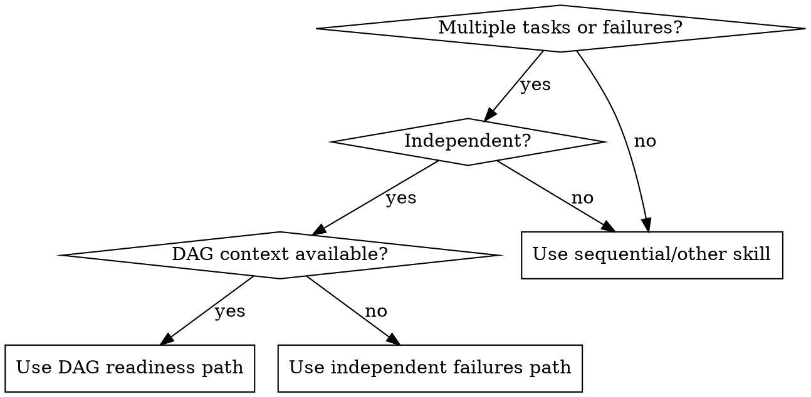

# arc-dispatching-parallel

## Overview

Dispatch multiple agents for independent tasks in parallel.

## When to Use



Use when:

- Review finds multiple independent issues to fix
- Multiple independent features can be handled at once
- Multiple independent investigation/research tasks
- Any identified set of independent tasks
- Multiple independent failures or problem domains (different test files, subsystems, or root causes)

**Don't use when:**

- Tasks are related (fix one might fix others)
- Need to understand full system state
- Agents would interfere (editing same files)

## The Pattern

### 1. Identify Independent Tasks

Group by independence:

- No shared dependencies
- No shared files
- Can be understood without context from others

**Independence checks (examples):**

- Different test files with unrelated failures
- Different subsystems with no shared code paths
- Different files and no shared dependencies

### 2. Create Focused Prompts

Each agent gets:

- **Specific scope:** One problem/feature
- **Clear goal:** What to achieve
- **Constraints:** Don't change other code
- **Expected output:** Summary of changes

**Prompt template:**

```
Fix <problem-domain> in <file-or-subsystem>.

Context:
- Failure 1: <name> (<error/message>)
- Failure 2: <name> (<error/message>)

Constraints:
- Don't change unrelated files
- Avoid refactors outside this scope

Return:
- Root cause
- Fix summary
- Files changed
```

### 3. Dispatch in Parallel

```
Task tool (general-purpose): "Fix issue A in file X"
Task tool (general-purpose): "Fix issue B in file Y"
Task tool (general-purpose): "Fix issue C in file Z"
# All three dispatch simultaneously
```

### 4. Review and Integrate

- Read each summary
- Verify no conflicts
- Run full test suite
- Integrate all changes

## Core Workflow

### Step 1: Read dag.yaml

```bash
cat dag.yaml
```

Parse the structure to understand:

- All features and their IDs
- Dependencies between features
- Current status of each feature

### Step 2: Identify Ready Features

A feature is "ready" when:

- Status is "ready" OR
- All dependencies are "complete"

```python
# Pseudocode
ready_features = []
for feature in all_features:
    if feature.status == "ready":
        ready_features.append(feature)
    elif all(dep.status == "complete" for dep in feature.dependencies):
        ready_features.append(feature)
```

### Step 3: Group by Independence

Features are independent when:

- Feature A doesn't depend on Feature B
- Feature B doesn't depend on Feature A
- They don't share dependencies that create ordering

Example:

```
Features A, B, C have no dependencies → Group 1 (parallel)
Feature D depends on A → Must wait for Group 1
Feature E depends on B and C → Must wait for Group 1
```

## Alternate Entry: Independent Failures

If there is no DAG context and you have multiple independent failures:

1. Group failures by subsystem or file.
2. Apply the independence checks above.
3. Dispatch parallel agents using the prompt template.
4. Integrate fixes and run the full test suite.

### Step 4: Present Parallelization Plan

```
─────────────────────────────────────────────────
✅ Parallelization analysis complete

**Can run in parallel NOW:**
- Feature A: <description>
- Feature B: <description>
- Feature C: <description>

**Must wait (blocked):**
- Feature D: <description> (depends on: A)
- Feature E: <description> (depends on: B, C)

**Execution approach:**

Option 1: Sequential (safer)
  Implement A → B → C → D → E

Option 2: Parallel Group 1 (faster)
  Dispatch A, B, C in parallel
  Then implement D, E after Group 1 complete

Which approach? (1-2)
─────────────────────────────────────────────────
```

### Step 5: Execute Choice

#### Option 1: Sequential

Use `arc-implementing` to implement features one at a time in dependency order.

#### Option 2: Parallel

For each feature in the parallel group, dispatch a separate subagent:

```
For each feature in Group 1:
    Use Task tool with subagent_type=general-purpose
    Prompt: "Implement feature <feature-id> from epics/<epic>/<feature>.md"
    Run in parallel (all at once)

Wait for all to complete
Review each implementation
Then proceed to next group
```

### Step 6: Integrate with Coordinator

Use `arc-coordinating` to fetch next work:

```bash
# Get next parallelizable tasks
arc-coordinating parallel

# Or get next single task
arc-coordinating next
```

## Example: Post-Review Parallel Fixes

```
Review found 3 independent issues:
1. Missing validation in auth.py
2. Wrong error message in api.py
3. Missing test for utils.py

[Dispatch 3 agents in parallel]

Agent 1: Fixed auth.py validation
Agent 2: Fixed api.py error message
Agent 3: Added utils.py test

[Verify no conflicts]
[Run full test suite]
All fixes integrated successfully.
```

## Red Flags

- Dispatch for related issues (fix one might fix others)
- Skip conflict verification
- Proceed without full test suite run

## Common Rationalizations

| Excuse                             | Reality                              |
| ---------------------------------- | ------------------------------------ |
| "Sequential prevents conflicts"    | Parallel is safe when no deps        |
| "Parallelization too complex"      | DAG makes it clear                   |
| "User knows the dependencies"      | Present structured analysis          |
| "Worktrees handle parallelization" | That's epic-level, not feature-level |

## Stage Completion Format

```
─────────────────────────────────────────────────
✅ Parallel execution planned

Group 1: [Features A, B, C] (in parallel)
Group 2: [Features D, E] (after Group 1)

Approach: [Sequential/Parallel]
Next feature: [Feature ID]

Next: Begin implementation with `/arc-implementing`
─────────────────────────────────────────────────
```

## Blocked Format

```
─────────────────────────────────────────────────
⚠️ Parallelization analysis blocked

Issue: [dag.yaml not found / No features ready / Parse error]
Location: [file or epic]

To resolve:
1. Create dag.yaml with `/arc-planning`
2. Complete dependency features first
3. Fix dag.yaml syntax

Then retry: `/arc-dispatching-parallel`
─────────────────────────────────────────────────
```

## Integration with Pipeline

- **Before:** `/arc-planning` creates dag.yaml
- **During:** Use this skill to plan feature execution order
- **After:** `/arc-implementing` executes features
- **Related:** `/arc-coordinating parallel` (CLI command)

## Key Distinction

| Type              | Scope                         | Tool                               |
| ----------------- | ----------------------------- | ---------------------------------- |
| **Epic-level**    | Multiple epics at once        | Git worktrees (`arc-using-worktrees`) |
| **Feature-level** | Multiple features within epic | This skill (`arc-dispatching-parallel`)    |

**Example:**

- Epic 1 (worktree 1): Features A, B, C in parallel
- Epic 2 (worktree 2): Features D, E in parallel
- Both epics run simultaneously via separate worktrees
