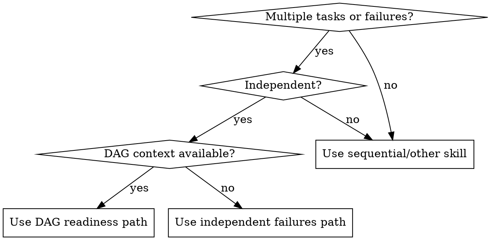

# arc-dispatching-parallel

## Overview

Dispatch multiple agents for independent tasks in parallel.

## When to Use


```dot
digraph when_to_use {
    "Multiple tasks or failures?" [shape=diamond];
    "Independent?" [shape=diamond];
    "DAG context available?" [shape=diamond];
    "Use DAG readiness path" [shape=box];
    "Use independent failures path" [shape=box];
    "Use sequential/other skill" [shape=box];

    "Multiple tasks or failures?" -> "Independent?" [label="yes"];
    "Multiple tasks or failures?" -> "Use sequential/other skill" [label="no"];
    "Independent?" -> "DAG context available?" [label="yes"];
    "Independent?" -> "Use sequential/other skill" [label="no"];
    "DAG context available?" -> "Use DAG readiness path" [label="yes"];
    "DAG context available?" -> "Use independent failures path" [label="no"];
}
```

Use when:

- Review finds multiple independent issues to fix
- Multiple independent features can be handled at once
- Multiple independent investigation/research tasks
- Any identified set of independent tasks
- Multiple independent failures or problem domains (different test files, subsystems, or root causes)

**Don't use when:**

- Tasks are related (fix one might fix others)
- Need to understand full system state
- Agents would interfere (editing same files)

## The Pattern

### 1. Identify Independent Tasks

Group by independence:

- No shared dependencies
- No shared files
- Can be understood without context from others

**Independence checks (examples):**

- Different test files with unrelated failures
- Different subsystems with no shared code paths
- Different files and no shared dependencies

### 2. Create Focused Prompts

Each agent gets:

- **Specific scope:** One problem/feature
- **Clear goal:** What to achieve
- **Constraints:** Don't change other code
- **Expected output:** Summary of changes

**Prompt template:**

```
Fix <problem-domain> in <file-or-subsystem>.

Context:
- Failure 1: <name> (<error/message>)
- Failure 2: <name> (<error/message>)

Constraints:
- Don't change unrelated files
- Avoid refactors outside this scope

Return:
- Root cause
- Fix summary
- Files changed
```

### 3. Dispatch in Parallel

Dispatch one subagent per task in a single message so they run concurrently:

```
Agent(subagent_type='general-purpose'): "Fix issue A in file X"
Agent(subagent_type='general-purpose'): "Fix issue B in file Y"
Agent(subagent_type='general-purpose'): "Fix issue C in file Z"
```

### 4. Review and Integrate

- Read each summary
- Verify no conflicts. If conflicts found: tasks were not truly independent — resolve manually and re-check grouping
- Verify the merged result with a fresh-context subagent rather than trusting
  the implementers' own reports:
  - `Agent(subagent_type='arcforge:verifier')` with the project test command —
    runs the suite from an empty context and returns raw output.
  - When a spec exists, also `Agent(subagent_type='arcforge:spec-reviewer')`
    with the relevant `specs/<spec-id>/.../*.md` attached — it confirms every
    acceptance criterion in the integrated branch.
- Integrate all changes only after the verifier (and spec-reviewer, if run) PASS

## DAG-Based Workflow

When `dag.yaml` exists (from `/arc-planning`), use this structured workflow.
If you don't have a DAG, skip to **Without DAG: Independent Failures** below.

### Step 1: Read the per-spec dag.yaml

Identify the spec you are working within (from the worktree's `.arcforge-epic` marker or the `--spec-id` argument passed by the lead), then:

```bash
cat specs/<spec-id>/dag.yaml
```

Parse the structure to understand:

- All features and their IDs
- Dependencies between features
- Current status of each feature

### Step 2: Identify Ready Features

A feature is ready when it is `pending` and every feature it `depends_on` is
`completed`. Don't hand-parse the dag for this — the engine computes it:

```bash
node "${ARCFORGE_ROOT}/scripts/cli.js" parallel --features --json
```

Output is the set of parallelizable features in the in-progress epic(s):

```json
{ "count": 2, "features": [{ "id": "feat-001", "name": "...", "epic": "epic-001" }] }
```

`count: 0` means nothing is ready right now — complete a blocking feature
first, or fall back to `arcforge next` for the single next task.

### Step 3: Group by Independence

Features are independent when:

- Feature A doesn't depend on Feature B
- Feature B doesn't depend on Feature A
- They don't share dependencies that create ordering

Example:

```
Features A, B, C have no dependencies → Group 1 (parallel)
Feature D depends on A → Must wait for Group 1
Feature E depends on B and C → Must wait for Group 1
```

### Step 4: Present Parallelization Plan

```
─────────────────────────────────────────────────
✅ Parallelization analysis complete

**Can run in parallel NOW:**
- Feature A: <description>
- Feature B: <description>
- Feature C: <description>

**Must wait (blocked):**
- Feature D: <description> (depends on: A)
- Feature E: <description> (depends on: B, C)

**Execution approach:**

Option 1: Sequential (safer)
  Implement A → B → C → D → E

Option 2: Parallel Group 1 (faster)
  Dispatch A, B, C in parallel
  Then implement D, E after Group 1 complete

Which approach? (1-2)
─────────────────────────────────────────────────
```

### Step 5: Execute Choice

#### Option 1: Sequential

Use `arc-implementing` to implement features one at a time in dependency order.

#### Option 2: Parallel

For each feature in the parallel group, dispatch a separate subagent — all in
one message so they run concurrently:

```
Agent(subagent_type='general-purpose'): "Implement feature <feature-id> from specs/<spec-id>/epics/<epic>/features/<feature>.md"
Agent(subagent_type='general-purpose'): "Implement feature <feature-id> from specs/<spec-id>/epics/<epic>/features/<feature>.md"
```

Wait for all to complete, then run the Step 4 verification gate
(`arcforge:verifier`, plus `arcforge:spec-reviewer` when a spec exists) before
proceeding to the next group.

### Step 6: Integrate with Coordinator

Fetch the next work from the engine (the `arc-coordinating` skill owns the full
lifecycle; these are the underlying CLI calls):

```bash
# Get the next parallelizable features
node "${ARCFORGE_ROOT}/scripts/cli.js" parallel --features --json

# Or get the next single task
node "${ARCFORGE_ROOT}/scripts/cli.js" next --json
```

## Without DAG: Independent Failures

When you have multiple independent failures but no `dag.yaml`:

1. **Group failures** by subsystem or file
2. **Apply independence checks** from The Pattern above
3. **Dispatch parallel agents** using the prompt template from The Pattern
4. **Integrate fixes** and run the full test suite
   - If conflicts found: tasks were not truly independent — resolve manually and re-check grouping

## Example: Post-Review Parallel Fixes

```
Review found 3 independent issues:
1. Missing validation in auth.py
2. Wrong error message in api.py
3. Missing test for utils.py

[Dispatch 3 agents in parallel]

Agent 1: Fixed auth.py validation
Agent 2: Fixed api.py error message
Agent 3: Added utils.py test

[Verify no conflicts]
[Run full test suite]
All fixes integrated successfully.
```

## Red Flags

- Dispatch for related issues (fix one might fix others)
- Skip conflict verification
- Proceed without full test suite run

## Common Rationalizations

| Excuse                             | Reality                              |
| ---------------------------------- | ------------------------------------ |
| "Sequential prevents conflicts"    | Parallel is safe when no deps        |
| "Parallelization too complex"      | DAG makes it clear                   |
| "User knows the dependencies"      | Present structured analysis          |
| "Worktrees handle parallelization" | That's epic-level, not feature-level |

## Stage Completion Format

```
─────────────────────────────────────────────────
✅ Parallel execution planned

Group 1: [Features A, B, C] (in parallel)
Group 2: [Features D, E] (after Group 1)

Approach: [Sequential/Parallel]
Next feature: [Feature ID]

Next: Begin implementation with `/arc-implementing`
─────────────────────────────────────────────────
```

## Blocked Format

```
─────────────────────────────────────────────────
⚠️ Parallelization analysis blocked

Issue: [dag.yaml not found / No features ready / Parse error]
Location: [file or epic]

To resolve:
1. Create dag.yaml with `/arc-planning`
2. Complete dependency features first
3. Fix dag.yaml syntax

Then retry: `/arc-dispatching-parallel`
─────────────────────────────────────────────────
```

## Related Skills

- **Before:** `/arc-planning` creates dag.yaml
- **During:** Use this skill to plan feature execution order
- **After:** `/arc-implementing` executes features
- **Related:** `/arc-coordinating` owns the DAG lifecycle (wraps `parallel`, `next`)

## Key Distinction

| Type              | Scope                         | Skill                                  |
| ----------------- | ----------------------------- | -------------------------------------- |
| **Epic-level**    | Multiple epics at once        | `arc-dispatching-teammates` (multi-epic via DAG) / `arc-coordinating` (lifecycle) |
| **Feature-level** | Multiple features within epic | This skill (`arc-dispatching-parallel`) |

**Example:**

- Epic 1: Features A, B, C in parallel (this skill, within one epic worktree)
- Epic 2: Features D, E in parallel (this skill, within its own epic worktree)
- The two epics run simultaneously as separate teammates via `arc-dispatching-teammates` / `arc-coordinating`
