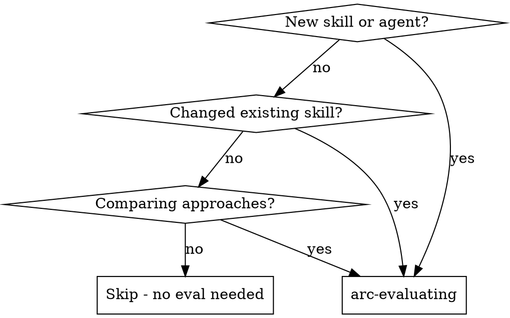

# arc-evaluating

Measure whether skills, agents, and workflows actually change LLM behavior. Define scenarios, run trials, grade results, track regressions.

**Core principle:** "Unit tests for AI behavior" — if you can't measure improvement, you can't ship with confidence.

## When to Use



## Three Eval Scopes

### 1. Skill Evals

Does skill X change LLM behavior?

- Run scenario WITHOUT the skill (baseline)
- Run scenario WITH the skill (treatment)
- Compare outputs using grader
- Measure: `delta` (improvement between baseline and treatment)

### 2. Agent Evals

Does agent Y produce correct output?

- Run agent with a defined scenario
- Grade output against acceptance criteria
- Measure: `pass@k` (reliability across k trials)

### 3. Workflow Evals

Does workflow A→B→C produce better outcomes?

- Run end-to-end workflow
- Grade final output
- Compare against alternative workflow
- Measure: `pass^k` for critical paths, `delta` for comparison

## The Process

```
1. Define eval    → scenario + assertions + grader type
2. Run eval       → spawn subagent with scenario, capture transcript
3. Grade eval     → code grader, model grader, or human grader
4. Track results  → pass@k metric over time (JSONL)
5. Report         → SHIP / NEEDS WORK / BLOCKED
```

### Step 1: Define Eval

Create a scenario file in `evals/scenarios/`:

```markdown
# Eval: [name]

## Scope
[skill | agent | workflow]

## Scenario
[The task or prompt to give the LLM]

## Context
[Any files, DAG state, or setup needed]

## Assertions
- [ ] [Specific, verifiable criterion 1]
- [ ] [Specific, verifiable criterion 2]

## Grader
[code | model | human]

## Grader Config
[For code: test command. For model: grading rubric. For human: review checklist]
```

### Step 2: Run Eval

For skill evals (A/B):
```
1. Run scenario WITHOUT skill → capture transcript A
2. Run scenario WITH skill → capture transcript B
```

For agent evals:
```
1. Spawn agent with scenario → capture transcript
```

For workflow evals:
```
1. Run full workflow → capture final output
```

### Step 3: Grade Eval

Three grader types:

| Grader | Use When | How |
|--------|----------|-----|
| **code** | Output is testable | Run test command, check exit code |
| **model** | Output needs judgment | Spawn eval-grader agent with rubric |
| **human** | Subjective quality | Present output + checklist for review |

### Step 4: Track Results

Results stored in `evals/results/` as JSONL (gitignored):

```json
{"eval": "skill-tdd-compliance", "trial": 1, "k": 5, "passed": true, "grader": "model", "score": 0.85, "timestamp": "2026-03-17T10:00:00Z"}
```

### Step 5: Report

| Verdict | Meaning | Threshold |
|---------|---------|-----------|
| **SHIP** | Consistently passes | pass@5 = 100% |
| **NEEDS WORK** | Flaky or partial | pass@5 < 100% but > 60% |
| **BLOCKED** | Fundamental issues | pass@5 < 60% |

## Metrics

| Metric | Formula | Use |
|--------|---------|-----|
| `pass@k` | At least 1 success in k trials | Reliability — "does it ever work?" |
| `pass^k` | All k trials succeed | Critical paths — "does it always work?" |
| `delta` | Treatment score - Baseline score | Improvement — "is it better?" |

## Storage Layout

```
evals/
├── scenarios/           # Eval definitions (version controlled)
│   ├── skill-tdd-compliance.md
│   ├── agent-planner-quality.md
│   └── workflow-brainstorm-to-execute.md
├── results/             # Run results (JSONL, gitignored)
│   └── 2026-03-17-skill-tdd.jsonl
└── benchmarks/          # Aggregated benchmarks (JSON, version controlled)
    └── latest.json
```

## Available Agents

| Agent | Role |
|-------|------|
| **eval-grader** | Grade individual eval outputs against rubrics |
| **eval-comparator** | Compare A/B results for skill/workflow evals |

## Red Flags

**Never:**
- Ship a skill without running evals
- Trust a single trial — always run k >= 3
- Compare trials run on different models
- Grade your own work (use independent grader)

**If eval keeps failing:**
1. Check if the scenario is well-defined (vague scenarios = unreliable results)
2. Check if assertions are measurable (subjective criteria = noisy grading)
3. Consider if the skill/agent needs fundamental redesign, not just tuning

## Integration

**Before:**
- **arc-brainstorming** → design the skill/agent being evaluated
- **arc-planning** → define what success looks like

**After:**
- **arc-evaluating** results inform whether to SHIP or iterate
- Track benchmarks over time in `evals/benchmarks/latest.json`
