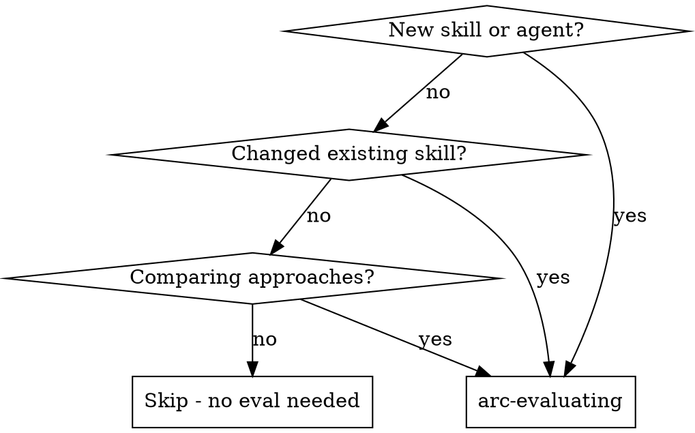

# arc-evaluating

Measure whether skills, agents, and workflows actually change AI agent behavior. Define scenarios, prepare environments, run trials, grade results, track regressions.

**Core principle:** "Unit tests for AI agent behavior" — if you can't measure improvement, you can't ship with confidence.

**Key distinction:** You are evaluating **AI agents** (LLM + tools), not just LLM text output. Agents use tools, read files, search codebases. Your eval environment must account for this.

## When to Use



## Three Eval Scopes

### 1. Skill Evals

Does skill X change agent behavior?

- Run scenario WITHOUT the skill (baseline)
- Run scenario WITH the skill (treatment)
- Compare outputs using grader
- Measure: `delta` (improvement between baseline and treatment)

### 2. Agent Evals

Does agent Y produce correct output?

- Run agent with a defined scenario
- Grade output against acceptance criteria
- Measure: `pass@k` (reliability across k trials)

### 3. Workflow Evals (System-Level)

Does the full toolkit system improve agent outcomes?

- **Baseline**: Agent runs in isolated environment (bare agent — no plugins, no MCP, no skills/hooks)
- **Treatment**: Agent runs with full toolkit (plugins, MCP, skills, hooks active)
- Same prompt, same assertions — only the **environment** varies
- Measure: `delta` (improvement from toolkit vs bare agent), `pass^k` for critical paths

This is the system-level evaluation: "does having the toolkit installed make the agent better at this task?" Unlike skill evals (which vary the prompt), workflow evals vary the environment while keeping the identical prompt for both conditions.

## The Process

```
1. Define eval    → scenario + assertions + grader type
2. Prepare env    → setup the trial environment (files, tools, context)
3. Run eval       → spawn agent with scenario, capture transcript
4. Grade eval     → code grader, model grader, or human grader
5. Track results  → pass@k metric over time (JSONL)
6. Report         → SHIP / NEEDS WORK / BLOCKED
```

### Step 1: Define Eval

Create a scenario file in `evals/scenarios/`:

```markdown
# Eval: [name]

## Scope
[skill | agent | workflow]

## Scenario
[The task or prompt to give the agent]

## Context
[Background info the agent needs to complete the task]

## Setup
[Shell command to prepare trial directory. Use $PROJECT_ROOT to copy project files.]
[Leave empty if the agent only needs the prompt Context to respond.]

## Assertions
- [ ] [Specific, verifiable criterion 1]
- [ ] [Specific, verifiable criterion 2]

## Grader
[code | model | human]

## Grader Config
[For code: test command. For model: grading rubric. For human: review checklist]
```

### Step 2: Prepare Environment

**Critical for AI agent evaluation.** Each trial runs in an isolated directory. The agent has tools (Read, Bash, Glob, Grep, etc.) and will use them. Design the environment accordingly:

| Scenario Type | Environment Needs | Setup Example |
|--------------|-------------------|---------------|
| Agent reads project code | Copy relevant files | `cp $PROJECT_ROOT/scripts/lib/eval.js .` |
| Agent writes new code | Empty dir is fine | (no setup needed) |
| Agent reviews existing code | Provide the code to review | `cp $PROJECT_ROOT/src/auth.js .` |
| Agent answers from context only | Empty dir, rich Context | (no setup needed, but Context must be sufficient) |

**If the agent times out** searching an empty directory, your scenario is missing a Setup or the Context is insufficient. This is a scenario design problem, not a system problem.

### Step 3: Run Eval

Trials run in isolated directories with plugins disabled, skills suppressed, and MCP servers stripped via `--strict-mcp-config` (prevents user-level MCP servers from inflating the system prompt). The agent has built-in tools but no project-specific context (CLAUDE.md, rules, hooks) unless provided via Setup.

For skill evals (A/B):
```
1. Run scenario WITHOUT skill → capture transcript A
2. Run scenario WITH skill → capture transcript B
```

For agent evals:
```
1. Spawn agent with scenario → capture transcript
```

For workflow evals (A/B):
```
1. Run scenario in ISOLATED environment (no plugins/MCP) → capture baseline
2. Run same scenario with FULL TOOLKIT (plugins, MCP active) → capture treatment
```
Both conditions run in `.eval-trials/` for workspace safety. The treatment trial has access to all installed plugins, MCP servers, and project skills/hooks — the baseline is a bare agent with no toolkit.

### Step 4: Grade Eval

Three grader types:

| Grader | Use When | How |
|--------|----------|-----|
| **code** | Output is testable (files, tests, structured artifacts) | Run test command, check exit code. `$TRIAL_DIR` env var available for checking trial artifacts. |
| **model** | Output needs judgment | Spawn eval-grader agent with rubric. Trial directory artifacts are automatically included in grader context. |
| **human** | Subjective quality | Present output + checklist for review |

**Prefer code grader** when assertions are verifiable: test exit codes, file existence, grep patterns. Code grading is free, deterministic, and more reliable than model grading. Use model grader only when assertions require subjective judgment (e.g., "review is well-structured").

### Step 5: Track Results

Results stored in `evals/results/` as JSONL (gitignored):

```json
{"eval": "skill-tdd-compliance", "trial": 1, "k": 5, "passed": true, "grader": "model", "score": 0.85, "timestamp": "2026-03-17T10:00:00Z"}
```

### Step 6: Report

| Verdict | Meaning | Threshold |
|---------|---------|-----------|
| **SHIP** | Consistently passes | pass rate = 100% |
| **NEEDS WORK** | Flaky or partial | 60% ≤ pass rate < 100% |
| **BLOCKED** | Fundamental issues | pass rate < 60% |

## Metrics

| Metric | Formula | Use |
|--------|---------|-----|
| `pass@k` | At least 1 success in k trials | Reliability — "does it ever work?" |
| `pass^k` | All k trials succeed | Critical paths — "does it always work?" |
| `delta` | Treatment score - Baseline score | Improvement — "is it better?" |

## Storage Layout

```
evals/
├── scenarios/           # Eval definitions (version controlled)
├── results/             # Run results (JSONL, gitignored)
│   └── transcripts/     # Full trial outputs
└── benchmarks/          # Aggregated benchmarks (JSON, version controlled)
    └── latest.json
```

## Available Agents

| Agent | Role |
|-------|------|
| **eval-grader** | Grade individual eval outputs against rubrics |
| **eval-comparator** | Compare A/B results for skill/workflow evals |

## Common Mistakes

| Mistake | What Happens | Fix |
|---------|-------------|-----|
| Comprehension scenario labeled as agent eval | Measures text quality, not tool-using behavior; misleading pass rates | Add `**Eval type: comprehension**` to Context, or redesign with Setup + file artifacts |
| Model grader for deterministic output | Noisy scores, false positives from LLM hallucination | Use code grader with `$TRIAL_DIR` — verify files, run tests, grep patterns |
| Empty trial dir without Setup or Context | Agent spends 5+ minutes searching nothing, then times out | Add Setup to copy needed files, or provide sufficient Context for text-only responses |
| Assertions that can't be verified by chosen grader | Code grader can't check "well-structured"; model grader is overkill for "file exists" | Match grader to assertion type — code for existence/correctness, model for judgment |
| Running k=1 and trusting the result | No variance information, single lucky/unlucky trial dominates | Always k >= 3; system warns at k < 5 |
| Grading stdout claims without checking artifacts | Agent says "I created the file" but didn't; grader scores the claim | Use code grader against `$TRIAL_DIR`, or model grader (artifacts auto-included) |
| Using `--skill-file` for workflow eval | Varies the prompt instead of the environment — measures the wrong thing | Workflow A/B varies the environment. Use `eval ab <name>` without `--skill-file` for workflow scope |
| Workflow eval with no plugins installed | Baseline and treatment are identical, delta is always 0 | Ensure toolkit plugin is installed: `claude plugin list` should show active plugins |
| Workflow scenario too skill-specific | Biases toward the toolkit — tests one skill, not systemic value | Use realistic, diverse tasks where the toolkit's value is non-obvious |

## Red Flags

**Never:**
- Ship a skill without running evals
- Trust a single trial — always run k >= 3
- Compare trials run on different models
- Grade your own work (use independent grader)
- Run agent evals in an empty directory without Setup or sufficient Context

**If eval keeps failing:**
1. Check if the scenario is well-defined (vague scenarios = unreliable results)
2. Check if assertions are measurable (subjective criteria = noisy grading)
3. Check if the agent has what it needs (files, context) to complete the task
4. Consider if the skill/agent needs fundamental redesign, not just tuning

## CLI Reference

```
arc eval list                                          # List all scenarios
arc eval run <name> --k 5                              # Run k trials, grade, show verdict
arc eval ab <skill-scenario> --skill-file path --k 5   # Skill A/B (varies prompt)
arc eval ab <workflow-scenario> --k 5 --interleave     # Workflow A/B (varies environment)
arc eval compare <name>                                # Compare saved A/B results
arc eval report [name]                                 # Generate benchmark report
arc eval history                                       # List benchmark snapshots
```

For skill scope, `--skill-file` is required (the treatment prepends the skill instruction). For workflow scope, `--skill-file` is not needed — the treatment is the environment itself (plugins, MCP, skills active vs isolated bare agent). The scope is auto-detected from the scenario file.

## Integration

**Before:**
- **arc-brainstorming** → design the skill/agent being evaluated
- **arc-planning** → define what success looks like

**After:**
- **arc-evaluating** results inform whether to SHIP or iterate
- Track benchmarks over time in `evals/benchmarks/latest.json`
