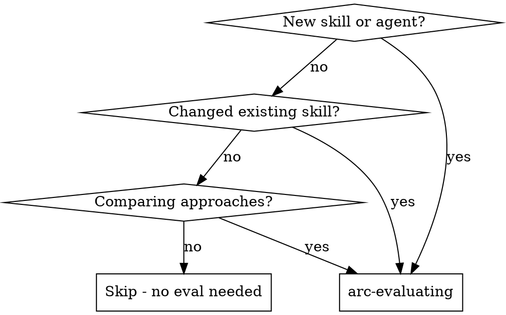

# arc-evaluating

Measure whether skills, agents, and workflows actually change AI agent behavior. Define scenarios, prepare environments, run trials, grade results, track regressions.

**Core principle:** "Unit tests for AI agent behavior" — if you can't measure improvement, you can't ship with confidence.

**Key distinction:** You are evaluating **AI agents** (LLM + tools), not just LLM text output. Agents use tools, read files, search codebases. Your eval environment must account for this.

## When to Use



## Three Eval Scopes

### 1. Skill Evals

Does skill X change agent behavior?

- Run scenario WITHOUT the skill (baseline)
- Run scenario WITH the skill (treatment)
- Compare outputs using grader
- Measure: `delta` (improvement between baseline and treatment)

### 2. Agent Evals

Does agent Y produce correct output?

- Run agent with a defined scenario
- Grade output against acceptance criteria
- Measure: `pass@k` (reliability across k trials)

### 3. Workflow Evals (System-Level)

Does the full toolkit system improve agent outcomes?

- **Baseline**: Agent runs in isolated environment (bare agent — no plugins, no MCP, no skills/hooks)
- **Treatment**: Agent runs with full toolkit (plugins, MCP, skills, hooks active)
- Same prompt, same assertions — only the **environment** varies
- Measure: `delta` (improvement from toolkit vs bare agent), `pass^k` for critical paths

This is the system-level evaluation: "does having the toolkit installed make the agent better at this task?" Unlike skill evals (which vary the prompt), workflow evals vary the environment while keeping the identical prompt for both conditions.

## Scope Alignment (MANDATORY)

Before designing any scenario, **confirm scope with the user**. Do NOT assume — ask.

1. **What is the eval target?** (skill, agent, hook, pipeline, infrastructure component)
2. **What question are you answering?** (match to table below)
3. **What Claude behavior would change?** If the answer is only side-effect artifacts (files, logs, counters) and not Claude's actions or output — the eval harness is the wrong tool.

Do NOT proceed to scenario design until the user confirms scope.

## Question First

Before you choose a metric, ask: **what are you trying to learn?**

If you cannot answer that in one sentence, you are not ready to design the scenario.

| Question | Scope | What Varies | What Stays Fixed | Primary Signal |
|----------|-------|-------------|------------------|----------------|
| Does this instruction change agent behavior? | **skill** | Skill present vs absent | Same scenario, model, setup | `delta` |
| Can this agent complete the task correctly? | **agent** | Trial-to-trial execution | Task, environment, assertions | `pass@k`, `pass^k` |
| Does the toolkit/environment improve outcomes? | **workflow** | Bare agent vs full toolkit | Same prompt, model, scenario | `delta`, `pass^k` |
| Does this component work correctly? | **none** | N/A | N/A | Use unit/integration tests, not eval harness |

Three common questions:
- **Behavior change**: "Did the skill cause different choices?"
- **Task outcome**: "Did the agent produce the correct output?"
- **Toolkit effect**: "Did the environment make the same agent better?"

If your question is "does this infrastructure work?" — it doesn't fit any scope. Use unit tests or E2E integration tests instead. The eval harness measures **Claude's behavior**, not infrastructure correctness.

Do not collapse these into one fuzzy "quality" question. A skill-adherence eval and an outcome-quality eval are different harnesses, even if both involve the same task domain.

**Mixed targets** (e.g., hooks): Some components have both behavior-affecting and infrastructure aspects. Separate them — eval the behavior-affecting parts (workflow scope), test the infrastructure parts with unit/E2E tests. Do not lump both into one eval.

**Validity vs Reliability trade-off:** A valid measurement captures the real signal (does the agent actually review code well?). A reliable measurement produces consistent scores across trials (does the grader always agree with itself?). When forced to choose, prefer validity — a noisy-but-real signal is more useful than a precise-but-fake one. Code grading is reliable but only valid for deterministic checks. Model grading is noisier but valid for judgment. Never sacrifice validity for reliability by converting judgment assertions into string-matching proxies.

## The Process

```
1. Define eval    → scenario + assertions + grader type
2. Prepare env    → setup the trial environment (files, tools, context)
3. Run eval       → spawn agent with scenario, capture transcript
4. Grade eval     → code grader, model grader, or human grader
5. Track results  → pass@k metric over time (JSONL)
6. Report         → SHIP / NEEDS WORK / BLOCKED
```

### Step 1: Define Eval

Create a scenario file in `evals/scenarios/`:

```markdown
# Eval: [name]

## Scope
[skill | agent | workflow]

## Target
[What this eval tests. Meaning varies by scope:]
[  skill: path to skill file (e.g., skills/arc-tdd/SKILL.md) — used as default --skill-file]
[  agent: path to agent definition (e.g., agents/eval-grader.md) — documentation]
[  workflow: description of the toolkit/pipeline being tested — documentation]

## Scenario
[The task or prompt to give the agent]

## Context
[Background info the agent needs to complete the task]

## Setup
[Shell command to prepare trial directory. Use $PROJECT_ROOT to copy project files.]
[Leave empty if the agent only needs the prompt Context to respond.]

## Assertions
- [ ] [Specific, verifiable criterion 1]
- [ ] [Specific, verifiable criterion 2]

## Grader
[code | model | human]

## Grader Config
[For code: test command. For model: grading rubric. For human: review checklist]

## Trials
[Optional: explicit trial count. Omit to use scenario-driven defaults.]

## Version
[Optional: bump when assertions change materially. Filters out stale historical results.]
```

### Scenario Design Rules

**Scenario files are single-condition.**

Do **not** put separate baseline and treatment sections into one scenario file. `arc eval ab` owns the A/B loop. It runs the same single-condition scenario twice and varies only the skill or environment.

For skill evals, start with narrow discriminative scenarios:
- **One behavior per scenario** when testing adherence. Isolate one behavior so lift can be attributed to one instruction.
- **Include a trap or bait** that a non-skill agent is likely to mishandle. Without a discriminative trap, you are measuring generic competence, not skill adherence.
- **Make ground truth defensible.** Assertions must be supportable from the provided context, not from hidden repo conventions or debatable reviewer taste.
- **Prefer 3-5 narrow scenarios over one overloaded scenario.** Add a capstone scenario only after the isolated behaviors are stable.

Good skill-eval scenario:
- Same task format in baseline and treatment
- One planted challenge tied to one rule
- Assertions that describe the expected behavior difference

Bad skill-eval scenario:
- One giant prompt testing everything at once
- No clear reason baseline and treatment would diverge
- Assertions that depend on arguable judgment calls

If the task is deterministic but your assertion is vague, fix the assertion. If the judgment is inherently subjective, switch to model or human grading instead of pretending code grading can capture it.

**Quick design checklist** (verify before writing assertions — applies to ALL scopes):
1. Can I name the specific **Claude behavior** this scenario tests? → If the answer is "file exists" or "no errors", you're testing infrastructure, not behavior — use unit/E2E tests instead
2. Would my assertions fail if I **disabled** the component under test? → If no, the eval has no discriminative power and will pass vacuously
3. Can I describe why baseline will fail? → If no, scenario isn't discriminative
4. Does each assertion use the right grader for its nature? → Code for facts, model for judgment
5. Is the output format small enough for consistent grading? → Prefer short structured artifacts

### Scenario Validity Preflight

Before spending a full A/B run on a new skill-eval scenario, do a quick validity check:

1. **Expected baseline failure**
   - Complete this sentence: "A non-skill agent is likely to fail because ___".
   - If you cannot name the likely failure mode, the scenario is probably not discriminative.
2. **Ceiling / floor risk**
   - Run 2-3 pilot trials before the full run.
   - If baseline already looks likely to score above ~0.8, or both sides look near 0, redesign before spending more trials.
3. **Answer leakage**
   - Do not tell the agent the repair pattern you want it to discover.
   - If the prompt explicitly names the correct grader split, decomposition, or target repair structure, you are testing prompt compliance, not skill adherence.
   - **Self-test:** Read the scenario prompt without the skill. If a competent agent could infer the expected answer from the prompt alone, the answer is leaked. The skill should provide the insight, not the prompt.
4. **Escape hatches**
   - Preserve the tension you want to test, but do not prescribe the exact fix.
   - It is valid to forbid changing the task, diff, or contract if those are the point of the eval.
   - It is not valid to also tell the agent the exact structure of the correct repair, because that removes the discriminative step.
   - Watch for scenarios where the agent can dissolve the tension entirely — e.g., rewriting the task prompt, switching to a different evaluation domain, or simplifying the code under test so the hard part disappears. The scenario must constrain what can change while leaving the "how to solve it" open.
5. **Output-complexity budget**
   - Prefer short structured outputs over rewriting full scenario files, especially for comprehension or model-graded evals.
   - Long outputs increase grading noise and often test formatting endurance rather than the target behavior.

### Step 2: Prepare Environment

**Critical for AI agent evaluation.** Each trial runs in an isolated directory. The agent has tools (Read, Bash, Glob, Grep, etc.) and will use them. Design the environment accordingly:

| Scenario Type | Environment Needs | Setup Example |
|--------------|-------------------|---------------|
| Agent reads project code | Copy relevant files | `cp $PROJECT_ROOT/scripts/lib/eval.js .` |
| Agent writes new code | Empty dir is fine | (no setup needed) |
| Agent reviews existing code | Provide the code to review | `cp $PROJECT_ROOT/src/auth.js .` |
| Agent answers from context only | Empty dir, rich Context | (no setup needed, but Context must be sufficient) |

**If the agent times out** searching an empty directory, your scenario is missing a Setup or the Context is insufficient. This is a scenario design problem, not a system problem.

### Step 3: Run Eval

Trials run in isolated directories with plugins disabled, skills suppressed, and MCP servers stripped via `--strict-mcp-config` (prevents user-level MCP servers from inflating the system prompt). The agent has built-in tools but no project-specific context (CLAUDE.md, rules, hooks) unless provided via Setup.

For skill evals (A/B):
```
1. Run scenario WITHOUT skill → capture transcript A
2. Run scenario WITH skill → capture transcript B
```

For agent evals:
```
1. Spawn agent with scenario → capture transcript
```

For workflow evals (A/B):
```
1. Run scenario in ISOLATED environment (no plugins/MCP) → capture baseline
2. Run same scenario with FULL TOOLKIT (plugins, MCP active) → capture treatment
```
Both conditions run in `.eval-trials/` for workspace safety. The treatment trial has access to all installed plugins, MCP servers, and project skills/hooks — the baseline is a bare agent with no toolkit.

### Step 4: Grade Eval

Three grader types — choose based on the assertion's nature, not convenience.

**Key principle:** Structured output (JSON, typed fields) does not make semantic quality deterministic. An agent can return valid JSON with correctly typed fields while still producing a poor security analysis or vague fix suggestion. Structure is code-verifiable; quality is not. When an assertion checks *what* the output contains, use code grading. When it checks *how good* the content is, use model grading.

| Grader | Use When | Not For | How |
|--------|----------|---------|-----|
| **code** | Assertions have deterministic correct answers (file exists, test passes, value matches expected) | Quality or intent judgment — don't rewrite assertions into grep proxies to force code grading | Run test command, check exit code. `$TRIAL_DIR` env var available for checking trial artifacts. |
| **model** | Assertions require understanding intent, quality, or reasoning (e.g., "identifies root cause", "explanation is clear", "follows systematic methodology") | Checks that can be verified by running commands — adds noise without value | Reads `agents/eval-grader.md` as grading methodology, scores each assertion on a normalized 0.0-1.0 scale, and uses trial artifacts as evidence when available. Harness logic computes overall score and pass/fail from the returned per-assertion scores. |
| **human** | Assertions involve audience-dependent experience, taste, or domain expertise that even LLMs assess unreliably (e.g., "feels intuitive", "tone matches brand") | Assessments an LLM can judge — save human bandwidth for what only humans can evaluate | Present output + checklist for review |

Some behavioral qualities cannot be captured by deterministic tests alone. When evaluating methodology, reasoning quality, or communication clarity, model or human grading captures signal that code grading structurally cannot. Match the grader to the assertion — not the other way around.

**When a goal has both deterministic and judgment aspects** (e.g., "agent writes good error handling"): split into complementary scenarios — one code-graded for verifiable aspects (tests pass, no empty catch blocks), one model-graded for judgment aspects (error messages are contextual, errors handled at appropriate layer).

Example: an eval where the agent returns a JSON code review. Split the assertions:
- Code grader: "output is valid JSON", "every finding has required fields" (structure — deterministic)
- Model grader: "SQL injection finding is correctly categorized and fix is sound" (quality — requires judgment)

### Step 5: Track Results

Results stored in `evals/results/` as JSONL (gitignored):

```json
{"eval": "skill-tdd-compliance", "trial": 1, "k": 5, "passed": true, "grader": "model", "score": 1.0, "timestamp": "2026-03-17T10:00:00Z"}
```

### Step 6: Report

| Verdict | Meaning | Threshold |
|---------|---------|-----------|
| **SHIP** | Consistently passes | Code-graded: pass rate = 100%. Model-graded: CI95 lower bound ≥ 0.8 (noise-tolerant) |
| **NEEDS WORK** | Flaky or partial | 60% ≤ pass rate < SHIP threshold |
| **BLOCKED** | Fundamental issues | pass rate < 60% |

## Metrics

| Metric | Formula | Use |
|--------|---------|-----|
| `pass@k` | At least 1 success in k trials | Reliability — "does it ever work?" |
| `pass^k` | All k trials succeed | Critical paths — "does it always work?" |
| `delta` | Treatment score - Baseline score | Improvement — "is it better?" |
| `delta CI` | 95% CI for delta (Welch's t-test) | When k ≥ 5: IMPROVED if lower > 0, REGRESSED if upper < 0 |
| `CI95` | 95% confidence interval (t-distribution) | Only shown when k >= 5 — "how precise is the average?" |

### Default Trial Counts (scenario-driven)

k is determined by eval type and grader, not a fixed default:

| Eval type | Code grader | Model grader |
|-----------|-------------|--------------|
| `eval run` (single condition) | k=3 | k=5 |
| `eval ab` (A/B, per group) | k=5 | k=10 |

A/B needs more data for meaningful delta. Model grading adds noise, requiring more trials.

Override with `## Trials` in the scenario file, or `--k` on the CLI.

## Storage Layout

```
evals/
├── scenarios/                    # Eval definitions (version controlled)
├── results/                      # Run results (gitignored)
│   └── <scenarioName>/           # Grouped by scenario
│       └── <runId>/              # Grouped by run (YYYYMMDD-HHmmss)
│           ├── results.jsonl     # Single-run trials
│           ├── baseline.jsonl    # A/B baseline trials
│           ├── treatment.jsonl   # A/B treatment trials
│           └── transcripts/      # Full trial outputs
└── benchmarks/                   # Aggregated benchmarks (JSON, version controlled)
    └── latest.json
```

## Available Agents

| Agent | Role | Used By |
|-------|------|---------|
| **eval-grader** | Grade individual eval outputs against rubrics | `arc eval run` (automated, model-graded scenarios) + manual dispatch |
| **eval-comparator** | Compare A/B results for skill/workflow evals | `arc eval compare` (automated, model/human-graded scenarios) + manual dispatch |

**Important:** numeric comparison is programmatic. The harness computes averages, `delta`, confidence intervals, and verdicts directly from saved results. `eval-comparator` adds **qualitative** analysis for model/human-graded A/B results; it does not replace the programmatic numeric verdict.

## Common Mistakes

| Mistake | What Happens | Fix |
|---------|-------------|-----|
| Writing the scenario before naming the eval question | You end up mixing adherence, correctness, and toolkit effects in one noisy test | State the question first: behavior change, task outcome, or environment/toolkit effect |
| Putting baseline/treatment structure inside the scenario file | The scenario no longer matches the harness contract; A/B logic is duplicated and confusing | Keep the scenario single-condition and let `arc eval ab` vary skill or environment |
| One overloaded skill-eval scenario with no trap | Baseline and treatment both look similar; delta is uninformative | Isolate one behavior per scenario and add a discriminative trap or bait |
| Baseline already near ceiling | Both conditions pass, delta stays tiny, and repeated runs remain inconclusive | Run 2-3 pilot trials first; if baseline already looks likely to exceed ~0.8, redesign before full A/B |
| Assertions with weak or arguable ground truth | Grading becomes subjective noise, and disagreements look like regressions | Make assertions defensible from the given context or split the scenario |
| Comprehension scenario labeled as agent eval | Measures text quality, not tool-using behavior; misleading pass rates | Add `**Eval type: comprehension**` to Context, or redesign with Setup + file artifacts |
| Prompt leaks the repair pattern | Baseline follows the template and scores high without the skill | Remove explicit grader split, required decomposition, or named repair structure from the prompt |
| Model grader for deterministic output | Noisy scores, false positives from LLM hallucination | Use code grader with `$TRIAL_DIR` — verify files, run tests, grep patterns |
| Empty trial dir without Setup or Context | Agent spends 5+ minutes searching nothing, then times out | Add Setup to copy needed files, or provide sufficient Context for text-only responses |
| Assertions that can't be verified by chosen grader | Code grader can't check "well-structured"; model grader is overkill for "file exists" | Match grader to assertion type — code for existence/correctness, model for judgment |
| Scenario allows an escape hatch | Agent changes the task so the target tension disappears instead of solving it | Preserve the contract or artifact under test, but do not prescribe the exact repair |
| Rewriting assertions to fit preferred grader | "Well-structured code" becomes "name > 10 chars" — measures surface proxy, not actual quality (validity sacrificed for reliability) | Choose grader to match assertion's nature. If the assertion requires judgment, use model/human grader — don't reshape it into a grep pattern |
| Code-grading semantic quality because output is structured JSON | `grep "security"` on a JSON review finding checks the label, not whether the analysis is correct — a hallucinated fix still passes | Structure checks (field exists, type correct) → code grader. Content quality (analysis is sound, fix is correct) → model grader. Split when both aspects matter. |
| Scenario response shape is too large | Model grading gets noisier, and failures reflect output length more than target behavior | Require a short structured artifact instead of full markdown rewrites |
| Running k=1 and trusting the result | No variance information, single lucky/unlucky trial dominates | Use scenario-driven defaults (k=3-10 depending on eval type and grader); CI shown at k >= 5 |
| Grading stdout claims without checking artifacts | Agent says "I created the file" but didn't; grader scores the claim | Use code grader against `$TRIAL_DIR`, or model grader (artifacts auto-included) |
| Using `--skill-file` for workflow eval | Varies the prompt instead of the environment — measures the wrong thing | Workflow A/B varies the environment. Use `eval ab <name>` without `--skill-file` for workflow scope |
| Workflow eval with no plugins installed | Baseline and treatment are identical, delta is always 0 | Ensure toolkit plugin is installed: `claude plugin list` should show active plugins |
| Workflow scenario too skill-specific | Biases toward the toolkit — tests one skill, not systemic value | Use realistic, diverse tasks where the toolkit's value is non-obvious |
| Testing infrastructure artifacts instead of Claude's behavior | Eval checks "log file exists" or "JSON is valid" — passes trivially but doesn't prove the component affected Claude's session | Ask: "does my eval measure how Claude **behaved**, or just whether a side-effect file appeared?" If the latter, use unit/integration tests |
| Choosing the easiest-to-measure aspect over the meaningful one | Eval tests a side-effect hook (easy: check file) instead of a context-injection hook (meaningful: check Claude's awareness) — results are technically correct but answer the wrong question | For each component, first identify HOW it affects Claude's behavior, then test THAT — not the convenient side-effect |

## Red Flags

**Never:**
- Ship a skill without running evals
- Trust a single trial — always run k >= 3
- Compare trials run on different models
- Grade your own work (use independent grader)
- Run agent evals in an empty directory without Setup or sufficient Context

**If eval keeps failing:**
1. Check if the scenario is well-defined (vague scenarios = unreliable results)
2. Check if assertions are measurable (subjective criteria = noisy grading)
3. Check if the agent has what it needs (files, context) to complete the task
4. Consider if the skill/agent needs fundamental redesign, not just tuning

**If delta stays near zero (baseline ≈ treatment):**
1. Baseline is at ceiling — the scenario isn't discriminative. Add a harder trap that requires the skill's specific insight.
2. Treatment is at floor — the skill isn't helping. Re-read the skill and verify its instructions actually address the scenario's challenge.
3. Both are mediocre — the scenario may be testing generic competence rather than skill-specific behavior. Narrow the scope to one rule.

## CLI Reference

```
arc eval list                                          # List all scenarios
arc eval run <name>                                    # Run trials (k auto-determined by scope+grader)
arc eval run <name> --k 5                              # Override default k
arc eval run <name> --model sonnet                     # Run with specific model
arc eval ab <skill-scenario> --skill-file path         # Skill A/B (varies prompt)
arc eval ab <workflow-scenario> --interleave            # Workflow A/B (varies environment)
arc eval ab <name> --skill-file path --model opus      # A/B with specific model
arc eval compare <name>                                # Compare saved A/B results (routes by grader type)
arc eval compare <name> --since 2026-03-18             # Compare only results after a date
arc eval compare <name> --model sonnet                 # Compare filtered by model
arc eval report [name]                                 # Generate benchmark report
arc eval report [name] --model opus                    # Report filtered by model
arc eval history                                       # List benchmark snapshots
arc eval dashboard [--port N]                          # Start live dashboard (default: 3333)
```

- k is auto-determined from scope + grader type (see default trial counts above). Use `--k` to override.
- `--since` filters results by date — useful after scenario changes to exclude old data.
- `--model` specifies which LLM to use for trial execution (not grading). Results are tagged with the model for later filtering and cross-model comparison.
- For skill scope, `--skill-file` is required. For workflow scope, it is not needed.
- `eval compare` auto-routes: code-graded → programmatic delta, model-graded → eval-comparator agent analysis.
- `eval dashboard` starts a live web dashboard at http://localhost:3333 for visual eval monitoring.

## Integration

**Before:**
- **arc-brainstorming** → design the skill/agent being evaluated
- **arc-planning** → define what success looks like

**After:**
- **arc-evaluating** results inform whether to SHIP or iterate
- Track benchmarks over time in `evals/benchmarks/latest.json`
