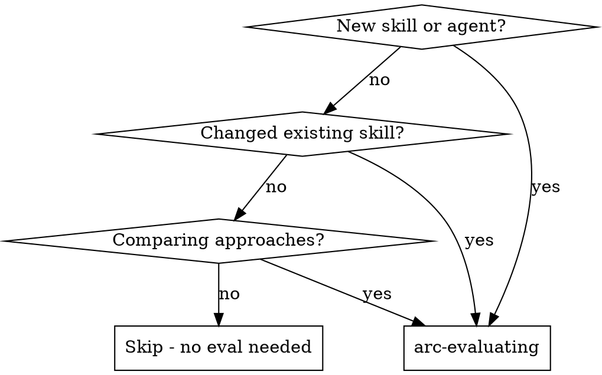

# arc-evaluating

Measure whether skills, agents, and workflows actually change AI agent behavior. Define scenarios, prepare environments, run trials, grade results, track regressions.

**Core principle:** "Unit tests for AI agent behavior" — if you can't measure improvement, you can't ship with confidence.

**Key distinction:** You are evaluating **AI agents** (LLM + tools), not just LLM text output. Agents use tools, read files, search codebases. Your eval environment must account for this.

## When to Use



## Three Eval Scopes

### 1. Skill Evals

Does skill X change agent behavior?

- Run scenario WITHOUT the skill (baseline)
- Run scenario WITH the skill (treatment)
- Compare outputs using grader
- Measure: `delta` (improvement between baseline and treatment)

### 2. Agent Evals

Does agent Y produce correct output?

- Run agent with a defined scenario
- Grade output against acceptance criteria
- Measure: `pass@k` (reliability across k trials)

### 3. Workflow Evals (System-Level)

Does the full toolkit system improve agent outcomes?

- **Baseline**: Agent runs in isolated environment (bare agent — no plugins, no MCP, no skills/hooks)
- **Treatment**: Agent runs with full toolkit (plugins, MCP, skills, hooks active)
- Same prompt, same assertions — only the **environment** varies
- Measure: `delta` (improvement from toolkit vs bare agent), `pass^k` for critical paths

Unlike skill evals (which vary the prompt), workflow evals vary the environment while keeping the identical prompt for both conditions.

## Scope Alignment (MANDATORY)

Before designing any scenario, **confirm scope with the user**:

1. **What is the eval target?** (skill, agent, hook, pipeline, infrastructure component)
2. **What question are you answering?** (match to table below)
3. **What Claude behavior would change?** If the answer is only side-effect artifacts (files, logs, counters) and not Claude's actions or output — the eval harness is the wrong tool.

Do NOT proceed to scenario design until the user confirms scope.

## Question First

Before you choose a metric, ask: **what are you trying to learn?**

If you cannot answer that in one sentence, you are not ready to design the scenario.

| Question | Scope | What Varies | What Stays Fixed | Primary Signal |
|----------|-------|-------------|------------------|----------------|
| Does this instruction change agent behavior? | **skill** | Skill present vs absent | Same scenario, model, setup | `delta` |
| Can this agent complete the task correctly? | **agent** | Trial-to-trial execution | Task, environment, assertions | `pass@k`, `pass^k` |
| Does the toolkit/environment improve outcomes? | **workflow** | Bare agent vs full toolkit | Same prompt, model, scenario | `delta`, `pass^k` |
| Does this component work correctly? | **none** | N/A | N/A | Use unit/integration tests, not eval harness |

Three common questions:
- **Behavior change**: "Did the skill cause different choices?"
- **Task outcome**: "Did the agent produce the correct output?"
- **Toolkit effect**: "Did the environment make the same agent better?"

If your question is "does this infrastructure work?" — use unit tests or E2E integration tests instead. The eval harness measures **Claude's behavior**, not infrastructure correctness.

Do not collapse these into one fuzzy "quality" question. A skill-adherence eval and an outcome-quality eval are different harnesses, even if both involve the same task domain.

**Mixed targets** (e.g., hooks): Some components have both behavior-affecting and infrastructure aspects. Separate them — eval the behavior-affecting parts (workflow scope), test the infrastructure parts with unit/E2E tests.

**Validity vs Reliability:** Prefer validity (real signal) over reliability (consistent scores). A noisy-but-real signal beats a precise-but-fake one. Never sacrifice validity for reliability by converting judgment assertions into string-matching proxies.

## The Process

```
1. Define eval    → scenario + assertions + grader type
2. Prepare env    → setup the trial environment (files, tools, context)
3. Run eval       → spawn agent with scenario, capture transcript
4. Grade eval     → code grader, model grader, or human grader
5. Track results  → pass@k metric over time (JSONL)
6. Report         → SHIP / NEEDS WORK / BLOCKED
```

### Step 1: Define Eval

Create a scenario file in `evals/scenarios/`. See `references/cli-and-metrics.md` for the full scenario template.

Scenario files are **single-condition**. Do not put separate baseline and treatment sections into one scenario file. `arc eval ab` owns the A/B loop — it runs the same single-condition scenario twice and varies only the skill or environment.

### Scenario Validity Preflight

**Before investing in scenario design**, do a quick validity check:

1. **Expected baseline failure**
   - Complete this sentence: "A non-skill agent is likely to fail because ___".
   - If you cannot name the likely failure mode, the scenario is probably not discriminative.
   - **Challenge your answer:** Now imagine a baseline agent with the same prompt, same files, same tools — but no skill. Would it actually behave differently? If the behavior is "read a provided file and follow its instructions", that's generic agent competence, not skill-specific behavior. Redesign the scenario or reconsider the scope.
2. **Ceiling / floor risk**
   - Run 2-3 pilot trials before the full run.
   - If baseline already looks likely to score above ~0.8, or both sides look near 0, redesign before spending more trials.
3. **Answer leakage**
   - Do not tell the agent the repair pattern you want it to discover.
   - **Self-test:** Read the scenario prompt without the skill. If a competent agent could infer the expected answer from the prompt alone, the answer is leaked.
4. **Escape hatches**
   - Preserve the tension you want to test, but do not prescribe the exact fix.
   - Watch for scenarios where the agent can dissolve the tension entirely — e.g., rewriting the task prompt, switching to a different domain, or simplifying the code so the hard part disappears.
5. **Output-complexity budget**
   - Prefer short structured outputs. Long outputs increase grading noise and test formatting endurance rather than target behavior.

### When to Step Back

If 2+ redesigns haven't produced a discriminative scenario, **stop iterating**:

- The skill may not teach new behavior — it formalizes what agents already do
- The eval scope may be wrong — try workflow or agent instead of skill
- The behavior may not be measurable via A/B

Escalate to the user rather than continuing to iterate silently.

### Scenario Design Rules

For skill evals, start with narrow discriminative scenarios:
- **One behavior per scenario** when testing adherence. Isolate one behavior so lift can be attributed to one instruction.
- **Include a trap or bait** that a non-skill agent is likely to mishandle. Without a discriminative trap, you are measuring generic competence, not skill adherence.
- **Make ground truth defensible.** Assertions must be supportable from the provided context, not from hidden repo conventions or debatable reviewer taste.
- **Prefer 3-5 narrow scenarios over one overloaded scenario.** Add a capstone scenario only after the isolated behaviors are stable.

**Quick design checklist** (verify before writing assertions — applies to ALL scopes):
1. Can I name the specific **Claude behavior** this scenario tests? → If the answer is "file exists" or "no errors", you're testing infrastructure, not behavior
2. Would my assertions fail if I **disabled** the component under test? → If no, the eval has no discriminative power
3. Can I describe why baseline will fail? → If no, scenario isn't discriminative
4. Does each assertion use the right grader for its nature? → Code for facts, model for judgment
5. Is the output format small enough for consistent grading? → Prefer short structured artifacts

### Steps 2-5: Prepare, Run, Grade, Track

See `references/grading-and-execution.md` for detailed guidance on environment setup, trial execution, isolation mechanics, and result tracking.

**Grader selection principle:** Structured output (JSON, typed fields) does not make semantic quality deterministic. An agent can return valid JSON with correctly typed fields while still producing poor analysis. When an assertion checks *what* the output contains, use code grading. When it checks *how good* the content is, use model grading.

Three graders: **code** (deterministic checks — file exists, test passes), **model** (intent/quality/reasoning judgment), **human** (audience-dependent taste or domain expertise). Match grader to assertion — not the other way around.

### Step 6: Report

| Verdict | Meaning | Threshold |
|---------|---------|-----------|
| **SHIP** | Consistently passes | Code-graded: pass rate = 100%. Model-graded: CI95 lower bound ≥ 0.8 (noise-tolerant) |
| **NEEDS WORK** | Flaky or partial | 60% ≤ pass rate < SHIP threshold |
| **BLOCKED** | Fundamental issues | pass rate < 60% |

## Common Mistakes

Top mistakes that waste the most eval runs. Full catalog (23 entries) in `references/common-mistakes-catalog.md`.

| Mistake | What Happens | Fix |
|---------|-------------|-----|
| Writing the scenario before naming the eval question | Mixing adherence, correctness, and toolkit effects in one noisy test | State the question first: behavior change, task outcome, or toolkit effect |
| Baseline already near ceiling | Both conditions pass, delta stays tiny | Run 2-3 pilot trials first; if baseline exceeds ~0.8, redesign |
| Skill formalizes behavior the agent already exhibits | Skill teaches a process but the behavior it produces is generic agent competence — any agent does it without the skill. A/B delta is zero. Unlike competence proxy (where one *artifact* is non-discriminative), here the *entire behavior* is non-discriminative. | Ask "would a baseline agent, given the same prompt and files, behave differently without this skill?" If no, consider workflow eval or agent eval instead. |
| Prompt leaks the repair pattern | Baseline follows the template and scores high without the skill | Remove explicit grader split or named repair structure from the prompt |
| Code-grading skill adherence via competence proxy | Code grader checks an artifact that baseline produces through general competence. Both conditions pass, delta is zero. | Mentally run the code grader against a baseline agent. If it still passes, the artifact isn't discriminative. |
| Testing infrastructure artifacts instead of Claude's behavior | Eval checks "log file exists" — passes trivially, doesn't prove the component affected Claude | Ask: "does my eval measure how Claude **behaved**, or just whether a side-effect file appeared?" |
| Using `--skill-file` for workflow eval | Varies the prompt instead of the environment — measures the wrong thing | Workflow A/B varies the environment. Use `eval ab <name>` without `--skill-file` |
| Workflow eval with no plugins installed | Baseline and treatment are identical, delta is always 0 | Ensure toolkit plugin is installed: `claude plugin list` should show active plugins |

## Red Flags

**Never:**
- Ship a skill without running evals
- Trust a single trial — always run k >= 3
- Compare trials run on different models
- Grade your own work (use independent grader)
- Run agent evals in an empty directory without Setup or sufficient Context

**If eval keeps failing:**
1. Check if the scenario is well-defined (vague scenarios = unreliable results)
2. Check if assertions are measurable (subjective criteria = noisy grading)
3. Check if the agent has what it needs (files, context) to complete the task
4. Consider if the skill/agent needs fundamental redesign, not just tuning

**If delta stays near zero (baseline ≈ treatment):**
1. Baseline is at ceiling — the scenario isn't discriminative. Add a harder trap that requires the skill's specific insight.
2. Treatment is at floor — the skill isn't helping. Re-read the skill and verify its instructions actually address the scenario's challenge.
3. Both are mediocre — the scenario may be testing generic competence rather than skill-specific behavior. Narrow the scope to one rule.

## Integration

**Before:**
- **arc-brainstorming** → design the skill/agent being evaluated
- **arc-planning** → define what success looks like

**After:**
- **arc-evaluating** results inform whether to SHIP or iterate
- Track benchmarks over time in `evals/benchmarks/latest.json`

**Numeric vs qualitative analysis:** Numeric comparison (delta, CI, verdict) is programmatic — the harness computes it. The `eval-analyzer` agent adds qualitative analysis for model/human-graded A/B results; it does not replace the programmatic verdict.

**Reference files:** `references/cli-and-metrics.md` (CLI commands, metrics, storage, scenario template, agents), `references/grading-and-execution.md` (environment, isolation, graders, tracking), `references/common-mistakes-catalog.md` (full 23-entry mistake catalog)
