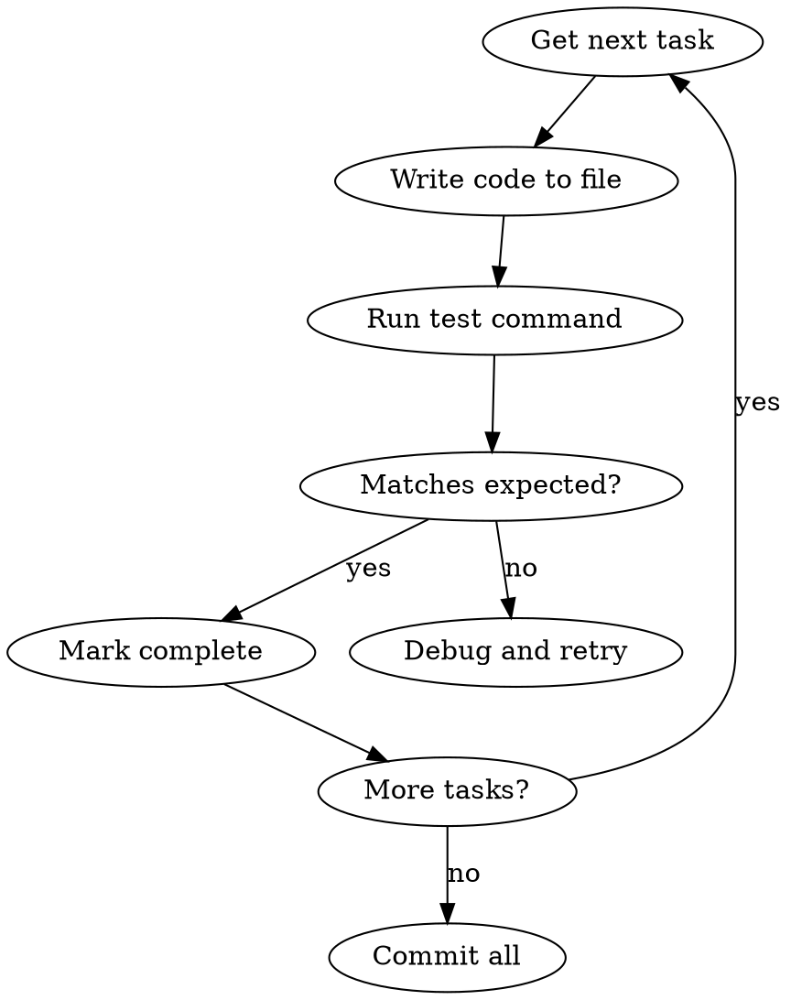

# Executing Tasks

## Overview

Human-in-the-loop execution with checkpoints. For when you want control over each batch.

**Announce at start:** "I'm using the arc-executing-tasks skill to implement this task list."

## vs arc-agent-driven

| Aspect | execute-tasks | agent-driven |
|------|---------------|--------------|
| Executor | main session | fresh subagent |
| Review | human checkpoints | automated two-stage |
| Control | high | low |
| Best for | needs human judgment | automated execution |

## The Process

### Step 1: Load and Review Tasks

1. Read task file from docs/tasks/<name>-tasks.md
2. Review critically for gaps or ambiguity
3. If concerns: raise them with user before starting
4. If no concerns: confirm the plan is approved, then proceed

### Step 2: Choose Execution Context

This skill is designed for **parallel session execution** (separate from planning). If already in a planning/design session, confirm handoff before starting.

### Step 3: Execute Batch

**Default: 3 tasks per batch**

For each task:
1. Mark as in_progress
2. Follow TDD steps exactly
3. Run verifications
4. Mark as completed

### Step 4: Checkpoint Report (Required)

```
─────────────────────────────────────────────────
Batch 1/3 complete (tasks 1-3)

Implemented:
- Task 1: [description] ✓
- Task 2: [description] ✓
- Task 3: [description] ✓

Verification:
- Tests: 12/12 passing
- Build: Success

Ready for feedback. Continue to next batch? (y/n)
─────────────────────────────────────────────────
```

### Step 5: Continue or Adjust

Based on feedback:
- Apply changes if needed
- Execute next batch
- Repeat until complete

### Step 6: Finish

After all tasks: use arc-finishing (or arc-finishing-epic for epic worktrees)

## Core Rules

1. **Execute in order** - Follow task dependencies
2. **Verify each** - Run test command, confirm expected output
3. **Commit atomic** - One commit per logical unit
4. **Stop on failure** - Don't continue if test fails
5. **Don't break working code** - Changes must not break existing functionality

## Execution Flow



## Per-Task Execution

```
Task 3/8: Write login function
─────────────────────────────
File: src/auth/login.py
Action: create

Writing code...
Running: pytest tests/auth/test_login.py -v
Expected: PASSED
Actual: PASSED ✓

[x] Task 3 complete
```

## Commit Strategy

| Scope | Message |
|-------|---------|
| Feature complete | `feat(auth): implement login flow` |
| Single task | `feat(auth): add password validation` |
| Small step (WIP) | `wip: add basic validation` |

### Commit Frequently

**Principle: Commit at small steps**

| Why | Benefit |
|-----|---------|
| Track changes | Know which change caused issues |
| Easy rollback | Return to known working state |
| Reduce risk | Avoid changing too much at once |

## Don't Break Working Code

**Core principle:** After changes, previously working functionality must still work.

| When | Action |
|------|--------|
| Before change | Describe impact scope |
| After change | List items to verify |
| If broken | Rollback immediately, rethink approach |

### Rationalizations

| Excuse | Reality |
|--------|---------|
| "Finish all changes then test together" | Small steps easier to debug |
| "Shouldn't affect other code" | Uncertain = commit first |
| "Rollback is too much trouble" | No commit = more trouble |

## Completion Format

✅ Execution complete
- Tasks: 8/8 passed
- Files created: 4
- Files modified: 2
- Commit: abc123

## Blocked Format

⚠️ Execution blocked
- Task: 5/8 (add session storage)
- Error: ImportError: redis not installed
- Action: Install dependency, then resume

## Integration

- **Required:** arc-using-worktrees (set up isolated workspace before starting)
- **Alternative:** arc-agent-driven (automated mode)
- **After:** arc-finishing (or arc-finishing-epic for epic worktrees)

## Red Flags - STOP

- "Start implementation on main/master branch without explicit user consent"
- "Skip failing test and continue"
- "Test failed but code looks right"
- "Commit now, fix test later"
- "Broke existing code but keep going"
- "Too many changes to track, just commit all"
- "Unsure of impact but don't commit first"

**Failing test = stop and fix before continuing.**
**Broke working code = rollback and rethink.**
