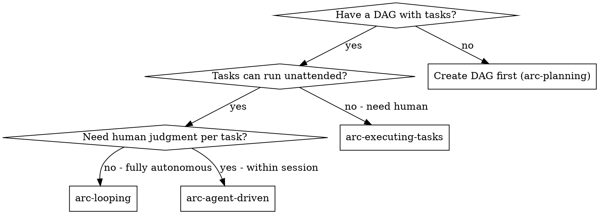

# arc-looping

Run arcforge workflows overnight without human intervention. Each iteration spawns a fresh Claude session. DAG + git persist state across sessions.

**Core principle:** Fresh session per task + file-based state = reliable cross-session execution with full auditability.

## When to Use



**vs. arc-agent-driven:**
- arc-agent-driven: subagents within ONE session (shared context, human available)
- arc-looping: fresh session per task (cross-session, unattended)

## Loop Patterns

### Sequential (Default — Safest)

```
node scripts/loop.js --pattern sequential --max-runs 20
```

- One task at a time
- Stop on failure
- Best for: linear task lists, dependent tasks, first-time use

### DAG (Parallel-aware)

```
node scripts/loop.js --pattern dag --max-runs 20
```

- Uses `parallelTasks()` to find independent epics
- Processes parallel tasks before sequential ones
- Continues past failures (tries other tasks)
- Best for: independent epics, large DAGs, overnight runs

## The Process

### Before Starting

1. **DAG must exist** — run `arc-planning` first to create `specs/<spec-id>/dag.yaml`. In multi-spec repos, pass `--spec-id <id>` to the loop; cross-spec loops are not supported.
2. **Verify baseline** — run `npm test` to confirm clean state
3. **Choose pattern** — sequential for safety, DAG for throughput
4. **Set limits** — `--max-runs` and `--max-cost` to bound execution

### Worktree Awareness

**Run loops from the project root**, not from inside a worktree.

If you are in a worktree (`.arcforge-epic` exists), the loop auto-detects both the epic and the spec from the marker (`spec_id` field) and scopes to that spec's `dag.yaml`. But running from project root with `--pattern dag` is the correct approach for multi-epic execution — it handles parallelism internally via `parallelTasks()`.

**Never run separate loops in separate worktrees.** Each worktree's marker points back to its base spec's `dag.yaml`, so multiple loops against the same spec will pick up the same tasks and do duplicate work.

For scoped single-epic execution, use `--epic`:
```bash
node scripts/cli.js loop --epic epic-001 --pattern sequential --max-runs 20
```

### During Execution

Each iteration:
```
1. Read specs/<spec-id>/dag.yaml → find next task (via coordinator)
2. Build prompt with task context
3. Spawn: claude -p < prompt
4. On success: coordinator.completeTask(taskId)
5. On failure: log error, retry once, then block task
6. Repeat until: all done, max-runs hit, or stop condition
```

### Stop Conditions

| Condition | What Happens |
|-----------|-------------|
| All tasks complete | Loop ends with status "complete" |
| Max runs reached | Loop ends with status "max_runs" |
| Cost limit hit | Loop ends with status "cost_limit" |
| Stall detected | No progress in 2+ iterations → stops |
| Retry storm | Same error 3+ times → stops |
| Sequential failure | Task fails after retry → stops (sequential only) |

### Monitoring

Spawn the `loop-operator` agent to check a running loop:

```
Use the loop-operator agent to check loop health
```

It reads `.arcforge-loop.json` and reports:
- Progress (completed/remaining/failed)
- Problems (stalls, retry storms, cost)
- Recommendations (continue/pause/intervene)

## State File

`.arcforge-loop.json` tracks loop state across iterations:

```json
{
  "iteration": 12,
  "pattern": "sequential",
  "started_at": "2026-03-17T22:00:00Z",
  "completed_tasks": ["feat-001-01", "feat-001-02"],
  "failed_tasks": ["feat-002-03"],
  "errors": [{"task_id": "...", "error": "...", "timestamp": "..."}],
  "total_cost": 0,
  "last_progress_at": "2026-03-17T23:15:00Z",
  "status": "running"
}
```

## CLI Usage

```bash
# Sequential — safest
node scripts/cli.js loop --pattern sequential --max-runs 20

# DAG — parallel-aware
node scripts/cli.js loop --pattern dag --max-runs 50

# With cost limit
node scripts/cli.js loop --max-cost 10 --max-runs 100

# Scoped to one epic (safe for parallel execution)
node scripts/cli.js loop --epic epic-001 --pattern sequential --max-runs 20
```

## Red Flags

**Never:**
- Run loops without a verified DAG
- Run loops without `--max-runs` on unfamiliar projects
- Ignore stall detection — it means something is fundamentally wrong
- Skip monitoring for loops > 10 iterations
- Run separate loops in separate worktrees — causes duplicate work

**If loop is failing:**
1. Check `.arcforge-loop.json` errors — are they the same error repeating?
2. Check `specs/<spec-id>/dag.yaml` — are blocked tasks preventing progress?
3. Run `npm test` — is the project in a broken state?
4. Check git log — are commits being made correctly?

## Integration

**Required before:**
- **arc-planning** — creates the dag.yaml that the loop executes

**Works with:**
- **loop-operator agent** — monitors running loops
- **arc-evaluating** — can run evals between loop iterations
- **arc-compacting** — not needed (each iteration is a fresh session)

**After loop completes (in order):**
1. **arc-verifying** — verify all requirements met and tests pass
2. **arc-finishing** or **arc-finishing-epic** — wrap up and decide merge/PR
