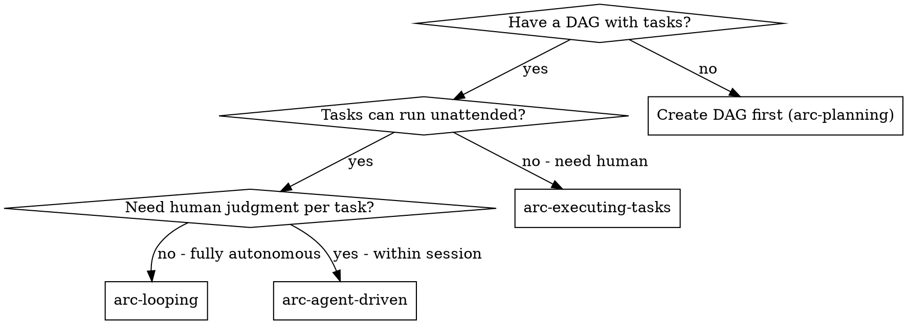

# arc-looping

Run arcforge workflows overnight without human intervention. Each iteration spawns a fresh Claude session. DAG + git persist state across sessions.

**Core principle:** Fresh session per task + file-based state = reliable cross-session execution with full auditability.

## When to Use



**vs. arc-agent-driven:**
- arc-agent-driven: subagents within ONE session (shared context, human available)
- arc-looping: fresh session per task (cross-session, unattended)

## Loop Patterns

### Sequential (Default — Safest)

```
node "${ARCFORGE_ROOT}/scripts/cli.js" loop --pattern sequential --max-runs 20
```

- One task at a time
- Stop on failure
- Best for: linear task lists, dependent tasks, first-time use

### DAG (Parallel-aware)

```
node "${ARCFORGE_ROOT}/scripts/cli.js" loop --pattern dag --max-runs 20
```

- Uses `parallelTasks()` to find independent epics
- Processes parallel tasks before sequential ones
- Continues past failures (tries other tasks)
- Best for: independent epics, large DAGs, overnight runs

## The Process

### Before Starting

1. **DAG must exist** — run `arc-planning` first to create `specs/<spec-id>/dag.yaml`. In multi-spec repos, pass `--spec-id <id>` to the loop; cross-spec loops are not supported.
2. **Verify baseline** — run `npm test` to confirm clean state
3. **Choose pattern** — sequential for safety, DAG for throughput
4. **Set limits** — `--max-runs` and `--max-cost` to bound execution

### Worktree Awareness

**Run loops from the project root**, not from inside a worktree.

If you are in a worktree (`.arcforge-epic` exists), the loop auto-detects both the epic and the spec from the marker (`spec_id` field) and scopes to that spec's `dag.yaml`. But running from project root with `--pattern dag` is the correct approach for multi-epic execution — it handles parallelism internally via `parallelTasks()`.

**Never run separate loops in separate worktrees.** Each worktree's marker points back to its base spec's `dag.yaml`, so multiple loops against the same spec will pick up the same tasks and do duplicate work.

For scoped single-epic execution, use `--epic`:
```bash
node "${ARCFORGE_ROOT}/scripts/cli.js" loop --epic epic-001 --pattern sequential --max-runs 20
```

### During Execution

Each iteration:
```
1. Read specs/<spec-id>/dag.yaml → find next task (via coordinator)
2. Build prompt with task context
3. Spawn: claude -p < prompt
4. On success: coordinator.completeTask(taskId)
5. On failure: log error, retry once, then block task
6. Repeat until: all done, max-runs hit, or stop condition
```

### Stop Conditions

| Condition | What Happens |
|-----------|-------------|
| All tasks complete | Loop ends with status "complete" |
| Max runs reached | Loop ends with status "max_runs" |
| Cost limit hit | Loop ends with status "cost_limit" |
| Stall detected | No progress in 2+ iterations → stops |
| Retry storm | Same error 3+ times → stops |
| Sequential failure | Task fails after retry → stops (sequential only) |

### Monitoring

Spawn the `loop-operator` agent to check a running loop:

```
Use the loop-operator agent to check loop health
```

It reads `.arcforge-loop.json` and reports:
- Progress (completed/remaining/failed)
- Problems (stalls, retry storms, cost)
- Recommendations (continue/pause/intervene)

## Flag Reference

The loop's functional flags (the `loop` command's built-in help prints the live list):

| Flag | Purpose |
|------|---------|
| `--pattern` | `sequential` (default) or `dag` |
| `--max-runs` | Maximum iterations (default 50) |
| `--max-cost` | Cost ceiling in dollars (default unlimited) |
| `--epic` | Scope loop to a single epic (auto-detected in worktrees) |
| `--max-parallel` | Max concurrent epics per round in dag mode (default 5) |
| `--no-project-setup` | Skip the per-worktree installer in dag mode |
| `--task-timeout` | Per-session timeout in seconds (default 600) |
| `--permission-mode` | Pass `--permission-mode` through to spawned sessions |
| `--allowed-tools` | Pass `--allowed-tools` through to spawned sessions |
| `--verify-cmd` | Acceptance floor run after each session exits 0; non-zero fails the task |
| `--verifier` | After the floor passes, spawn an independent verifier agent (opt-in) |
| `--max-retries` | Verifier feedback retries before blocking (default 2) |

## Headless Permissions

Spawned sessions run as headless `claude -p` — they **cannot** answer interactive permission prompts. A session that hits one runs silently until `--task-timeout` kills it, surfacing as a timeout, not a permission error. No code path ever auto-appends `--dangerously-skip-permissions`; permission posture is yours to set.

Pre-authorize so unattended sessions never block:

```bash
node "${ARCFORGE_ROOT}/scripts/cli.js" loop --pattern dag --max-runs 50 \
  --permission-mode acceptEdits \
  --allowed-tools "Bash,Edit,Write,Read"
```

- `--permission-mode` and `--allowed-tools` pass straight through to each spawned session.
- A task that times out with no progress is the headless permission-stall signature — widen `--allowed-tools` or raise `--permission-mode` rather than the timeout.

## Launching overnight

A dag loop is many sessions back-to-back — each capped at `--task-timeout` (default 600s), so wall-clock is `N × 600s`. **Never launch the loop in the foreground of a tool-driven session**: the Bash-tool timeout kills the parent process long before the loop finishes, and the loop dies with it.

Launch detached so the loop outlives the launching shell:

```bash
# Background, survives the launching session (preferred when a runner supports it)
node "${ARCFORGE_ROOT}/scripts/cli.js" loop --pattern dag --max-runs 50 \
  --permission-mode acceptEdits > loop.log 2>&1 &
disown

# Or fully detach from the terminal
nohup node "${ARCFORGE_ROOT}/scripts/cli.js" loop --pattern dag --max-runs 50 \
  --permission-mode acceptEdits > loop.log 2>&1 &
disown
```

Then walk away and check progress with the `loop-operator` agent (it reads `.arcforge-loop.json`) — do not hold a foreground session open waiting on it.

**If a launched loop is killed** (terminal closed without `disown`, machine sleep, OOM): the last `.arcforge-loop.json` is left with `status: "running"` and no `finished_at`. That sentinel marks the loop live, so the SDD ratify gate stays closed. This self-heals: the gate keys off the state file's mtime, and once the heartbeat is stale (30 minutes with no write) the gate treats the loop as dead and reopens. To clear it immediately, start the next run with `--reset` (archives the stale state) or run the ratify command after the staleness window.

**Finding the plugin root.** Under Claude Code the SessionStart hook exports `ARCFORGE_ROOT`, so the blessed `node "${ARCFORGE_ROOT}/scripts/cli.js"` form works as-is. On platforms with no SessionStart hook (or any detached shell where the hook env didn't propagate), `ARCFORGE_ROOT` is unset — prepend the fallback header so the path resolves:

```bash
: "${ARCFORGE_ROOT:=$HOME/.agents/arcforge}"
if [ ! -d "$ARCFORGE_ROOT" ]; then
  echo "ERROR: ARCFORGE_ROOT=$ARCFORGE_ROOT does not exist. Set it to your arcforge checkout." >&2
  exit 1
fi
node "${ARCFORGE_ROOT}/scripts/cli.js" loop --pattern dag --max-runs 50
```

The `:=` fallback only assigns when unset, so the hook-exported value still wins under Claude Code. See `docs/guide/cli-invocation.md` for the full resolution rules.

## State File

`.arcforge-loop.json` tracks loop state across iterations:

```json
{
  "iteration": 12,
  "pattern": "sequential",
  "started_at": "2026-03-17T22:00:00Z",
  "max_runs": 20,
  "max_cost": 10,
  "run_id": "a1b2c3d4-0000-0000-0000-000000000000",
  "run_started_iteration": 0,
  "completed_tasks": ["feat-001-01", "feat-001-02"],
  "failed_tasks": ["feat-002-03"],
  "errors": [
    {
      "task_id": "feat-002-03",
      "iteration": 11,
      "error": "tests failed",
      "timestamp": "2026-03-17T23:10:00Z",
      "attempt": 2,
      "run_id": "a1b2c3d4-0000-0000-0000-000000000000"
    }
  ],
  "verifier_attempts": [
    {
      "task_id": "feat-001-02",
      "iteration": 6,
      "attempt": 1,
      "verdict": "PASS",
      "feedback": "",
      "cost_usd": 0.04,
      "timestamp": "2026-03-17T22:40:00Z",
      "run_id": "a1b2c3d4-0000-0000-0000-000000000000"
    }
  ],
  "total_cost": 0,
  "last_progress_at": "2026-03-17T23:15:00Z",
  "status": "running",
  "finished_at": null
}
```

`pattern`, `max_runs`, `max_cost`, and a fresh `run_id` are stamped at the
start of each run. Stall and retry-storm detection count only the current
run's errors (scoped by `run_id`), so resuming a loop is not penalized by a
previous run's failures.

## Resume vs Reset

Both reuse the same `.arcforge-loop.json` — the difference is whether prior history carries forward.

- **Resume (default):** re-run the same loop command with no `--reset`. The existing state file is loaded, `iteration` keeps climbing, and `completed_tasks` are not re-run. A fresh `run_id` scopes the new run's stall/retry-storm counters to zero, so a previous run's errors do not condemn the resumed one.
- **Reset:** pass `--reset` to archive the current state to `.arcforge-loop.archive/<started_at>.json` and start fresh from `iteration: 0`. Use it when the prior run is stale, wedged, or you want a clean audit boundary. `--reset` is a deliberate pre-run action — never mid-run.

## After the Loop

When the loop ends, hand off in order:

1. **arc-verifying** — confirm all requirements are met and tests pass across the completed work.
2. **arc-finishing** — wrap up and decide merge/PR. Its Step 0 detects the `.arcforge-epic` marker and auto-selects the arc-finishing close-out path for the epic; from a plain project root it runs the standard finish. This is the single finishing handoff — there is no separate epic-finishing skill.

## CLI Usage

```bash
# Sequential — safest
node "${ARCFORGE_ROOT}/scripts/cli.js" loop --pattern sequential --max-runs 20

# DAG — parallel-aware
node "${ARCFORGE_ROOT}/scripts/cli.js" loop --pattern dag --max-runs 50

# With cost limit
node "${ARCFORGE_ROOT}/scripts/cli.js" loop --max-cost 10 --max-runs 100

# Scoped to one epic (safe for parallel execution)
node "${ARCFORGE_ROOT}/scripts/cli.js" loop --epic epic-001 --pattern sequential --max-runs 20
```

To archive prior state and start fresh, add `--reset` to any of these (see Resume vs Reset).

## Red Flags

**Never:**
- Run loops without a verified DAG
- Run loops without `--max-runs` on unfamiliar projects
- Launch a dag loop in the foreground of a tool-driven session (the Bash-tool timeout kills it) — detach it (see Launching overnight)
- Ignore stall detection — it means something is fundamentally wrong
- Skip monitoring for loops > 10 iterations
- Run separate loops in separate worktrees — causes duplicate work

**If loop is failing:**
1. Check `.arcforge-loop.json` errors — are they the same error repeating?
2. Check `specs/<spec-id>/dag.yaml` — are blocked tasks preventing progress?
3. Run `npm test` — is the project in a broken state?
4. Check git log — are commits being made correctly?
5. Ratify gate stuck after a killed loop? `.arcforge-loop.json` still says `status: "running"` — wait out the 30-minute staleness window or start the next run with `--reset`.

## Integration

**Required before:**
- **arc-planning** — creates the dag.yaml that the loop executes

**Works with:**
- **loop-operator agent** — monitors running loops
- **arc-evaluating** — can run evals between loop iterations
- **arc-compacting** — not needed (each iteration is a fresh session)

**After loop completes:** see [After the Loop](#after-the-loop) — arc-verifying, then arc-finishing.
