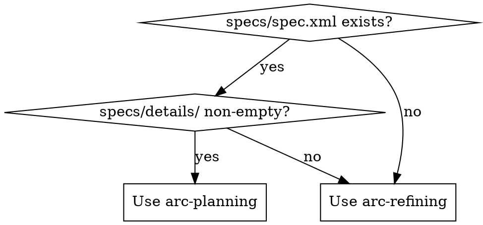

# Planner

## Overview

Convert specs into executable DAG with epic/feature breakdown. Maintain strict 1:1 mapping for traceability.

## Trigger

Implicit approval: `specs/spec.xml` exists → enter Planner.

If `specs/spec.xml` is missing or `specs/details/` is empty, STOP and route back to `/arc-refining`.

## Decision Flow (When to Use)



## Mapping Rules

| Spec Level | Planner Level | Ratio |
|------------|---------------|-------|
| `<detail>` | Epic | 1:1 (large detail can split) |
| `<requirement>` | Feature | 1:1 strict |
| `<dependency ref>` | `depends_on` | Auto-derive |

## Output Structure

```
dag.yaml                    # Epic/Feature DAG
epics/
├── epic-auth/
│   ├── epic.md             # Epic overview (context, goals, features list)
│   └── features/
│       ├── auth-login.md
│       └── auth-register.md
└── epic-api/
    └── ...
```

**feature.md minimal example:**

```markdown
# Feature: auth-login

## Source
- Requirement: FR-AUTH-001
- Detail: authentication.xml

## Dependencies
- auth-schema (must complete first)

## Acceptance Criteria
- [ ] POST /login accepts {email, password}
- [ ] Returns 200 + JWT on valid credentials
- [ ] Returns 401 on invalid credentials
```

**dag.yaml structure:**

## Infrastructure Commands

**Set SKILL_ROOT** from skill loader header (`# SKILL_ROOT: ...`):
```bash
: "${SKILL_ROOT:=${ARCFORGE_ROOT:-}/skills/arc-planning}"
if [ ! -d "$SKILL_ROOT" ]; then
  echo "ERROR: SKILL_ROOT=$SKILL_ROOT does not exist. Set ARCFORGE_ROOT or SKILL_ROOT manually." >&2
  exit 1
fi
```

To view the full schema and example, run:
```bash
# View schema with field descriptions
node "${SKILL_ROOT}/scripts/planner.js" schema

# View complete example
node "${SKILL_ROOT}/scripts/planner.js" schema --example

# View as JSON (for programmatic use)
node "${SKILL_ROOT}/scripts/planner.js" schema --json
```

Example dag.yaml:
```yaml
epics:
  - id: "epic-auth"
    name: "Authentication System"
    status: "in_progress"
    spec_path: "epics/epic-auth/epic.md"
    worktree: null
    depends_on: []
    features:
      - id: "auth-login"
        name: "User Login"
        status: "completed"
        source_requirement: "FR-AUTH-001"
        depends_on: []
      - id: "auth-logout"
        name: "User Logout"
        status: "pending"
        depends_on: ["auth-login"]
```

## Self-Validation

Before finalizing:
- [ ] Every detail maps to ≥1 epic
- [ ] Every requirement maps to exactly 1 feature
- [ ] No circular dependencies (fail if found)
- [ ] All `depends_on` references exist
- [ ] All `source_requirement` references valid

## Commit Requirements

Before handoff:

```
git add dag.yaml epics/
git commit -m "docs: plan epics and features for <topic>"
```

**Circular dependency = STOP, ask user.**

## Completion Format

✅ Planner complete
- Epics: 3
- Features: 12
- DAG validated: no cycles
- Ready for: arc-coordinating or arc-implementing

## Blocked Format

⚠️ Planner blocked
- Issue: Circular dependency detected
- Cycle: FR-AUTH-002 ↔ FR-API-007
- Action: User must clarify which dependency is optional

## Red Flags - STOP

- "I'll break the cycle arbitrarily"
- "Let implementer figure it out"
- "Close enough mapping"

**Cycles must be resolved by user, not guessed.**
