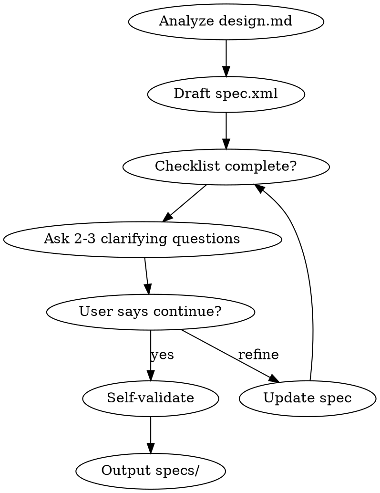

# Refiner

## Overview

Transform design documents into structured XML specifications. The spec becomes Source of Truth - downstream skills cannot invent requirements.

## Core Rules

1. **ask, don't assume** - if unclear, ask user; never invent requirements
2. **source of truth** - spec.xml is authoritative; downstream quotes it
3. **checklist validation** - complete checklist before proceeding
4. **iterative refinement** - ask 2-3 clarifying questions per iteration

## Input Requirements (Block If Missing)

Before drafting spec.xml, verify the design doc includes:
- REFINER_INPUT section
- At least one functional requirement

If missing, STOP and ask for the missing content.

## quality checklist

Before moving to the next stage, confirm:
- [ ] every requirement has acceptance criteria
- [ ] no vague terms ("should", "maybe", "usually")
- [ ] dependencies identified
- [ ] user confirms: "Is this spec complete?"

## workflow guidance

Ask at least 2-3 clarifying questions.
The agent decides when it is enough.
The user can say "enough, continue" at any time.

## Workflow



## output structure

creates specs/details/ directory with:

```
specs/
├── spec.xml              # main spec (overview, cross_cutting, details index)
└── details/
    ├── authentication.xml
    ├── api-endpoints.xml
    └── data-models.xml
```

## Commit Requirements

After generating or updating specs:

```
git add specs/spec.xml specs/details/
git commit -m "docs: refine spec for <topic>"
```

## self-validation

before finalizing, verify:
- [ ] all required fields exist (id, title, description, acceptance_criteria)
- [ ] all ids unique
- [ ] all references valid
- [ ] every criterion has `<trace>` to source
- [ ] every input requirement has ≥1 criterion

## asking user (example)

```
checklist review:

gaps found:
- fr-auth-003 lacks error handling criteria
- "password strength" undefined

questions:
1. what should happen when password reset fails?
2. what are the specific password strength requirements?
3. are there any other authentication edge cases to handle?
```

## red flags - stop

- "user seems happy, let's proceed"
- "i can make reasonable assumptions"
- "we can refine later in implementation"
- "skipping clarifying questions"

**all mean: keep asking until checklist complete and user confirms.**

## completion format

✅ refiner complete
- iterations: 6
- checklist: complete ✓
- output: specs/spec.xml + 3 detail files (committed)
- ready for: arc-planning

## blocked format

⚠️ refiner blocked
- issue: user unavailable for clarification
- checklist incomplete: missing 3 acceptance criteria definitions
- action: resume when user returns
