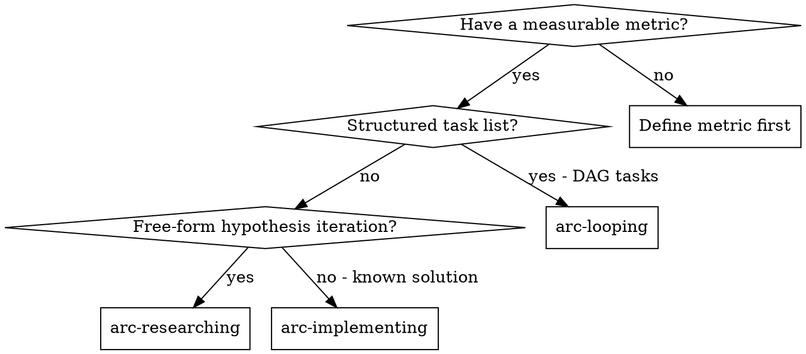

# arc-researching

Autonomous iterative research: define a measurable optimization target, establish a baseline, then run a hypothesis-driven experiment loop until interrupted.

**Core principle:** "Fixed judge + free player" — the evaluation method is immutable (the judge), while the implementation is free to change (the player). By locking what you measure, you prevent moving goalposts during optimization.

## When to Use



**vs. arc-looping:** arc-looping executes a DAG of predefined tasks across sessions. arc-researching runs a free-form hypothesis-driven experiment loop within a single session — no predefined task list.

**vs. arc-implementing:** arc-implementing follows a structured epic/feature/task plan. arc-researching iterates on hypotheses with no predetermined path.

## Iron Laws

1. **NEVER modify files outside the declared scope** — the research contract defines what you CAN and CANNOT touch
2. **NEVER modify the evaluation method** — it is the fixed judge. If the eval is wrong, stop and tell the human.
3. **NEVER stop mid-loop to ask the human** — you are autonomous. Make decisions, log them, keep going.
4. **ALWAYS revert on failure or regression** — no half-committed experiments. `git revert` immediately.
5. **ALWAYS log every experiment to results.tsv** — even crashes, even reverts. The record must be complete.
6. **ALWAYS establish baseline before experimenting** — you need a reference point to measure improvement.

## The Process

### Phase 1: Build Research Contract (Interactive)

Agent proposes, human reacts, refine iteratively, then lock.

**Step 1: Analyze Target**
- Read files, understand the project structure
- Identify what's measurable and what the human likely wants to optimize
- Note existing tests, build scripts, benchmarks

**Step 2: Propose Draft Contract**
- Present a complete draft `research-config.md` covering all 6 sections (below)
- Use one AskUserQuestion with the full proposal
- Include sensible defaults based on what you found

**Step 3: Refine with Human**
- Based on human feedback, adjust section by section
- Clarify scope boundaries (CAN/CANNOT), metric direction, timeout budget
- Ask follow-up questions only if critical information is missing

**Step 4: Lock the Contract**
- Write `research-config.md` to disk
- Get final confirmation from the human
- After lock: the contract is **immutable**. Do not modify it during experiments.

#### research-config.md Template

```markdown
# Research Config: {target}

## Scope
CAN modify: {files and directories the agent may change}
CANNOT modify: {files and directories that are off-limits}

## Goal
Metric: {metric name, e.g., "build_time_seconds", "val_bpb", "p95_latency_ms"}
Direction: {lower-is-better | higher-is-better}
Target: {optional target value, e.g., "< 30s" or "none"}

## Evaluation
Run command: {exact shell command to execute, e.g., "npm run build 2>&1"}
Extract metric: {grep/parse pattern to extract metric from output, e.g., "grep -oP 'Time: \K[\d.]+' build.log"}
Timeout: {seconds per experiment, e.g., "300"}

## Constraints
Soft constraints: {secondary considerations, e.g., "keep memory usage under 4GB", "maintain test pass rate"}

## Autonomy
Mode: {run-until-interrupted | run-N-times | run-until-target}

## Simplicity Criterion
{When two experiments achieve similar metric values, prefer the simpler implementation. Default: fewer lines changed from baseline.}
```

### Phase 2: Establish Baseline

1. Create a research branch: `git checkout -b research/{tag}`
2. Run the evaluation command from the contract
3. Extract the baseline metric value
4. Log baseline to `results.tsv` with status `baseline`
5. Start the dashboard: `node scripts/cli.js research dashboard --results results.tsv --config research-config.md`
6. Tell the human: "Dashboard running at http://localhost:3000 — monitor progress there."
7. Commit the baseline state

### Phase 3: Experiment Loop (Autonomous)

This is the heart of the skill. **NEVER STOP** — run until interrupted or the stop condition from the contract is met.

```
LOOP (until stop condition):
  1. READ STATE    — git log, results.tsv, research-config.md
  2. HYPOTHESIZE   — pick a direction based on results so far
  3. IMPLEMENT     — modify files within declared scope only
  4. COMMIT        — git commit with descriptive message
  5. RUN           — execute evaluation command, capture output
  6. EXTRACT       — parse metric value from output
  7. DECIDE        — improved? keep. Same/worse? revert. Crash? log + revert.
  8. LOG           — append row to results.tsv (every experiment, no exceptions)
  9. ANALYZE       — 3+ failures in same direction? change direction entirely
```

#### Decision Rules

| Outcome | Action | Git | results.tsv Status |
|---------|--------|-----|--------------------|
| Metric improved | Keep the change | Keep commit | `keep` |
| Metric same or worse | Discard the change | `git revert HEAD --no-edit` | `discard` |
| Command crashed/timed out | Log and discard | `git revert HEAD --no-edit` | `crash` |

#### Stuck Protocol

If **3 or more consecutive experiments** fail in the same direction (e.g., all trying to reduce allocations):
1. Stop that line of investigation entirely
2. Read all results so far and identify untried approaches
3. Choose a fundamentally different direction
4. If all major directions exhausted, try combinations of previously successful changes

#### Crash/Timeout Handling

- If the run command exits non-zero: log as `crash` with the error in description
- If the run exceeds the timeout: kill the process, log as `crash` with "timeout" in description
- Always revert the commit after a crash
- Never count crashes toward the "3 failures → change direction" rule (crashes indicate broken code, not a bad hypothesis)

### Phase 4: Report

When the loop ends (interrupted, target reached, or max iterations):
1. Read all results from `results.tsv`
2. Summarize: baseline value, best value, improvement %, total experiments, keep/discard/crash counts
3. List the top 3 most impactful kept experiments
4. If target was set: report whether it was achieved
5. Provide the final commit hash and branch name

## results.tsv Format

Tab-separated values with header row:

```
commit	metric_value	status	description
a1b2c3d	0.997	baseline	Initial baseline measurement
b2c3d4e	0.891	keep	Reduced learning rate by 50%
c3d4e5f	0.912	discard	Added dropout layer 0.3 — regression from 0.891
d4e5f6g	NaN	crash	Segfault in custom allocator — timeout after 300s
```

- **commit**: Short git hash (7 chars)
- **metric_value**: Numeric value, or `NaN` for crashes
- **status**: One of `baseline`, `keep`, `discard`, `crash`
- **description**: What was tried and why it was kept/discarded

## Resume Protocol

If the agent is interrupted and resumes in a new session:

1. Check for existing `research-config.md` → if exists, contract is already locked (skip Phase 1)
2. Read `results.tsv` → understand all prior experiments
3. Read `git log` → understand current code state
4. Check current branch starts with `research/` → confirm research context
5. Continue Phase 3 from current state (do not redo Phase 1 or 2)

## Red Flags

**Never:**
- Modify the evaluation command or metric extraction during the loop
- Skip logging an experiment (even crashes)
- Continue after 5+ consecutive crashes (something is fundamentally broken — stop and report)
- Modify files outside the declared scope
- Ask the human questions during the experiment loop

**If results are suspicious:**
1. Check if the evaluation command is deterministic (run it twice, compare)
2. Check if the metric extraction pattern matches correctly
3. Check if external factors (network, disk, other processes) affect the metric
4. If non-deterministic: run each experiment 3 times and use the median

## Common Rationalizations

| Rationalization | Why It's Wrong | What to Do Instead |
|----------------|---------------|-------------------|
| "The eval method has a bug, let me fix it" | You are the player, not the judge. Fixing the eval changes the game. | Stop the loop and tell the human the eval may be flawed. |
| "This file is technically in scope" | If you have to argue about it, it's out of scope. | Check the CAN/CANNOT lists literally. |
| "I'll skip logging this failed experiment" | Incomplete records make analysis impossible. Future you needs the full picture. | Log every experiment. No exceptions. |
| "I should ask the human about this approach" | You are autonomous. The contract has everything you need. | Make your best judgment and log the reasoning. |
| "The metric barely regressed, I'll keep it" | "Barely" is a slippery slope. The rule is binary: improved or not. | Revert. If the approach has promise, try a refined version next. |

## Completion Format

```
✓ RESEARCH COMPLETE
  Target: {target name}
  Baseline: {baseline value}
  Best: {best value} ({improvement}% {direction})
  Experiments: {total} ({kept} kept, {discarded} discarded, {crashed} crashed)
  Branch: research/{tag}
  Best commit: {hash}
```

## Blocked Format

```
✗ RESEARCH BLOCKED
  Reason: {why the loop cannot continue}
  Last experiment: {commit hash}
  Suggestion: {what the human should investigate}
```

## Integration

**Before:**
- **arc-brainstorming** → explore what to optimize and identify measurable targets

**Works with:**
- **research dashboard** → `arc research dashboard` for live monitoring
- **git** → branch-based isolation, commit per experiment, revert on failure

**After:**
- Review the `research/{tag}` branch
- Cherry-pick or merge successful experiments to main
- Run project tests to confirm nothing was broken outside scope
