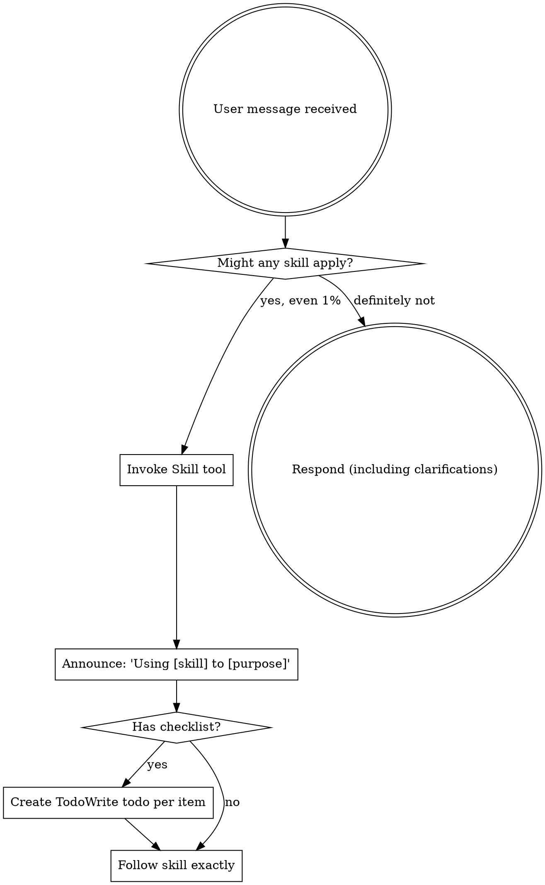

<EXTREMELY-IMPORTANT>
If there is even a 1% chance a skill might apply, you ABSOLUTELY MUST invoke the skill.

IF A SKILL APPLIES TO YOUR TASK, YOU DO NOT HAVE A CHOICE. YOU MUST USE IT.

This is not negotiable. This is not optional. You cannot rationalize your way out of this.
</EXTREMELY-IMPORTANT>

## How to Access Skills

**In Claude Code:** Use the `Skill` tool. When you invoke a skill, its content is loaded and presented to you—follow it directly. Never use the Read tool on skill files.

**In other environments:** Check your platform's documentation for how skills are loaded.

## Core Philosophy

**File artifacts = truth**
- `docs/plans/*-design.md` → Design documents
- `specs/spec.xml` → Refined specifications
- `dag.yaml` + `epics/` → Implementation plans
- `.worktrees/` → Isolated feature work

**Session context = current workflow only**
- Don't rely on memory of past sessions
- Resume from file artifacts, not conversation history

## The Rule

**Invoke relevant or requested skills BEFORE any response or action.** Even a 1% chance a skill might apply means that you should invoke the skill to check. If an invoked skill turns out to be wrong for the situation, you don't need to use it.

## Skill Priority

When multiple skills could apply:

1. **Process skills first** (brainstorm, debug, refiner, planner, writing-tasks, writing-skills) - determine approach, requirements, and task breakdown
2. **Workflow skills second** (coordinator, implementer, executing-tasks) - orchestrate and execute

Examples:
- "Let's build X" → arc-brainstorming first (explore design), then workflow skills
- "Fix this bug" → arc-debugging first (find root cause), then fix
- "Implement epic" → arc-planning (break down), then arc-coordinating (manage worktrees), then arc-implementing (execute features)

## Red Flags

These thoughts mean STOP—you're rationalizing:

| Thought | Reality |
|---------|---------|
| "This is just a simple question" | Questions are tasks. Check for skills. |
| "I need more context first" | Skill check comes BEFORE clarifying questions. |
| "Let me explore the codebase first" | Skills tell you HOW to explore. Check first. |
| "I can check git/files quickly" | Files lack conversation context. Check for skills. |
| "Let me gather information first" | Skills tell you HOW to gather information. |
| "This doesn't need a formal skill" | If a skill exists, use it. |
| "I remember this skill" | Skills evolve. Read current version. |
| "This doesn't count as a task" | Action = task. Check for skills. |
| "The skill is overkill" | Simple things become complex. Use it. |
| "I'll just do this one thing first" | Check BEFORE doing anything. |
| "This feels productive" | Undisciplined action wastes time. Skills prevent this. |
| "I know what that means" | Knowing the concept ≠ using the skill. Invoke it. |

## User Instructions

Instructions say WHAT, not HOW. "Add X" or "Fix Y" doesn't mean skip workflows.
