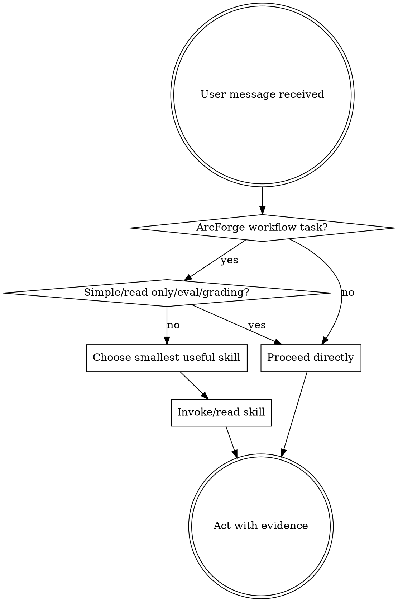

# arc-using

## Purpose

`arc-using` is a bounded router for ArcForge skills. It helps choose the smallest useful workflow for the current task. It is guidance, not a global law.

Use it when:

- The user asks to use ArcForge or an ArcForge skill.
- The task is an ArcForge workflow task: brainstorming, refining specs, planning, implementing epics, verifying, evaluating, or maintaining ArcForge skills.
- You are unsure which ArcForge skill should handle the next step.

Respect higher-priority instructions, explicit user constraints, and the host harness. If a workflow would add more friction than value, do not force it.

## How to Access Skills

**In Claude Code:** Use the `Skill` tool. When you invoke a skill, its content is loaded and presented to you — follow it directly. Never use the Read tool on skill files.

**In other environments:** Use the platform's skill-loading mechanism, or read the relevant skill documentation when no tool exists.

## Core Philosophy

- Skills are tools, not laws.
- Prefer the smallest useful workflow.
- File artifacts are the source of truth when the workflow creates them.
- Session context is current workflow state only; resume from files, not memory.
- Strong workflows are opt-in by task fit, not always-on behavior.

## File Artifacts = Truth

SDD pipeline v2 uses per-spec layout:

- `docs/plans/<spec-id>/<YYYY-MM-DD>/design.md` → Design documents
- `specs/<spec-id>/spec.xml` + `specs/<spec-id>/details/*.xml` → Refined specifications
- `specs/<spec-id>/dag.yaml` + `specs/<spec-id>/epics/` → Implementation plans
- Isolated feature work → see Worktree Rule below

## Worktree Rule

ArcForge worktrees live at `~/.arcforge/worktrees/<project>-<hash>-<epic>/`, computed at runtime by `${ARCFORGE_ROOT}/scripts/lib/worktree-paths.js` and managed by `coordinator.js`.

When touching worktrees:

- Don't hardcode paths in output. Use abstract language like "the worktree" or fill paths from CLI output.
- Don't create worktrees manually. Delegate to `arc-coordinating expand` or `arc-using-worktrees` so marker schema and DAG sync stay valid.
- Enter worktrees via `arcforge status --json`; do not reconstruct paths from memory.
- Use direct file-editing tools only where `.arcforge-epic` lives. Base sessions coordinate; worktree sessions implement.

For derivation rules, marker schema, and cleanup semantics, see `docs/guide/worktree-workflow.md`.

## Routing Flow

```dot
digraph skill_flow {
    "User message received" [shape=doublecircle];
    "ArcForge workflow task?" [shape=diamond];
    "Simple/read-only/eval/grading?" [shape=diamond];
    "Choose smallest useful skill" [shape=box];
    "Invoke/read skill" [shape=box];
    "Proceed directly" [shape=box];
    "Act with evidence" [shape=doublecircle];

    "User message received" -> "ArcForge workflow task?";
    "ArcForge workflow task?" -> "Proceed directly" [label="no"];
    "ArcForge workflow task?" -> "Simple/read-only/eval/grading?" [label="yes"];
    "Simple/read-only/eval/grading?" -> "Proceed directly" [label="yes"];
    "Simple/read-only/eval/grading?" -> "Choose smallest useful skill" [label="no"];
    "Choose smallest useful skill" -> "Invoke/read skill";
    "Invoke/read skill" -> "Act with evidence";
    "Proceed directly" -> "Act with evidence";
}
```

## Skill Priority

When multiple skills could apply, choose the smallest useful one:

1. **Clarify intent** — `arc-brainstorming` when requirements or decisions are unclear.
2. **Formalize source of truth** — `arc-refining` when converting a design/decision log into structured specs.
3. **Plan work** — `arc-planning` when a refined spec needs an implementation DAG.
4. **Execute work** — `arc-coordinating`, `arc-dispatching-teammates`, `arc-looping`, or `arc-implementing` based on DAG/worktree context.
5. **Cross-cutting quality** — use discipline skills only when their trigger is actually present.

Examples:

- "Let's build X" → `arc-brainstorming` if design is unclear; `arc-planning` if a refined spec already exists.
- "Fix this bug" → `arc-debugging` if cause is unknown; `arc-tdd` if cause and expected behavior are clear.
- "Implement epic" → `arc-planning` if no `specs/<spec-id>/dag.yaml`; coordination/implementation skills if the DAG exists.
- "Audit this skill/workflow" → `arc-evaluating` when shipping/merge/completion evidence matters.

## Discipline Skills — Conditional Triggers

These skills activate during a workflow when the condition is present. They are not mandatory pipeline steps for every message.

| Condition | Skill | Gate |
|-----------|-------|------|
| About to write implementation code | `arc-tdd` | Failing test before production code |
| Test fails or unexpected behavior appears | `arc-debugging` | Root cause before fixes |
| About to claim work is complete | `arc-verifying` | Fresh verification evidence before completion claims |
| Task or feature complete | `arc-requesting-review` | Review before proceeding to next task |
| Received code review feedback | `arc-receiving-review` | Technical rigor, not performative agreement |
| User asks about vault health, missing links, or orphan notes | `arc-maintaining-obsidian` audit mode | Propose changes, never auto-modify without approval |
| About to ship, merge, or mark complete a skill, agent, or workflow | `arc-evaluating` | Eval evidence that does not return `INSUFFICIENT_DATA` |

## When Not to Route

Do not force an ArcForge workflow when the task is:

- A simple factual answer or direct clarification.
- Read-only inspection where no workflow decision is needed.
- Harness, eval, or grading execution that must preserve isolation.
- A single-skill eval where `arc-using` would contaminate the behavior under test.
- Explicitly constrained by the user to avoid workflow overhead.
- Outside ArcForge's domain.

In those cases, proceed directly, and only mention ArcForge skills if they materially help.

## User Instructions

User instructions say what outcome matters. ArcForge skills can help decide how to get there, but they do not override user intent, harness constraints, or higher-priority system instructions.
