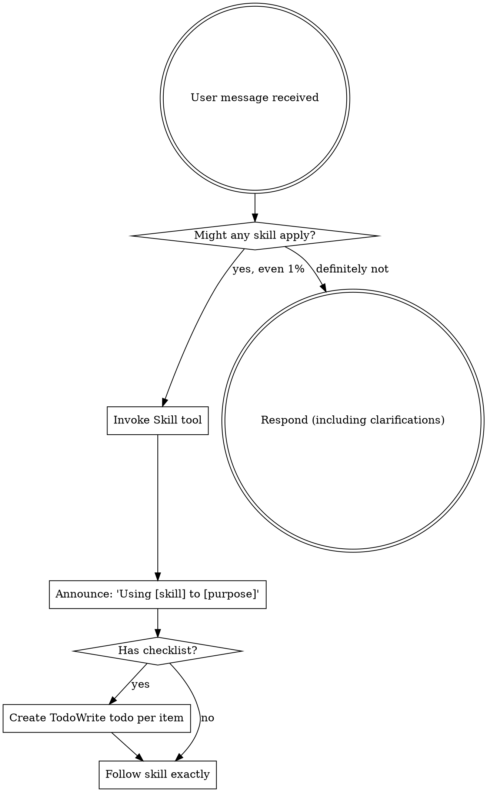

<EXTREMELY-IMPORTANT>
When a skill matches your context, invoke it before acting. Skills provide tested workflows
that prevent common mistakes — skipping them means losing that protection.

If a skill turns out not to fit after reading it, you can set it aside.
If no skill fits, proceed directly.
</EXTREMELY-IMPORTANT>

## How to Access Skills

**In Claude Code:** Use the `Skill` tool. When you invoke a skill, its content is loaded and presented to you—follow it directly. Never use the Read tool on skill files.

**In other environments:** Check your platform's documentation for how skills are loaded.

## Core Philosophy

**File artifacts = truth**
- `docs/plans/*-design.md` → Design documents
- `specs/spec.xml` → Refined specifications
- `dag.yaml` + `epics/` → Implementation plans
- `.worktrees/` → Isolated feature work

**Session context = current workflow only**
- Don't rely on memory of past sessions
- Resume from file artifacts, not conversation history

## The Rule

**Invoke relevant or requested skills BEFORE any response or action.** Even a 1% chance a skill might apply means that you should invoke the skill to check. If an invoked skill turns out to be wrong for the situation, you don't need to use it.

```dot
digraph skill_flow {
    "User message received" [shape=doublecircle];
    "Might any skill apply?" [shape=diamond];
    "Invoke Skill tool" [shape=box];
    "Announce: 'Using [skill] to [purpose]'" [shape=box];
    "Has checklist?" [shape=diamond];
    "Create TodoWrite todo per item" [shape=box];
    "Follow skill exactly" [shape=box];
    "Respond (including clarifications)" [shape=doublecircle];

    "User message received" -> "Might any skill apply?";
    "Might any skill apply?" -> "Invoke Skill tool" [label="yes, even 1%"];
    "Might any skill apply?" -> "Respond (including clarifications)" [label="definitely not"];
    "Invoke Skill tool" -> "Announce: 'Using [skill] to [purpose]'";
    "Announce: 'Using [skill] to [purpose]'" -> "Has checklist?";
    "Has checklist?" -> "Create TodoWrite todo per item" [label="yes"];
    "Has checklist?" -> "Follow skill exactly" [label="no"];
    "Create TodoWrite todo per item" -> "Follow skill exactly";
}
```

## Skill Priority

When multiple skills could apply:

1. **Process skills first** (brainstorm, debug, refiner, planner, writing-tasks, writing-skills) - determine approach, requirements, and task breakdown
2. **Workflow skills second** (coordinator, implementer, executing-tasks) - orchestrate and execute

Examples:
- "Let's build X" → arc-brainstorming (if design is unclear) or arc-writing-tasks (if requirements are known)
- "Fix this bug" → arc-debugging (if cause unknown) or arc-tdd (if cause is clear)
- "Implement epic" → arc-planning (if no dag.yaml), arc-coordinating (if dag.yaml exists), arc-implementing (if in worktree)

## Discipline Skills — Conditional Triggers

These skills activate **during any workflow** when the condition is met. They are not pipeline steps — they fire cross-cutting based on what you are about to do.

| Condition | Skill | Iron Law |
|-----------|-------|----------|
| About to write implementation code | `arc-tdd` | No production code without a failing test first |
| Test fails or unexpected behavior | `arc-debugging` | No fixes without root cause investigation first |
| About to claim work is complete | `arc-verifying` | No completion claims without fresh verification evidence |
| Task or feature complete | `arc-requesting-review` | Review before proceeding to next task |
| Received code review feedback | `arc-receiving-review` | Technical rigor, not performative agreement |

**The 1% rule applies here too.** If there is even a 1% chance a discipline skill should activate, invoke it. These are quality gates — skipping them is how bugs, false completions, and unreviewed code slip through.

## Red Flags

These patterns often lead to skipping useful skills. When you notice them, pause and
check — but if after checking no skill genuinely fits, proceed directly.

| Thought | Reality |
|---------|---------|
| "This is just a simple question" | Questions are tasks. Check for skills. |
| "I need more context first" | Skill check comes BEFORE clarifying questions. |
| "Let me explore the codebase first" | Skills tell you HOW to explore. Check first. |
| "I can check git/files quickly" | Files lack conversation context. Check for skills. |
| "Let me gather information first" | Skills tell you HOW to gather information. |
| "This doesn't need a formal skill" | If a skill exists, use it. |
| "I remember this skill" | Skills evolve. Read current version. |
| "This doesn't count as a task" | Action = task. Check for skills. |
| "The skill is overkill" | Simple things become complex. Use it. |
| "I'll just do this one thing first" | Check BEFORE doing anything. |
| "This feels productive" | Undisciplined action wastes time. Skills prevent this. |
| "I know what that means" | Knowing the concept ≠ using the skill. Invoke it. |

## User Instructions

Instructions say WHAT, not HOW. "Add X" or "Fix Y" doesn't mean skip workflows.
