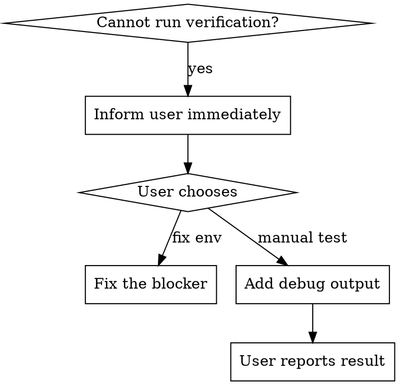

# arc-verifying

## Core Principle

**Claiming work is complete without verification is dishonesty, not efficiency.**

## The Iron Law

```
NO COMPLETION CLAIMS WITHOUT FRESH VERIFICATION EVIDENCE
```

If you haven't run the verification command in THIS message, you cannot claim it passes.

## The Gate Function

BEFORE claiming any status or expressing satisfaction:

1. **IDENTIFY:** What command proves this claim?
2. **RUN:** Execute the FULL command (fresh, complete)
3. **READ:** Full output, check exit code, count failures
4. **VERIFY:** Does output confirm the claim?
   - If NO: State actual status with evidence
   - If YES: State claim WITH evidence
5. **ONLY THEN:** Make the claim

**Skip any step = lying, not verifying**

## Common Failures

| Claim | Requires | NOT Sufficient |
|-------|----------|----------------|
| Tests pass | Test command output: 0 failures | Previous run, "should pass" |
| Build succeeds | Build command: exit 0 | Linter passing |
| Bug fixed | Test original symptom: passes | Code changed, assumed fixed |
| Agent completed | VCS diff shows changes | Agent reports "success" |
| Requirements met | Line-by-line checklist | Tests passing |

## Regression Tests (Red/Green)

If claiming a bug is fixed, require a true regression check:

```
1. Run failing test (RED)
2. Apply fix
3. Run test again (GREEN)
```

Skipping RED means you don't know the test proves anything.

## Requirements Verification

If claiming requirements are met:
1. Re-read the requirements
2. Make a checklist
3. Verify each item with evidence
4. Report any gaps explicitly

## When Verification Cannot Run

**Core principle:** Cannot verify ≠ skip verification. Must inform user and choose alternative.

### Flow



### Handling

| Situation | Action |
|-----------|--------|
| Build fails | Fix build first, then verify |
| Cannot run Simulator/Emulator | Ask user: fix blocker OR add debug print |
| Requires manual UI testing | Describe expected behavior, ask user to verify |

### Rationalizations

| Excuse | Reality |
|--------|---------|
| "Should work now" | Assumption ≠ verification |
| "I changed it, should be fine" | Changed ≠ verified |
| "Continue for now, verify later" | Cannot verify = stop here |

### Red Flags - Cannot Verify

- Cannot verify but don't inform user
- Multiple changes without any verification
- Assuming "should work"

## Red Flags - STOP

- Using "should", "probably", "seems to"
- Expressing satisfaction BEFORE verification ("Great!", "Perfect!", "Done!")
- About to commit/push/PR without verification
- Trusting agent success reports
- Relying on partial verification
- Assuming linter success implies build/test success
- Feeling tired and wanting it over
- Using different wording to imply success without evidence

## Rationalization Prevention

| Excuse | Reality |
|--------|---------|
| "Should work now" | RUN the verification |
| "I'm confident" | Confidence ≠ evidence |
| "Just this once" | No exceptions |
| "Agent said success" | Verify independently |
| "Partial check is enough" | Partial proves nothing |
| "Too simple to verify" | Complexity irrelevant |
| "I already ran it earlier" | Run it again, now |
| "The logs look fine" | Logs ≠ verification |

## Key Patterns

**Tests:**
```
✅ [Run test command] [See: 34/34 pass] "All tests pass"
❌ "Should pass now" / "Looks correct"
```

**Build:**
```
✅ [Run build] [See: exit 0] "Build passes"
❌ "Linter passed" (linter doesn't check compilation)
```

**Agent delegation:**
```
✅ Agent reports success → Check VCS diff → Verify changes → Report actual state
❌ Trust agent report
```

**Requirements:**
```
✅ Re-read plan → Create checklist → Verify each → Report gaps or completion
❌ "Tests pass, phase complete"
```

## IMPORTANT: This is a MINDSET, not a procedure

You do NOT invoke arc-verifying as a separate skill. Instead:

- **arc-implementing** embeds verification (TDD's GREEN must actually run tests)
- **arc-finishing** embeds verification (verify tests BEFORE offering merge options)
- **arc-finishing-epic** embeds verification (verify tests BEFORE offering merge options)
- **Spec reviewer** embeds verification (read actual code, don't trust reports)
- **Quality reviewer** embeds verification (run tests, check output)

Each skill executes its own verification. This skill just defines the mindset.

## Integration

All arcforge skills should adopt this mindset:
- Never claim without evidence
- Run fresh verification commands
- Show actual output
- Be honest about failures
