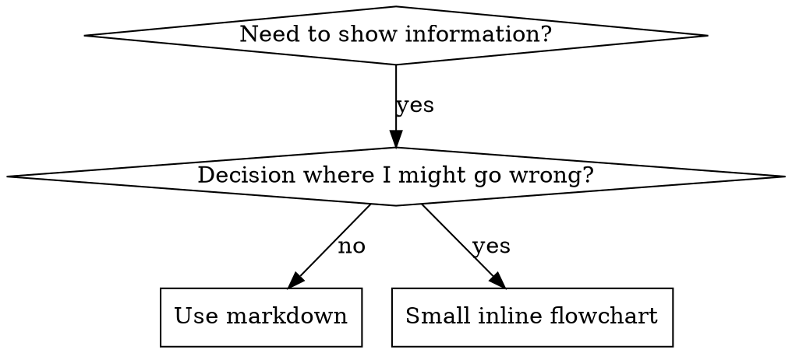

# Writing Skills

## Overview

**Writing skills IS Test-Driven Development applied to process documentation.**

You write test cases (pressure scenarios with subagents), watch them fail (baseline behavior), write the skill (documentation), watch tests pass (agents comply), and refactor (close loopholes).

**Core principle:** If you didn't watch an agent fail without the skill, you don't know if the skill teaches the right thing.

**REQUIRED BACKGROUND:** You MUST understand arc-tdd before using this skill. That skill defines the fundamental RED-GREEN-REFACTOR cycle. This skill adapts TDD to documentation.

## What is a Skill?

A **skill** is a reference guide for proven techniques, patterns, or tools. Skills help future Claude instances find and apply effective approaches.

**Skills are:** Reusable techniques, patterns, tools, reference guides

**Skills are NOT:** Narratives about how you solved a problem once

## TDD Mapping for Skills

| TDD Concept | Skill Creation |
|-------------|----------------|
| **Test case** | Pressure scenario with subagent |
| **Production code** | Skill document (SKILL.md) |
| **Test fails (RED)** | Agent violates rule without skill (baseline) |
| **Test passes (GREEN)** | Agent complies with skill present |
| **Refactor** | Close loopholes while maintaining compliance |
| **Write test first** | Run baseline scenario BEFORE writing skill |
| **Watch it fail** | Document exact rationalizations agent uses |
| **Minimal code** | Write skill addressing those specific violations |
| **Watch it pass** | Verify agent now complies |
| **Refactor cycle** | Find new rationalizations → plug → re-verify |

## When to Create a Skill

**Create when:**
- Technique wasn't intuitively obvious to you
- You'd reference this again across projects
- Pattern applies broadly (not project-specific)
- Others would benefit

**Don't create for:**
- One-off solutions
- Standard practices well-documented elsewhere
- Project-specific conventions (put in CLAUDE.md)
- Mechanical constraints (if enforceable with regex/validation, automate it)

## Skill Types

### Technique
Concrete method with steps to follow (e.g., condition-based-waiting)

### Pattern
Way of thinking about problems (e.g., flatten-with-flags)

### Reference
API docs, syntax guides, tool documentation

## Directory Structure

### Skill Locations by Platform

| Platform | Skills Directory |
|----------|------------------|
| Claude Code | `~/.claude/skills/` |
| Codex | `~/.codex/skills/` |
| Cursor | `~/.cursor/skills/` |
| Gemini | `~/.gemini/skills/` |

### Skill Folder Structure

```
skills/
  skill-name/
    SKILL.md              # Main reference (required)
    supporting-file.*     # Only if needed
```

**Flat namespace** - all skills in one searchable namespace

**Separate files for:**
1. **Heavy reference** (100+ lines) - API docs, comprehensive syntax
2. **Reusable tools** - Scripts, utilities, templates

**Keep inline:** Principles, concepts, code patterns (< 50 lines)

## SKILL.md Structure

**Frontmatter (YAML):**
- Only two fields: `name` and `description`
- Max 1024 characters total
- `name`: Letters, numbers, and hyphens only
- `description`: Third-person, describes ONLY when to use (NOT what it does)
  - Start with "Use when..."
  - Include specific symptoms, situations, contexts
  - **NEVER summarize the skill's process or workflow**

```markdown
---
name: Skill-Name-With-Hyphens
description: Use when [specific triggering conditions and symptoms]
---

# Skill Name

## Overview
Core principle in 1-2 sentences.

## When to Use
Bullet list with SYMPTOMS and use cases. When NOT to use.

## Core Pattern
Before/after code comparison (for techniques/patterns)

## Quick Reference
Table or bullets for scanning

## Common Mistakes
What goes wrong + fixes
```

## Claude Search Optimization (CSO)

**Critical for discovery:** Future Claude needs to FIND your skill

### 1. Rich Description Field

**CRITICAL: Description = When to Use, NOT What the Skill Does**

The description should ONLY describe triggering conditions. Do NOT summarize the skill's process or workflow.

**Why this matters:** Testing revealed that when a description summarizes the skill's workflow, Claude may follow the description instead of reading the full skill content.

**The trap:** Descriptions that summarize workflow create a shortcut Claude will take. The skill body becomes documentation Claude skips.

```yaml
# BAD: Summarizes workflow - Claude may follow this instead of reading skill
description: Use for TDD - write test first, watch it fail, write minimal code

# GOOD: Triggering conditions only
description: Use when implementing any feature or bugfix, before writing implementation code
```

### 2. Keyword Coverage

Use words Claude would search for:
- Error messages, symptoms, synonyms
- Tools: Actual commands, library names, file types

### 3. Descriptive Naming

#### Naming Convention

| Rule | Details |
|------|---------|
| Prefix | `arc-` required |
| Case | kebab-case |
| Voice | Verb-first, active |
| Form | Gerund (-ing) for process skills |
| Structure | `arc-<action>[-<object>[-<scope>]]` |

**Patterns:**

| Pattern | When | Example |
|---------|------|---------|
| `arc-<gerund>` | Single action | `arc-brainstorming`, `arc-debugging` |
| `arc-<gerund>-<object>` | Action + target | `arc-writing-tasks`, `arc-requesting-review` |
| `arc-using-<tool>` | Tool usage | `arc-using-worktrees` |
| `arc-<acronym>` | Well-known abbreviation | `arc-tdd` |

**Avoid:**
- Agent-nouns: `arc-coordinator` → `arc-coordinating`
- Bare verbs: `arc-debug` → `arc-debugging`
- Noun-first: `arc-task-writer` → `arc-writing-tasks`

### 4. Token Efficiency

**Target word counts (soft guidance, not test-enforced):**
- Lean (< 500w): Simple triggers, thin wrappers
- Standard (< 1000w): Most workflow skills
- Comprehensive (< 1800w): Complex multi-path skills
- Meta (< 2500w): Self-referential teaching skills (like this one)
- Over limit? Move details to `references/` directory for progressive loading

### 5. Cross-Referencing Other Skills

Use explicit requirement markers:

```markdown
**REQUIRED SUB-SKILL:** Use arc-debugging when encountering failures
**REQUIRED BACKGROUND:** You MUST understand arc-using first
```

**Never use at-sign file syntax** - it force-loads files immediately, consuming context before needed.

## Flowchart Usage



**Use flowcharts ONLY for:**
- Non-obvious decision points
- Process loops where you might stop too early
- "When to use A vs B" decisions

**Never use flowcharts for:**
- Reference material → Tables, lists
- Code examples → Markdown blocks
- Linear instructions → Numbered lists
- Labels without semantic meaning (step1, helper2)

See `graphviz-conventions.dot` for graphviz style rules.

**Visualizing for your human partner:** Use `render-graphs.js` to render a skill's flowcharts to SVG:
```bash
./render-graphs.js ../some-skill           # Each diagram separately
./render-graphs.js ../some-skill --combine # All diagrams in one SVG
```

## Examples

**Description (good vs bad):**
```yaml
# BAD: Summarizes workflow
description: Use for TDD - write tests first and refactor after

# GOOD: Trigger conditions only
description: Use when implementing any feature or bugfix, before writing implementation code
```

**Structure (good vs bad):**
```
BAD: Long narrative with no headings, no checklist, no red flags
GOOD: Overview → When to Use → Core Pattern → Common Mistakes → Checklist
```

## The Iron Law

```
NO SKILL WITHOUT A FAILING TEST FIRST
```

This applies to NEW skills AND EDITS to existing skills.

Write skill before testing? Delete it. Start over.
Edit skill without testing? Same violation.

**No exceptions:**
- Not for "simple additions"
- Not for "just adding a section"
- Not for "documentation updates"
- Don't keep untested changes as "reference"
- Delete means delete

## Testing Skill Types

### Discipline-Enforcing Skills (rules/requirements)

**Test with:**
- Academic questions: Do they understand the rules?
- Pressure scenarios: Do they comply under stress?
- Multiple pressures combined: time + sunk cost + exhaustion

**Success criteria:** Agent follows rule under maximum pressure

### Technique Skills (how-to guides)

**Test with:**
- Application scenarios: Can they apply correctly?
- Variation scenarios: Do they handle edge cases?
- Gap testing: Do instructions have gaps?

**Success criteria:** Agent successfully applies technique

### Pattern Skills (mental models)

**Test with:**
- Recognition scenarios: Do they recognize when pattern applies?
- Counter-examples: Do they know when NOT to apply?

**Success criteria:** Agent correctly identifies when/how to apply pattern

### Reference Skills (documentation/APIs)

**Test with:**
- Retrieval scenarios: Can they find the right information?
- Application scenarios: Can they use what they found correctly?

**Success criteria:** Agent finds and correctly applies reference

## Common Rationalizations for Skipping Testing

| Excuse | Reality |
|--------|---------|
| "Skill is obviously clear" | Clear to you ≠ clear to other agents. Test it. |
| "It's just a reference" | References can have gaps. Test retrieval. |
| "Testing is overkill" | Untested skills have issues. Always. |
| "I'll test if problems emerge" | Problems = agents can't use skill. Test BEFORE deploying. |
| "Too tedious to test" | Testing is less tedious than debugging bad skill. |
| "I'm confident it's good" | Overconfidence guarantees issues. Test anyway. |
| "No time to test" | Deploying untested skill wastes more time fixing it later. |

## Bulletproofing Against Rationalization

### Close Every Loophole Explicitly

Don't just state the rule - forbid specific workarounds:

```markdown
# BAD
Write code before test? Delete it.

# GOOD
Write code before test? Delete it. Start over.

**No exceptions:**
- Don't keep it as "reference"
- Don't "adapt" it while writing tests
- Delete means delete
```

### Address "Spirit vs Letter" Arguments

```markdown
**Violating the letter of the rules is violating the spirit of the rules.**
```

This cuts off entire class of "I'm following the spirit" rationalizations.

### Build Rationalization Table

Every excuse agents make goes in the table with counter.

### Create Red Flags List

```markdown
## Red Flags - STOP and Start Over

- Code before test
- "I already manually tested it"
- "Tests after achieve the same purpose"
- "This is different because..."

**All of these mean: Delete. Start over.**
```

## RED-GREEN-REFACTOR for Skills

### RED: Write Failing Test (Baseline)

Run pressure scenario with subagent WITHOUT the skill. Document:
- What choices did they make?
- What rationalizations did they use (verbatim)?
- Which pressures triggered violations?

### GREEN: Write Minimal Skill

Write skill addressing those specific rationalizations. Don't add extra content for hypothetical cases.

Run same scenarios WITH skill. Agent should now comply.

### REFACTOR: Close Loopholes

Agent found new rationalization? Add explicit counter. Re-test until bulletproof.

**Testing methodology:** See `testing-skills-with-subagents.md` for complete testing methodology.

## Anti-Patterns

### Narrative Example
"In session 2025-10-03, we found..."
**Why bad:** Too specific, not reusable

### Multi-Language Dilution
example-js.js, example-py.py, example-go.go
**Why bad:** Mediocre quality, maintenance burden

### Code in Flowcharts
**Why bad:** Can't copy-paste, hard to read

### Generic Labels
helper1, helper2, step3
**Why bad:** Labels should have semantic meaning

## Common Mistakes

- Writing skills without a failing baseline scenario
- Letting the description summarize workflow
- Adding examples that are too long to reuse
- Skipping red flags for discipline skills

---

## STOP: Before Moving to Next Skill

**After writing ANY skill, you MUST STOP and complete the deployment process.**

**Do NOT:**
- Create multiple skills in batch without testing each
- Move to next skill before current one is verified
- Skip testing because "batching is more efficient"

**The deployment checklist below is MANDATORY for EACH skill.**

Deploying untested skills = deploying untested code. It's a violation of quality standards.

---

## Skill Creation Checklist

**IMPORTANT: Use TodoWrite to create todos for EACH checklist item.**

**RED Phase - Write Failing Test:**
- [ ] Create pressure scenarios (3+ combined pressures for discipline skills)
- [ ] Run scenarios WITHOUT skill - document baseline behavior verbatim
- [ ] Identify patterns in rationalizations/failures

**GREEN Phase - Write Minimal Skill:**
- [ ] Name uses only letters, numbers, hyphens
- [ ] YAML frontmatter with only name and description (max 1024 chars)
- [ ] Description starts with "Use when..." (triggers only, no workflow)
- [ ] Description written in third person
- [ ] Keywords throughout for search (errors, symptoms, tools)
- [ ] Address specific baseline failures identified in RED
- [ ] Run scenarios WITH skill - verify agents now comply

**REFACTOR Phase - Close Loopholes:**
- [ ] Identify NEW rationalizations from testing
- [ ] Add explicit counters (if discipline skill)
- [ ] Build rationalization table from all test iterations
- [ ] Create red flags list
- [ ] Re-test until bulletproof

**Deployment:**
- [ ] Run pytest validation
- [ ] Commit skill to git

## Supporting Files

This skill includes supporting files for comprehensive skill development:

**Methodology:**
- `testing-skills-with-subagents.md` - Complete testing methodology with pressure scenarios
- `anthropic-best-practices.md` - Official skill authoring guidance (conciseness, structure, evaluation)

**Psychology:**
- `persuasion-principles.md` - Research on persuasion techniques for skill design (authority, commitment, scarcity, social proof, unity)

**Flowcharts:**
- `graphviz-conventions.dot` - Style guide for graphviz flowcharts (node shapes, edge labels, naming patterns)
- `render-graphs.js` - Utility to render SKILL.md flowcharts to SVG

**Examples:**
- `examples/CLAUDE_MD_TESTING.md` - Example of testing documentation variants with pressure scenarios

## Discovery Workflow

How future Claude finds your skill:

1. **Encounters problem** ("tests are flaky")
2. **Searches skills** (keywords match description)
3. **Finds SKILL** (description matches triggering condition)
4. **Scans overview** (is this relevant?)
5. **Reads patterns** (quick reference table)
6. **Loads example** (only when implementing)

**Optimize for this flow** - put searchable terms early and often.

## The Bottom Line

**Creating skills IS TDD for process documentation.**

Same Iron Law: No skill without failing test first.
Same cycle: RED (baseline) → GREEN (write skill) → REFACTOR (close loopholes).
Same benefits: Better quality, fewer surprises, bulletproof results.

If you follow TDD for code, follow it for skills. It's the same discipline applied to documentation.
