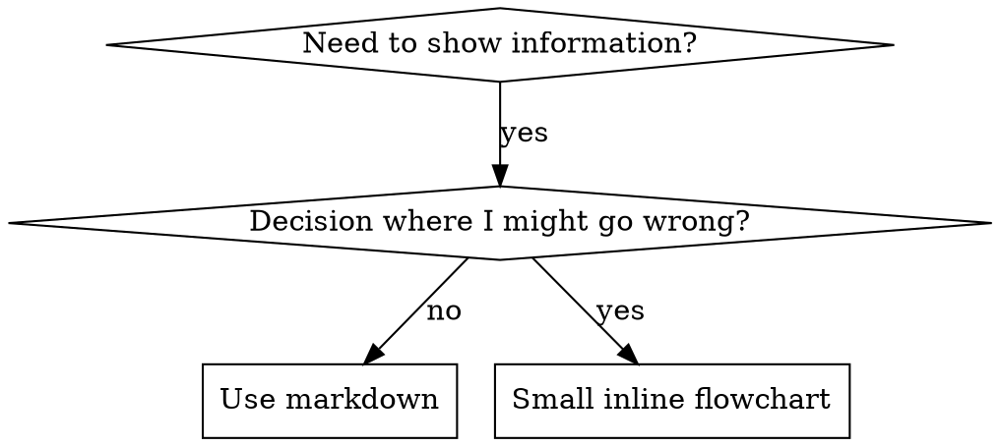

# Writing ArcForge Skills

## Overview

This is a **project-level meta skill** for maintaining ArcForge's own composable skill system. It is not a general promoted/user-facing core skill for ordinary product work.

**Writing skills IS Test-Driven Development applied to process documentation.**

You write test cases (pressure scenarios with subagents), watch them fail (baseline behavior), write the skill (documentation), watch tests pass (agents comply), and refactor (close loopholes).

**Core principle:** If you didn't watch an agent fail without the skill, you don't know if the skill teaches the right thing.

**REQUIRED BACKGROUND:** You MUST understand arc-tdd before using this skill. That skill defines the fundamental RED-GREEN-REFACTOR cycle. This skill adapts TDD to documentation.

## What is a Skill?

A **skill** is a reference guide for proven techniques, patterns, or tools. Skills help future Claude instances find and apply effective approaches.

**Skills are:** Reusable techniques, patterns, tools, reference guides

**Skills are NOT:** Narratives about how you solved a problem once

## TDD Mapping for Skills

| TDD Concept | Skill Creation |
|-------------|----------------|
| **Test case** | Pressure scenario with subagent |
| **Production code** | Skill document (SKILL.md) |
| **Test fails (RED)** | Agent violates rule without skill (baseline) |
| **Test passes (GREEN)** | Agent complies with skill present |
| **Refactor** | Close loopholes while maintaining compliance |
| **Write test first** | Run baseline scenario BEFORE writing skill |
| **Watch it fail** | Document exact rationalizations agent uses |
| **Minimal code** | Write skill addressing those specific violations |
| **Watch it pass** | Verify agent now complies |
| **Refactor cycle** | Find new rationalizations → plug → re-verify |

## Scope

Use this skill for ArcForge maintainer work: changing `skills/`, skill tests, pressure fixtures, evals, and skill distribution behavior.

Do not use it as a default workflow for non-ArcForge product implementation. For ordinary project work, route to the smallest useful product-facing skill instead.

## When to Create an ArcForge Skill

**Create when:**
- Technique wasn't intuitively obvious to you
- ArcForge users or maintainers would reference this again
- Pattern applies broadly across ArcForge-supported agent workflows
- Others would benefit

**Don't create for:**
- One-off solutions
- Standard practices well-documented elsewhere
- Product-specific conventions (put in that project's instructions instead)
- Mechanical constraints (if enforceable with regex/validation, automate it)

## Skill Types

Two orthogonal axes are useful when designing a skill — composition (how it gets triggered) and content (what it teaches). Pick deliberately on each.

### By composition (how it's triggered)

| Type | Trigger Mechanism | Composition | Example |
|------|-------------------|-------------|---------|
| **Workflow** | Handoff from previous step | "After This Skill" section defines next step | `arc-brainstorming` → `arc-writing-tasks` |
| **Discipline** | Conditional — fires during ANY workflow when condition is met | Listed in `arc-using` routing table | `arc-tdd`, `arc-verifying` |
| **Meta** | Independent — user, maintainer, or project-level task invokes directly | No routing needed | `arc-writing-skills`, `arc-auditing-spec` |

When creating a new skill:

1. **Determine its composition type** — pipeline step (Workflow), cross-cutting quality gate (Discipline), or system management tool (Meta)?
2. **Workflow skills** MUST have an "After This Skill" section with explicit next-step guidance. Workflow without handoff = dead-end in autonomous mode.
3. **Discipline skills** MUST be added to `arc-using`'s "Discipline Skills — Conditional Triggers" table — and the routing condition must be concrete (no global "always invoke" language; preserve harness/eval isolation).
4. **Meta skills** need no routing — they are invoked directly when needed.

### By content (what the skill teaches)

- **Technique** — Concrete method with steps to follow (e.g., condition-based-waiting)
- **Pattern** — Way of thinking about problems (e.g., flatten-with-flags)
- **Reference** — API docs, syntax guides, tool documentation

## Design Anti-Patterns

Discovered through eval — don't repeat:

- **"Mindset" skills** — AI agents don't internalize mindsets. A skill that says "embed me in everything" relies on copy-paste, which is unreliable. Use bounded routing conditions to trigger discipline skills instead.
- **Self-contradicting invocation** — Never write "don't invoke me" in a skill that's registered in the routing table. The routing table says "invoke it"; the skill says "don't invoke me" → agent obeys the prohibition.
- **Embedded-only verification** — Verification embedded in other skills (arc-finishing Step 1, arc-tdd Verify RED/GREEN) is defense-in-depth, not the primary mechanism. The primary trigger is the routing table.

## Directory Structure

### Skill Locations by Platform

| Platform | Skills Directory |
|----------|------------------|
| Claude Code | `~/.claude/skills/` |
| Codex | `~/.codex/skills/` |
| Cursor | `~/.cursor/skills/` |
| Gemini | `~/.gemini/skills/` |

### Skill Folder Structure

```
skills/
  skill-name/
    SKILL.md              # Core logic and decisions (required)
    references/           # Detailed material, loaded on-demand
      patterns.md         # Detailed patterns, examples
      api.md              # API docs, syntax reference
    scripts/              # Executable utilities (run, not loaded)
    agents/               # Subagent templates
```

**Flat namespace** - all skills in one searchable namespace

**What stays in SKILL.md:** Core rule, decision logic, routing, red flags, checklists — anything the agent needs to make the right choice.

**What moves to `references/`:** Detailed examples, API docs, comprehensive syntax, lengthy tables, extended rationale. Reference from SKILL.md so the agent knows when to load them.

**Keep inline:** Principles, concepts, code patterns (< 50 lines)

## Path Resolution (Plugin Distribution Awareness)

arcforge ships as a plugin. At runtime the LLM works in a user's project — cwd is the user's project, NOT the plugin install. Any reference to plugin internal files from skill prose must be absolute, derived from `${ARCFORGE_ROOT}` — never bare cwd-relative.

`${ARCFORGE_ROOT}` is set by the SessionStart hook (`inject-skills`) and points at the plugin install root.

### Which prefix to use

| Reference target | Prefix | Example |
|---|---|---|
| Plugin shared library (`${ARCFORGE_ROOT}/scripts/lib/`, `${ARCFORGE_ROOT}/scripts/cli.js`) | `${ARCFORGE_ROOT}/` | `${ARCFORGE_ROOT}/scripts/lib/print-schema.js` |
| Skill's own files (`skills/<name>/scripts/`, `references/`) | `${SKILL_ROOT}/` | `${SKILL_ROOT}/scripts/planner.js` |
| Plugin templates / agents referenced from a skill | `${ARCFORGE_ROOT}/` | `${ARCFORGE_ROOT}/templates/<name>.md` |
| User's project files (not plugin) | (none — bare is correct) | `specs/<spec-id>/spec.xml` |

`${SKILL_ROOT}` is set via the skill loader header. Use this idiom at the top of any Bash block that needs it:

```bash
: "${SKILL_ROOT:=${ARCFORGE_ROOT:-}/skills/<your-skill-name>}"
```

### Anti-patterns

```bash
# WRONG — cwd-relative require breaks when cwd ≠ plugin root
node -e "require('./scripts/lib/sdd-utils')"

# WRONG — bare prose path; LLM follows literally and fails in user's cwd
"Read scripts/lib/sdd-schemas/spec.md for the schema."

# CORRECT — direct read with prefix (preferred for LLM consumption)
"Read ${ARCFORGE_ROOT}/scripts/lib/sdd-schemas/spec.md for the schema."

# CORRECT — Bash invocation with prefix
node "${ARCFORGE_ROOT}/scripts/lib/print-schema.js" spec --markdown
```

### CI enforcement

CI lint scans `skills/**/SKILL.md`, `skills/**/references/**/*.md`, `templates/**/*.md`, and `agents/**/*.md` for `${ARCFORGE_ROOT}/scripts/lib/` discipline: any plugin shared-library reference must use that exact prefix. Failures block merge. The only exception is this fenced Anti-patterns teaching block. Skill-local relative paths (using `${SKILL_ROOT}/`, or `cd ${SKILL_ROOT}` then bare) are author's judgment — not enforced.

## SKILL.md Structure

**Frontmatter (YAML):**

Required fields:
- `name`: Letters, numbers, and hyphens only
- `description`: Third-person, describes ONLY when to use (NOT what it does)
  - Start with "Use when..."
  - Include specific symptoms, situations, contexts
  - **NEVER summarize the skill's process or workflow**

Combined `name` + `description` must stay under 1024 characters.

Optional fields (use only when they earn their place):

| Field | Use when |
|---|---|
| `argument-hint` | Skill takes CLI-style arguments and you want them surfaced in the slash-command palette (e.g., `arc-maintaining-obsidian`). Pure UX — no triggering effect. |
| `allowed-tools` | You want to constrain which tools the skill may use. Encouraged for skills that don't need full tool access — defense in depth at the skill layer rather than relying on the harness default. |
| `disable-model-invocation` | Skill must be **user-invocable only**, never auto-triggered by the model. |
| `user-invocable` | Skill should appear in the slash command list. |

Avoid `model`, `context`, `agent`, `hooks` in skill frontmatter unless you have a concrete reason — those couple the skill to runtime/harness concerns better managed at the plugin or settings level.

```markdown
---
name: Skill-Name-With-Hyphens
description: Use when [specific triggering conditions and symptoms]
---

# Skill Name

## Overview
Core principle in 1-2 sentences.

## When to Use
Bullet list with SYMPTOMS and use cases. When NOT to use.

## Core Pattern
Before/after code comparison (for techniques/patterns)

## Quick Reference
Table or bullets for scanning

## Common Mistakes
What goes wrong + fixes
```

## Claude Search Optimization (CSO)

**Critical for discovery:** Future Claude needs to FIND your skill

### 1. Rich Description Field

**CRITICAL: Description = When to Use, NOT What the Skill Does**

The description should ONLY describe triggering conditions. Do NOT summarize the skill's process or workflow.

**Why this matters:** Testing revealed that when a description summarizes the skill's workflow, Claude may follow the description instead of reading the full skill content.

**The trap:** Descriptions that summarize workflow create a shortcut Claude will take. The skill body becomes documentation Claude skips.

```yaml
# BAD: Summarizes workflow - Claude may follow this instead of reading skill
description: Use for TDD - write test first, watch it fail, write minimal code

# GOOD: Triggering conditions only
description: Use when implementing any feature or bugfix, before writing implementation code
```

### 2. Keyword Coverage

Use words Claude would search for:
- Error messages, symptoms, synonyms
- Tools: Actual commands, library names, file types

### 3. Descriptive Naming

#### Naming Convention

| Rule | Details |
|------|---------|
| Prefix | `arc-` required |
| Case | kebab-case |
| Voice | Verb-first, active |
| Form | Gerund (-ing) for process skills |
| Structure | `arc-<action>[-<object>[-<scope>]]` |

**Patterns:**

| Pattern | When | Example |
|---------|------|---------|
| `arc-<gerund>` | Single action | `arc-brainstorming`, `arc-debugging` |
| `arc-<gerund>-<object>` | Action + target | `arc-writing-tasks`, `arc-requesting-review` |
| `arc-using-<tool>` | Tool usage | `arc-using-worktrees` |
| `arc-<acronym>` | Well-known abbreviation | `arc-tdd` |

**Avoid:**
- Agent-nouns: `arc-coordinator` → `arc-coordinating`
- Bare verbs: `arc-debug` → `arc-debugging`
- Noun-first: `arc-task-writer` → `arc-writing-tasks`

### 4. Token Efficiency

#### 3-Level Loading Model

Skills use progressive disclosure — not everything loads at once:

| Level | What loads | When | Token cost |
|-------|-----------|------|------------|
| **1. Description** | `name` + `description` frontmatter | Always in context | ~100 tokens per skill |
| **2. SKILL.md body** | Full markdown content | On skill invocation | 500–4,000 tokens |
| **3. References** | Files in `references/`, `agents/`, etc. | On-demand when agent reads them | Zero until needed |

**Keep SKILL.md lean and high-signal. Move detail to references.**

#### Word Count Tiers (soft guidance)

| Tier | Limit | Use for |
|------|-------|---------|
| Lean | <500w | Simple triggers, thin wrappers |
| Standard | <1000w | Most workflow skills |
| Comprehensive | <1800w | Complex multi-path skills |
| Meta | <2500w | Self-referential teaching skills |

#### When to Split into References

Split when any of these are true:
- A section has **100+ lines** of examples, tables, or API docs
- Content is only needed for **specific subtasks**, not the core flow
- The same reference material applies to **multiple skills**
- SKILL.md is approaching its tier limit and has extractable detail

#### How to Reference

Point to reference files from SKILL.md with clear loading guidance:

```markdown
**Testing methodology:** See `testing-skills-with-subagents.md` for complete testing methodology.
```

For large reference files (300+ lines), include a table of contents at the top so the agent can navigate efficiently.


### 5. Cross-Referencing Other Skills

Use explicit requirement markers:

```markdown
**REQUIRED SUB-SKILL:** Use arc-debugging when encountering failures
**REQUIRED BACKGROUND:** You MUST understand arc-using first
```

**Never use at-sign file syntax** - it force-loads files immediately, consuming context before needed.

## Flowchart Usage


```dot
digraph when_flowchart {
    "Need to show information?" [shape=diamond];
    "Decision where I might go wrong?" [shape=diamond];
    "Use markdown" [shape=box];
    "Small inline flowchart" [shape=box];

    "Need to show information?" -> "Decision where I might go wrong?" [label="yes"];
    "Decision where I might go wrong?" -> "Small inline flowchart" [label="yes"];
    "Decision where I might go wrong?" -> "Use markdown" [label="no"];
}
```

**Use flowcharts ONLY for:**
- Non-obvious decision points
- Process loops where you might stop too early
- "When to use A vs B" decisions

**Never use flowcharts for:**
- Reference material → Tables, lists
- Code examples → Markdown blocks
- Linear instructions → Numbered lists
- Labels without semantic meaning (step1, helper2)

See `graphviz-conventions.dot` for graphviz style rules.

**Visualizing for your human partner:** Use `render-graphs.js` to render a skill's flowcharts to SVG:
```bash
./render-graphs.js ../some-skill           # Each diagram separately
./render-graphs.js ../some-skill --combine # All diagrams in one SVG
```

## Examples

**Description (good vs bad):**
```yaml
# BAD: Summarizes workflow
description: Use for TDD - write tests first and refactor after

# GOOD: Trigger conditions only
description: Use when implementing any feature or bugfix, before writing implementation code
```

**Structure (good vs bad):**
```
BAD: Long narrative with no headings, no checklist, no red flags
GOOD: Overview → When to Use → Core Pattern → Common Mistakes → Checklist
```

## Test-Driven Skill Creation

Create a skill the way you'd write tested code: observe the failure first, then write
the fix.

Before writing the skill, run your pressure scenarios against a subagent *without* the
skill and watch what it actually does — the choices it makes and the reasons it gives for
the wrong one. Those observed rationalizations are your spec: the skill exists to counter
them. Write the skill first and test after, and you're writing against imagined failures
instead of real ones — the skill ends up heavy where it doesn't matter and thin where it
does. Baseline first, write to what you saw, then close the gaps that show up on re-test
(the RED → GREEN → REFACTOR section below spells this out).

Whether the skill actually changes behavior — and, for an edit to an existing skill,
whether a re-run is even needed — is a measurement question. That belongs to
**arc-evaluating**, which owns the ship gate (and exempts changes with no behavioral
footprint, such as a typo or a metadata tweak). This skill is about producing a good
skill; arc-evaluating decides whether it ships.

## Testing Skill Types

### Discipline-Enforcing Skills (rules/requirements)

**Test with:**
- Academic questions: Do they understand the rules?
- Pressure scenarios: Do they comply under stress?
- Multiple pressures combined: time + sunk cost + exhaustion

**Success criteria:** Agent follows rule under maximum pressure

### Technique Skills (how-to guides)

**Test with:**
- Application scenarios: Can they apply correctly?
- Variation scenarios: Do they handle edge cases?
- Gap testing: Do instructions have gaps?

**Success criteria:** Agent successfully applies technique

### Pattern Skills (mental models)

**Test with:**
- Recognition scenarios: Do they recognize when pattern applies?
- Counter-examples: Do they know when NOT to apply?

**Success criteria:** Agent correctly identifies when/how to apply pattern

### Reference Skills (documentation/APIs)

**Test with:**
- Retrieval scenarios: Can they find the right information?
- Application scenarios: Can they use what they found correctly?

**Success criteria:** Agent finds and correctly applies reference

## Common Rationalizations for Skipping the Baseline

These come up when deciding whether to run the baseline. Each has a measured answer:

| Rationalization | Why the baseline still helps |
|-----------------|------------------------------|
| "The skill is obviously clear" | Clear to the author isn't the same as clear to another agent; the baseline shows the gap. |
| "It's just a reference" | Reference skills can have retrieval gaps a baseline surfaces. |
| "I'll test if problems emerge" | By then the cost is a confused agent mid-task, not a quick check up front. |
| "I'm confident it's good" | The baseline is cheap — it either confirms the confidence or corrects it. |
| "No time to test" | A skill that doesn't land costs more downstream than the baseline does now. |

## Bulletproofing a Discipline Skill Against Rationalization

This section is about writing a *discipline* skill — one the agent must hold under pressure.
The examples below are intentionally firm because that firmness belongs in the discipline
skill you're authoring (this is how `arc-tdd`, say, talks); it's the subject being taught,
not the tone of this guide. Technique, pattern, and reference skills don't need it.

### Close Every Loophole Explicitly

Don't just state the rule — forbid specific workarounds:

```markdown
# BAD
Write code before test? Delete it.

# GOOD
Write code before test? Delete it. Start over.

**No exceptions:**
- Don't keep it as "reference"
- Don't "adapt" it while writing tests
- Delete means delete
```

### Address "Spirit vs Letter" Arguments

```markdown
**Violating the letter of the rules is violating the spirit of the rules.**
```

This cuts off entire class of "I'm following the spirit" rationalizations.

### Build Rationalization Table

Every excuse agents make goes in the table with counter.

### Create Red Flags List

```markdown
## Red Flags - STOP and Start Over

- Code before test
- "I already manually tested it"
- "Tests after achieve the same purpose"
- "This is different because..."

**All of these mean: Delete. Start over.**
```

## RED-GREEN-REFACTOR for Skills

### RED: Write Failing Test (Baseline)

Run pressure scenario with subagent WITHOUT the skill. Document:
- What choices did they make?
- What rationalizations did they use (verbatim)?
- Which pressures triggered violations?

### GREEN: Write Minimal Skill

Write skill addressing those specific rationalizations. Don't add extra content for hypothetical cases.

Run same scenarios WITH skill. Agent should now comply.

### REFACTOR: Close Loopholes

Agent found new rationalization? Add explicit counter. Re-test until bulletproof.

**Testing methodology:** See `testing-skills-with-subagents.md` for the pressure-scenario method.

**Structured grading and measurement belong to arc-evaluating.** When you need to grade
compliance, mine rationalizations from a transcript, compare two versions blind, or prove a
behavior change before shipping, use **arc-evaluating** — it owns the graders (including the
discipline-skill `skill-grader` with its `rationalizations[]` output), the A/B loop
(`arc eval ab`), and the SHIP verdict. Keep this skill focused on writing the skill well, and
hand measurement to arc-evaluating.

## Anti-Patterns

### Narrative Example
"In session 2025-10-03, we found..."
**Why bad:** Too specific, not reusable

### Multi-Language Dilution
example-js.js, example-py.py, example-go.go
**Why bad:** Mediocre quality, maintenance burden

### Code in Flowcharts
**Why bad:** Can't copy-paste, hard to read

### Generic Labels
helper1, helper2, step3
**Why bad:** Labels should have semantic meaning

## Common Mistakes

- Writing skills without a failing baseline scenario
- Letting the description summarize workflow
- Adding examples that are too long to reuse
- Skipping red flags for discipline skills

---

## Finish One Skill Before Starting the Next

When you're creating several skills, finish and verify each one before moving on. Batching the
writing and deferring all the testing to the end is how untested skills slip through — the
baseline check and the per-skill verification are the point, not overhead. Run the checklist
below for each skill.

---

## Skill Creation Checklist

Track these as you go (TodoWrite helps when you're working through a multi-skill batch).

**RED Phase - Write Failing Test:**
- [ ] Create pressure scenarios (3+ combined pressures for discipline skills)
- [ ] Run scenarios WITHOUT skill - document baseline behavior verbatim
- [ ] Identify patterns in rationalizations/failures

**GREEN Phase - Write Minimal Skill:**
- [ ] Name uses only letters, numbers, hyphens
- [ ] YAML frontmatter has required `name` + `description` (combined under 1024 chars); any optional fields used per the Frontmatter section
- [ ] Description starts with "Use when..." (triggers only, no workflow)
- [ ] Description written in third person
- [ ] Keywords throughout for search (errors, symptoms, tools)
- [ ] Address specific baseline failures identified in RED
- [ ] Run scenarios WITH skill - verify agents now comply

**REFACTOR Phase - Close Loopholes:**
- [ ] Identify NEW rationalizations from testing
- [ ] Add explicit counters (if discipline skill)
- [ ] Build rationalization table from all test iterations
- [ ] Create red flags list
- [ ] Re-test until bulletproof

**Deployment:**
- [ ] Run pytest validation
- [ ] Commit skill to git

## Supporting Files

This skill includes supporting files for comprehensive skill development:

**Methodology:**
- `testing-skills-with-subagents.md` - Complete testing methodology with pressure scenarios
- `anthropic-best-practices.md` - Official skill authoring guidance (conciseness, structure, evaluation)

**Psychology:**
- `persuasion-principles.md` - Research on persuasion techniques for skill design (authority, commitment, scarcity, social proof, unity)

**Flowcharts:**
- `graphviz-conventions.dot` - Style guide for graphviz flowcharts (node shapes, edge labels, naming patterns)
- `render-graphs.js` - Utility to render SKILL.md flowcharts to SVG

**Evaluation:**
- Grading, blind comparison, rationalization extraction, and behavior-change measurement live
  in **arc-evaluating** (`skills/arc-evaluating/`), not here — use it to validate a skill.

**Examples:**
- `examples/CLAUDE_MD_TESTING.md` - Example of testing documentation variants with pressure scenarios

## Discovery Workflow

How future Claude finds your skill:

1. **Encounters problem** ("tests are flaky")
2. **Searches skills** (keywords match description)
3. **Finds SKILL** (description matches triggering condition)
4. **Scans overview** (is this relevant?)
5. **Reads patterns** (quick reference table)
6. **Loads example** (only when implementing)

**Optimize for this flow** - put searchable terms early and often.

## The Bottom Line

**Creating a skill is TDD for process documentation.**

Same idea: see the failure first (RED baseline), write to it (GREEN), close the gaps
(REFACTOR). Same payoff: the skill is grounded in real failures, not imagined ones.
Measuring whether it actually changed behavior is arc-evaluating's job.
