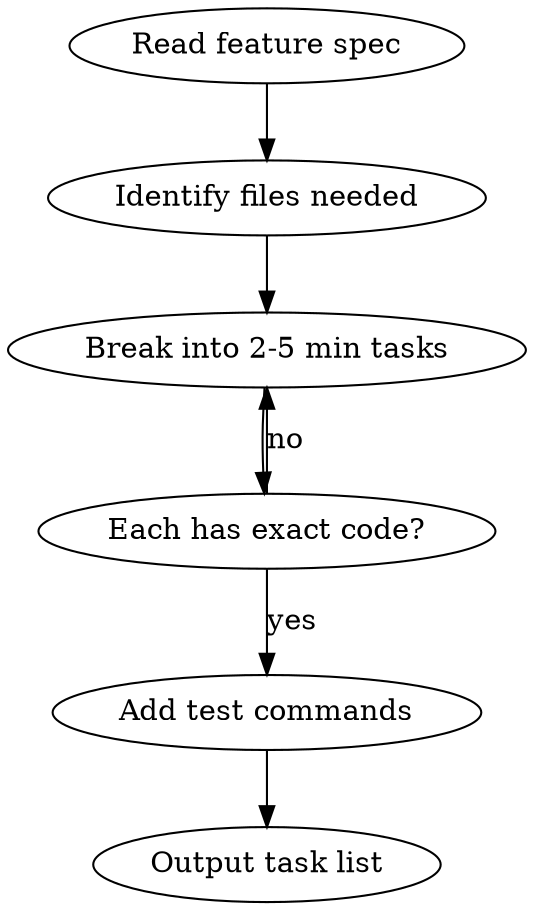

# Writing Tasks

## Overview

Break features into bite-sized tasks (2-5 minutes each) with exact code and commands. Each task is independently executable.

## Core Rules

1. **Bite-sized** - Each task 2-5 minutes
2. **Exact code** - Complete code, not "add validation"
3. **Exact commands** - Full test command with expected output
4. **TDD order** - Test first, then implementation
5. **Persist to file** - Tasks saved to docs/tasks/<name>-tasks.md

## Task Format

```yaml
tasks:
  - id: 1
    description: "Write failing test for login validation"
    file: "tests/auth/test_login.py"
    action: "create"
    code: |
      def test_login_valid_credentials():
          result = login("user", "valid123")
          assert result.success is True
    test_command: "pytest tests/auth/test_login.py -v"
    expected: "FAILED - login not defined"

  - id: 2
    description: "Implement login function"
    file: "src/auth/login.py"
    depends_on: [1]
    code: |
      def login(username: str, password: str) -> LoginResult:
          # exact implementation
    test_command: "pytest tests/auth/test_login.py -v"
    expected: "PASSED"
```

## Granularity Check

| Too Vague | Just Right |
|-----------|------------|
| "Set up auth" | "Create User dataclass in src/types.py" |
| "Add tests" | "Write test_login_invalid_password in tests/auth/" |
| "Implement login" | "Add password hash check in login()" |

## Workflow



## Output Structure

Output to `docs/tasks/<feature-name>-tasks.md`

Format:
```markdown
# <Feature Name> Tasks

> **Goal:** [One sentence describing what this delivers]
> **Architecture:** [2-3 sentences about approach]
> **Tech Stack:** [Key technologies/libraries]

> **For Claude:** Use arc-agent-driven or arc-executing-tasks to implement.

## Context
[Scene-setting from feature spec]

## Tasks

### Task 1: [Name]
**Files:**
- Create: `exact/path/to/file.py`
- Test: `tests/exact/path/to/test.py`

**Step 1: Write failing test**
\`\`\`python
def test_specific_behavior():
    ...
\`\`\`

**Step 2: Run test**
Run: `pytest tests/path/test.py::test_name -v`
Expected: FAIL

**Step 3: Implement**
\`\`\`python
def function():
    ...
\`\`\`

**Step 4: Verify**
Run: `pytest tests/path/test.py::test_name -v`
Expected: PASS

**Step 5: Commit**
`git commit -m "feat: add specific feature"`

### Task 2: ...
```

## Completion Format

✅ Tasks written → docs/tasks/<name>-tasks.md
- Total: N tasks
- Ready for: arc-agent-driven or arc-executing-tasks

## Blocked Format

⚠️ Writing tasks blocked
- Issue: Feature spec unclear
- Missing: Authentication method not specified
- Action: Clarify with user before breaking down

## Red Flags - STOP

- "Set up X" without exact files
- "Add tests" without test code
- "Implement Y" without exact implementation
- Tasks longer than 5 minutes

**Vague = break down further.**
